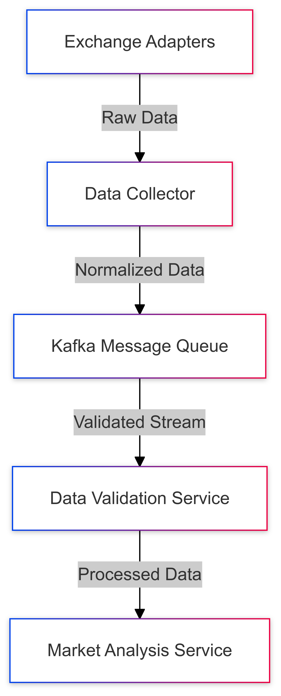

# Data Ingestion Layer Design for Multi-Exchange Cryptocurrency Data Processing

## Prologue

In the context of building a distributed cryptocurrency trading analytics platform, facing challenges of diverse exchange data formats, real-time processing requirements, and high-volume data streams, we decided to implement a modular, event-driven data ingestion layer to achieve high-performance, normalized, and validated cryptocurrency market data accepting potential complexity in initial implementation and ongoing maintenance.

## Discussion

### Technical Challenges

- Diverse cryptocurrency exchange APIs
- Inconsistent data formats
- High-frequency trading data
- Performance and scalability requirements
- Data integrity and validation

### Current Landscape

- Exchanges provide varying:
  - API protocols
  - Data structures
  - Rate limiting
  - Authentication mechanisms

### Key Requirements

1. Support multiple cryptocurrency exchanges
2. Real-time data processing
3. Consistent data normalization
4. High throughput (10,000+ trades/second)
5. Low-latency data transformation

### Constraints

- Limited computational resources
- Network bandwidth limitations
- Varying exchange API reliability
- Compliance with exchange terms of service

## Solution

### Architecture Components

1. **Exchange Adapter Pattern**

   - Modular adapter for each exchange
   - Standardized interface
   - Encapsulated exchange-specific logic

2. **Data Normalization Strategy**

   - Canonical data model
   - Unified schema across exchanges
   - Type-safe transformation

3. **Processing Pipeline**

   - Event-driven architecture
   - Apache Kafka for message streaming
   - Golang for high-performance processing

### Technical Implementation

#### Exchange Adapter Interface

```go
type ExchangeAdapter interface {
    Connect() error
    Authenticate() error
    FetchMarketData() ([]MarketTick, error)
    NormalizeData(rawData interface{}) (MarketTick, error)
}
```

#### Normalized Data Model

```protobuf
message MarketTick {
    string exchange = 1;
    string symbol = 2;
    double price = 3;
    double volume = 4;
    int64 timestamp = 5;
    TradeType trade_type = 6;
}

enum TradeType {
    BUY = 0;
    SELL = 1;
    NEUTRAL = 2;
}
```

#### Data Validation Rules

- Price within reasonable range
- Timestamp integrity
- Volume validation
- Symbol standardization

### Processing Pipeline



## Consequences (Results)

### Positive Outcomes

- Flexible, extensible architecture
- Consistent data representation
- High-performance processing
- Easy addition of new exchanges
- Improved data quality

### Potential Risks

- Increased initial development complexity
- Maintenance overhead for adapters
- Potential performance bottlenecks
- Dependency on external exchange APIs

### Monitoring and Mitigation

- Comprehensive logging
- Circuit breaker patterns
- Adaptive rate limiting
- Fallback mechanisms

## Performance Metrics

### Target Specifications

- Latency: < 50ms per data point
- Throughput: 10,000+ trades/second
- Data sources: 20+ exchanges
- Adapter initialization: < 100ms

## Specific Implementation Details

### Exchange Adapter Development

1. Standardized configuration
2. Error handling strategies
3. Retry mechanisms
4. Exponential backoff

### Data Validation Approach

- Schema validation
- Range checking
- Anomaly detection
- Machine learning-based outlier identification

## Future Considerations

- Machine learning-enhanced validation
- Adaptive rate limiting
- Enhanced error reporting
- Blockchain-native data sources

## Decision Validation Criteria

- Successful integration of 5+ exchanges
- Maintained performance targets
- Data consistency across sources
- Minimal manual intervention

## Alternatives Considered

1. Centralized data collection
2. Third-party data aggregation services
3. Static adapter implementation

## Appendix

- Detailed exchange adapter specifications
- Performance benchmark results
- Validation test cases
