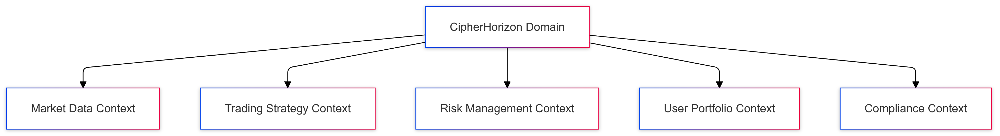

# Domain-Driven Design for CipherHorizon Microservices Architecture

## Prologue

In the context of building a complex cryptocurrency trading analytics platform, facing challenges of intricate business logic, evolving domain complexity, and system maintainability,  
we decided to implement Domain-Driven Design (DDD) principles
to achieve a robust, flexible, and business-aligned software architecture accepting the initial complexity and learning curve of DDD implementation.

## Discussion

### Domain Complexity Challenges

- Intricate cryptocurrency trading domain
- Multiple interconnected business processes
- Complex risk management rules
- Evolving market dynamics
- Regulatory compliance requirements

### Current System Limitations

- Rigid architectural design
- Difficulty in modeling complex business rules
- Poor alignment between technical implementation and business logic
- Challenges in system evolution and maintenance

### Key Domain Challenges

1. Modeling complex trading strategies
2. Representing risk management rules
3. Capturing market analysis logic
4. Handling regulatory compliance
5. Supporting multiple cryptocurrency exchanges

### Strategic Design Objectives

- Clear bounded contexts
- Ubiquitous language
- Model-driven design
- Business logic encapsulation
- Flexible system evolution

## Solution

### Domain-Driven Design Strategic Patterns

#### 1. Bounded Contexts



#### Bounded Context Definitions

1. **Market Data Context**

   - Responsible for data collection
   - Normalize exchange information
   - Maintain data integrity

2. **Trading Strategy Context**

   - Define trading rules
   - Generate trading signals
   - Manage strategy variations

3. **Risk Management Context**

   - Calculate portfolio risk
   - Implement risk mitigation strategies
   - Monitor compliance

4. **User Portfolio Context**

   - Track user investments
   - Manage portfolio composition
   - Performance tracking

5. **Compliance Context**

   - Regulatory rule enforcement
   - Transaction monitoring
   - Reporting mechanisms

### Domain Model Example

```PROTOBUF
// Trading Strategy Domain Model
message TradingStrategy {
    string strategy_id = 1;
    string name = 2;
    StrategyType type = 3;
    repeated StrategyRule rules = 4;
    RiskProfile risk_profile = 5;
}

message StrategyRule {
    RuleType type = 1;
    string description = 2;
    ConditionExpression condition = 3;
    ActionType action = 4;
}

enum StrategyType {
    MOMENTUM = 0;
    MEAN_REVERSION = 1;
    ARBITRAGE = 2;
}
```

### Tactical Design Patterns

#### Aggregates

- Trading Strategy Aggregate
- Portfolio Aggregate
- Risk Management Aggregate

#### Value Objects

- Money
- Percentage
- TimeFrame
- ExchangeRate

#### Domain Events

```PROTOBUF
message DomainEvent {
    string event_id = 1;
    string aggregate_id = 2;
    EventType type = 3;
    google.protobuf.Timestamp timestamp = 4;
    bytes payload = 5;
}

enum EventType {
    TRADING_SIGNAL_GENERATED = 0;
    RISK_THRESHOLD_EXCEEDED = 1;
    PORTFOLIO_REBALANCED = 2;
}
```

### Ubiquitous Language Principles

- Consistent terminology across teams
- Shared understanding of domain concepts
- Alignment between business and technical teams

## Consequences

### Positive Outcomes

- Improved business logic modeling
- Flexible and maintainable architecture
- Clear separation of concerns
- Enhanced collaboration between domains
- Easier system evolution

### Potential Challenges

- Initial complexity
- Learning curve for team
- Overhead in design and implementation
- Potential performance implications

### Mitigation Strategies

- Continuous team education
- Regular domain modeling workshops
- Incremental DDD adoption
- Performance profiling

## Implementation Roadmap

### Phase 1: Strategic Design

- Define bounded contexts
- Establish ubiquitous language
- Create high-level domain model

### Phase 2: Tactical Design

- Implement aggregates
- Define value objects
- Design domain events

### Phase 3: Continuous Refinement

- Regular domain model reviews
- Adapt to changing business requirements
- Optimize bounded context interactions

## Decision Validation Criteria

- Improved system maintainability
- Faster feature implementation
- Better alignment with business goals
- Reduced complexity in domain logic

## Alternatives Considered

1. Anemic domain model
2. Transaction script approach
3. Active record pattern
4. Microservices without DDD principles

## Appendix

- Domain model documentation
- Bounded context definitions
- Ubiquitous language glossary
