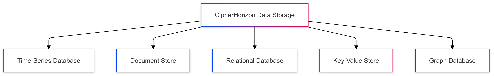
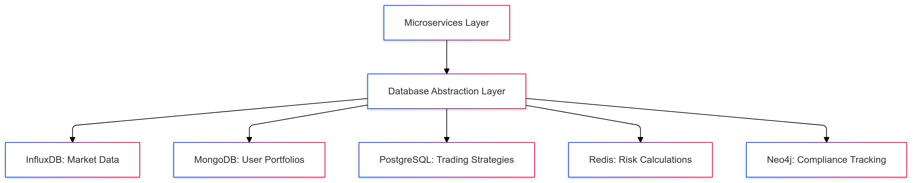

# Polyglot Persistence Strategy for CipherHorizon Microservices

## Prologue

In the context of building a distributed cryptocurrency trading analytics platform, facing challenges of diverse data storage requirements across different microservices, we decided to implement a polyglot persistence strategy to achieve optimal data storage performance, flexibility, and scalability accepting the increased complexity of managing multiple database technologies.

## Discussion

### Data Storage Challenges

- Varied data access patterns
- Different data consistency requirements
- Performance variations across service domains
- Complex querying needs
- Scalability concerns
- Compliance and regulatory requirements

### Current Landscape

- One-size-fits-all database approaches
- Performance bottlenecks
- Limited scalability
- Inefficient data modeling
- Increased operational complexity
- Increased system complexity
- Inefficient resource utilization

### Key Requirements

1. Optimal database selection per service
2. High performance for specific use cases
3. Horizontal scalability
4. Data consistency
5. Flexible querying capabilities
6. Cost-effective storage solutions

### Constraints

- Limited computational resources
- Database management overhead
- Team expertise
- Operational complexity

## Solution (Decision)

### Polyglot Persistence Architecture

#### Database Selection Strategy



#### Service-Specific Database Mapping

1. **Market Data Service**

   - **Database**: InfluxDB (Time-Series)
   - **Use Case**: High-frequency market data
   - **Key Features**
     - Optimized for time-based data
     - High write throughput
     - Efficient compression

2. **Trading Strategy Service**

   - **Database**: MongoDB (Document Store)
   - **Use Case**: Complex, evolving trading strategies
   - **Key Features**
     - Flexible schema
     - Rich query capabilities
     - Horizontal scaling

3. **User Portfolio Service**

   - **Database**: PostgreSQL (Relational)
   - **Use Case**: Complex relationships, transactions
   - **Key Features**
     - ACID compliance
     - Complex joins
     - Strong consistency

4. **Risk Management Service**

   - **Database**: Redis (Key-Value Store)
   - **Use Case**: Caching, real-time risk calculations
   - **Key Features**
     - In-memory performance
     - Atomic operations
     - Pub/Sub capabilities

5. **Social Trading Service**

   - **Database**: Neo4j (Graph Database)
   - **Use Case**: Social network analysis
   - **Key Features**
     - Relationship tracking
     - Complex graph traversals
     - Network effect modeling

### Data Model Examples

#### Time-Series Market Data

```PROTOBUF
message MarketTick {
    string exchange = 1;
    string symbol = 2;
    double price = 3;
    double volume = 4;
    int64 timestamp = 5;
}
```

#### Trading Strategy Document

```json
{
  "_id": "strategy_123",
  "name": "Momentum Trading",
  "type": "momentum",
  "rules": [
    {
      "indicator": "RSI",
      "condition": "above_70",
      "action": "sell"
    }
  ],
  "risk_profile": {
    "max_loss": 0.05,
    "volatility": 0.2
  }
}
```

### Inter-Database Synchronization

- Event-driven synchronization
- Change data capture (CDC)
- Eventual consistency model
- Kafka for event propagation

## Consequences

### Positive Outcomes

- Optimized data storage
- Improved query performance
- Flexible data modeling
- Service-specific database solutions
- Enhanced scalability

### Potential Risks

- Increased operational complexity
- Data consistency challenges
- Learning curve for multiple databases
- Cross-database querying limitations

### Mitigation Strategies

- Comprehensive monitoring
- Automated database management
- Continuous team training
- Performance optimization techniques

## Performance Metrics

### Target Specifications

- Query latency: < 50ms
- Write throughput: 10,000+ ops/second
- Storage efficiency: 70% compression
- Horizontal scaling: 5x current load

## Specific Implementation Details

### Data Migration Strategies

- Incremental migration
- Dual-write during transition
- Automated schema evolution
- Backward compatibility

### Monitoring and Observability

- Database performance metrics
- Distributed tracing
- Automated alerts
- Performance dashboards

## Future Considerations

- Serverless database solutions
- Machine learning-driven database optimization
- Advanced caching strategies
- Multi-region data replication

## Decision Validation Criteria

- Improved query performance
- Reduced storage costs
- Simplified service development
- Scalability under high load

## Alternatives Considered

1. Single database approach
2. Cloud-managed database services
3. Microservices with shared database

## Appendix

- Database benchmarks
- Migration playbooks
- Performance optimization guidelines

### Architectural Diagram


