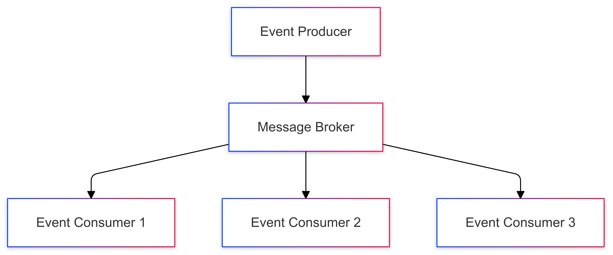
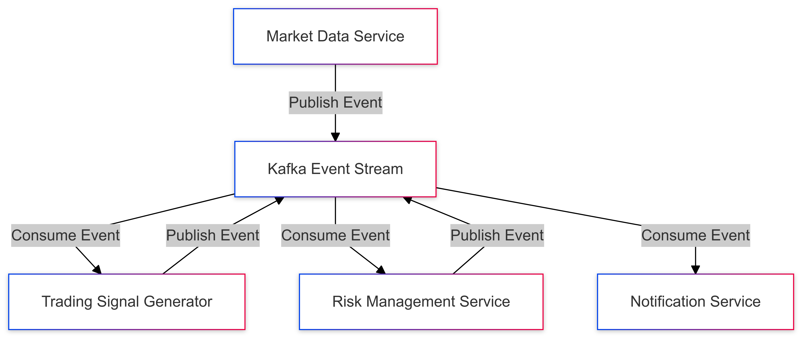

# Event-Driven Communication Strategy for CipherHorizon Microservices

## Prologue

In the context of building a distributed cryptocurrency trading analytics platform,  
facing challenges of complex inter-service communication, real-time data processing, and system decoupling,  
we decided to implement an event-driven communication architecture  
to achieve loose coupling, scalability, and responsive system design  
accepting the increased complexity of distributed event management.

## Discussion

### Communication Challenges

- Synchronous communication limitations
- High coupling between services
- Performance bottlenecks
- Scalability constraints
- Complex transactional requirements
- Real-time data propagation needs

### Current Landscape

- Traditional request-response patterns
- Tight service dependencies
- Limited system responsiveness
- Difficulty in handling complex workflows
- Challenges in system extensibility

### Key Communication Requirements

1. Asynchronous service interactions
2. Loose service coupling
3. Real-time event propagation
4. Resilient communication
5. Horizontal scalability
6. Eventual consistency
7. Audit trail capabilities

### Constraints

- Network latency
- Message delivery guarantees
- Computational overhead
- Event processing complexity

## Solution (Decision)

### Event-Driven Architecture Design

#### Core Communication Patterns



#### Event Types and Schemas

```PROTOBUF
syntax = "proto3";

message DomainEvent {
    string event_id = 1;
    string aggregate_id = 2;
    EventType type = 3;
    google.protobuf.Timestamp timestamp = 4;
    bytes payload = 5;
    map<string, string> metadata = 6;
}

enum EventType {
    MARKET_DATA_RECEIVED = 0;
    TRADING_SIGNAL_GENERATED = 1;
    RISK_THRESHOLD_CROSSED = 2;
    PORTFOLIO_REBALANCED = 3;
    USER_NOTIFICATION_TRIGGERED = 4;
}
```

### Event Publishing Mechanism

```go
type EventPublisher struct {
    kafkaProducer *kafka.Producer
    topic         string
}

func (p *EventPublisher) PublishEvent(event DomainEvent) error {
    // Serialize event
    eventBytes, err := proto.Marshal(event)
    if err != nil {
        return err
    }

    // Publish to Kafka
    return p.kafkaProducer.Produce(&kafka.Message{
        TopicPartition: kafka.TopicPartition{
            Topic:     &p.topic,
            Partition: kafka.PartitionAny,
        },
        Value: eventBytes,
    }, nil)
}
```

### Event Consumption Strategy

```go
type EventConsumer struct {
    kafkaConsumer *kafka.Consumer
    handlers     map[EventType]EventHandler
}

func (c *EventConsumer) ConsumeEvents() {
    for {
        msg, err := c.kafkaConsumer.ReadMessage(-1)
        if err != nil {
            // Handle error
            continue
        }

        var event DomainEvent
        err = proto.Unmarshal(msg.Value, &event)
        if err != nil {
            // Handle deserialization error
            continue
        }

        // Invoke appropriate handler
        handler, exists := c.handlers[event.Type]
        if exists {
            handler.Handle(event)
        }
    }
}
```

### Event Processing Workflow

1. **Event Sourcing**

   - Capture all state changes as events
   - Rebuild system state from event log
   - Provide complete audit trail

2. **CQRS (Command Query Responsibility Segregation)**

   - Separate read and write operations
   - Optimize for different data access patterns
   - Improved scalability

### Event Broker: Apache Kafka

- Distributed streaming platform
- High-throughput message processing
- Guaranteed message delivery
- Event replay capabilities

## Consequences (Results)

### Positive Outcomes

- Decoupled microservices
- Improved system responsiveness
- Scalable communication
- Flexible event processing
- Comprehensive system traceability

### Potential Challenges

- Eventual consistency complexity
- Increased operational overhead
- Message ordering challenges
- Debugging distributed systems

### Mitigation Strategies

- Comprehensive logging
- Distributed tracing
- Idempotent event handlers
- Retry and circuit breaker mechanisms

## Performance Metrics

### Target Specifications

- Event processing latency: < 50ms
- Message throughput: 100,000+ events/second
- Event delivery guarantee: 99.99%
- Scalability: Horizontal service expansion

## Implementation Roadmap

### Phase 1: Event Schema Design

- Define core domain events
- Create protobuf schemas
- Establish event naming conventions

### Phase 2: Infrastructure Setup

- Configure Kafka clusters
- Implement event publishers
- Develop event consumers

### Phase 3: Advanced Patterns

- Implement event sourcing
- Develop CQRS architecture
- Advanced error handling

## Decision Validation Criteria

- Successful event propagation
- Minimal service coupling
- Performance under high load
- System resilience

## Alternatives Considered

1. Synchronous REST communication
2. gRPC streaming
3. Message queues without event sourcing
4. Shared database communication

## Appendix

- Event schema definitions
- Kafka configuration
- Event processing guidelines

### Architectural Diagram


