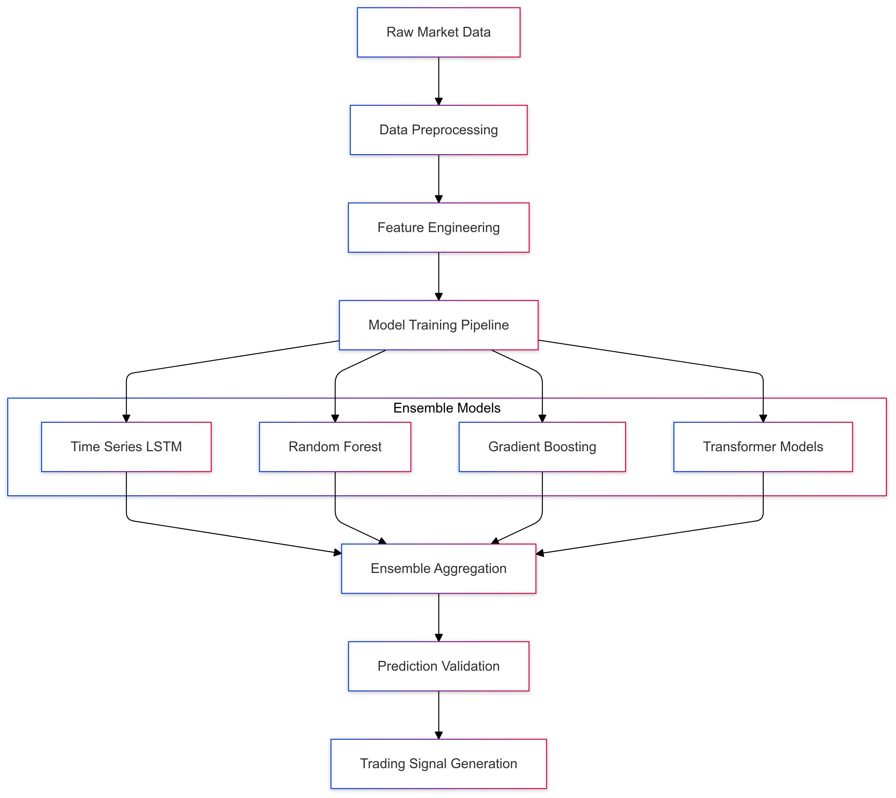

# Predictive Modeling Strategy for CipherHorizon Machine Learning Layer

## Prologue

In the context of building a sophisticated cryptocurrency trading analytics platform,  
facing challenges of complex market prediction and dynamic trading strategies,  
we decided to implement a hybrid predictive modeling approach  
to achieve accurate, adaptive, and interpretable market insights  
accepting the inherent complexity and computational overhead of advanced machine learning techniques.

## Discussion

### Predictive Modeling Challenges

- High volatility in cryptocurrency markets
- Complex, non-linear market dynamics
- Limited historical data
- Rapid market changes
- Diverse trading strategies
- Regulatory and ethical considerations

### Current Predictive Limitations

- Static prediction models
- Limited adaptability
- Poor generalization
- Lack of interpretability
- High false positive rates

### Key Modeling Requirements

1. Adaptive learning capabilities
2. Multi-model ensemble approach
3. Real-time model updating
4. Interpretable predictions
5. Risk-aware predictions
6. Computational efficiency

### Constraints

- Limited computational resources
- Data privacy
- Model training time
- Regulatory compliance
- Ethical AI considerations

## Solution (Decision)

### Predictive Modeling Architecture



### Modeling Strategies

#### 1. Ensemble Learning Approach

- Combine multiple model architectures
- Leverage strengths of different algorithms
- Reduce individual model bias
- Improve overall prediction accuracy

#### 2. Model Architectures

```python
class PredictiveModelEnsemble:
    def __init__(self):
        self.models = [
            TimeSeriesLSTM(),
            RandomForestRegressor(),
            GradientBoostingModel(),
            TransformerModel()
        ]

    def train(self, data):
        for model in self.models:
            model.fit(data)

    def predict(self, input_data):
        predictions = [
            model.predict(input_data)
            for model in self.models
        ]
        return self.aggregate_predictions(predictions)
```

#### 3. Feature Engineering

- Technical indicators
- Sentiment analysis
- Market sentiment
- Blockchain metrics
- Macroeconomic indicators

### Model Validation Framework

```python
class ModelValidator:
    def validate_model(self, model, test_data):
        metrics = {
            'accuracy': calculate_accuracy(model, test_data),
            'sharpe_ratio': calculate_sharpe_ratio(model),
            'max_drawdown': calculate_max_drawdown(model),
            'prediction_confidence': calculate_confidence_interval(model)
        }
        return metrics
```

### Continuous Learning Pipeline

1. Periodic model retraining
2. Online learning techniques
3. Adaptive hyperparameter optimization
4. Model performance tracking

### Prediction Confidence Scoring

```PROTOBUF
message PredictionResult {
    double predicted_price = 1;
    double confidence_score = 2;
    RiskLevel risk_level = 3;
    repeated FeatureImportance feature_impacts = 4;
}

enum RiskLevel {
    LOW = 0;
    MEDIUM = 1;
    HIGH = 2;
}
```

## Consequences (Results)

### Positive Outcomes

- Improved prediction accuracy
- Adaptive learning capabilities
- Reduced individual model bias
- Enhanced interpretability
- Risk-aware predictions

### Potential Challenges

- Increased computational complexity
- Model training overhead
- Potential overfitting
- Interpretability limitations

### Mitigation Strategies

- Regular model evaluation
- Robust validation frameworks
- Explainable AI techniques
- Continuous monitoring

## Performance Metrics

### Prediction Targets

- Accuracy: 70-85%
- Sharpe Ratio: > 1.5
- Maximum Drawdown: < 10%
- Prediction Confidence: 80%+

## Implementation Roadmap

### Phase 1: Foundation

- Initial model development
- Basic ensemble implementation
- Performance baseline

### Phase 2: Optimization

- Advanced feature engineering
- Hyperparameter tuning
- Model interpretability

### Phase 3: Advanced Capabilities

- Reinforcement learning integration
- Advanced ensemble techniques
- Real-time model adaptation

## Decision Validation Criteria

- Consistent performance improvement
- Reduced prediction error
- Adaptability to market changes
- Computational efficiency

## Alternatives Considered

1. Single model approach
2. Rule-based prediction systems
3. Traditional statistical methods
4. Black-box deep learning models

## Ethical Considerations

- Transparent prediction methodology
- Bias detection and mitigation
- User privacy protection
- Regulatory compliance

## Appendix

- Model architecture details
- Feature engineering techniques
- Validation methodology
- Performance benchmarks
