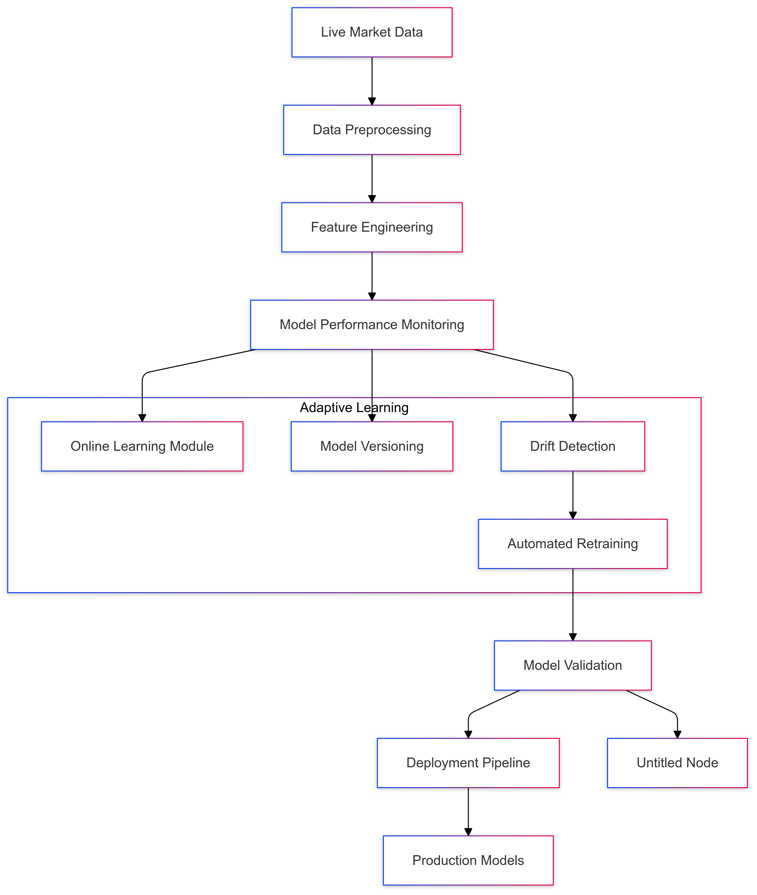
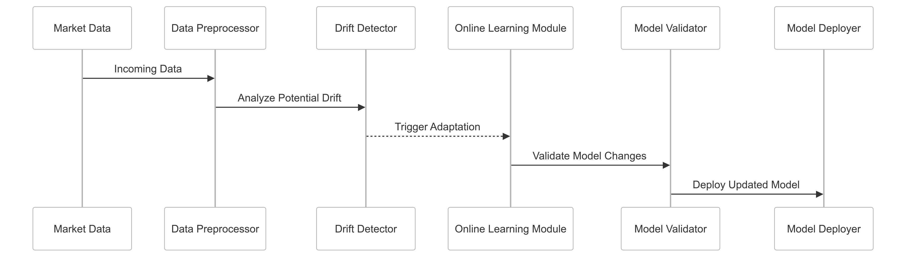

# Continuous Learning Strategy for CipherHorizon Machine Learning Layer

## Prologue

In the context of building an adaptive cryptocurrency trading analytics platform, facing challenges of rapidly evolving market dynamics and static machine learning models, we decided to implement a continuous learning architecture to achieve dynamic model adaptation, real-time performance improvement, and resilient predictive capabilities accepting the computational overhead and complexity of adaptive learning systems.

## Discussion

### Continuous Learning Challenges

- Rapidly changing cryptocurrency markets
- Limited predictive model longevity
- Dynamic market conditions
- Concept drift in trading strategies
- Performance degradation over time

### Current Learning Limitations

- Static model training
- Periodic manual retraining
- Limited adaptive capabilities
- High maintenance overhead
- Slow response to market changes

### Key Continuous Learning Requirements

1. Real-time model adaptation
2. Automated performance monitoring
3. Dynamic feature engineering
4. Minimal human intervention
5. Robust error correction
6. Scalable learning infrastructure

### Constraints

- Computational resources
- Data privacy
- Regulatory compliance
- Ethical AI considerations
- Model interpretability

## Solution

### Continuous Learning Architecture



### Continuous Learning Strategies

#### 1. Online Learning Mechanism

```python
class OnlineLearningModel:
    def __init__(self, base_model):
        self.base_model = base_model
        self.learning_rate = 0.01
        self.drift_detector = ConceptDriftDetector()

    def update(self, new_data):
        if self.drift_detector.detect_drift(new_data):
            self.adapt_model(new_data)

    def adapt_model(self, data):
        # Incremental learning logic
        self.base_model.partial_fit(data)
```

#### 2. Concept Drift Detection

- Statistical drift detection
- Performance metric monitoring
- Adaptive threshold mechanisms
- Multi-level drift identification

#### 3. Model Versioning and Tracking

```PROTOBUF
message ModelVersion {
    string version_id = 1;
    ModelPerformanceMetrics performance = 2;
    repeated FeatureImportance features = 3;
    google.protobuf.Timestamp created_at = 4;
    ModelStatus status = 5;
}

enum ModelStatus {
    EXPERIMENTAL = 0;
    PRODUCTION = 1;
    DEPRECATED = 2;
}
```

### Adaptive Feature Engineering

- Dynamic feature selection
- Automated feature importance ranking
- Contextual feature generation
- Temporal feature adaptation

### Learning Validation Framework

```python
class ContinuousLearningValidator:
    def validate_model_adaptation(self, old_model, new_model):
        performance_metrics = {
            'accuracy_improvement': calculate_accuracy_delta(),
            'generalization_score': assess_generalization(),
            'drift_mitigation': evaluate_drift_reduction(),
            'computational_efficiency': measure_resource_usage()
        }
        return performance_metrics
```

## Consequences

### Positive Outcomes

- Dynamic model adaptation
- Reduced performance degradation
- Automated learning process
- Minimal manual intervention
- Improved predictive resilience

### Potential Challenges

- Increased computational complexity
- Potential overfitting
- Model stability concerns
- Performance overhead

### Mitigation Strategies

- Robust validation frameworks
- Controlled learning rates
- Ensemble stabilization techniques
- Comprehensive monitoring

## Performance Metrics

### Continuous Learning Targets

- Adaptation Speed: < 1 hour
- Performance Improvement: 5-10% quarterly
- Drift Detection Accuracy: 85%+
- Resource Utilization: Minimal overhead

## Implementation Roadmap

### Phase 1: Foundation

- Initial online learning setup
- Basic drift detection
- Performance baseline

### Phase 2: Advanced Capabilities

- Multi-model adaptive ensemble
- Sophisticated drift detection
- Automated feature engineering

### Phase 3: Intelligent Adaptation

- Reinforcement learning integration
- Advanced concept drift handling
- Predictive maintenance of models

## Decision Validation Criteria

- Consistent performance improvement
- Reduced manual intervention
- Adaptive response to market changes
- Computational efficiency

## Alternatives Considered

1. Periodic batch retraining
2. Static model deployment
3. Manual model updates
4. External model replacement

## Ethical Considerations

- Transparent adaptation process
- Bias detection and mitigation
- User privacy protection
- Explainable model changes

## Appendix

- Online learning techniques
- Drift detection methodologies
- Model versioning strategy
- Performance benchmarks

### Continuous Learning Workflow


