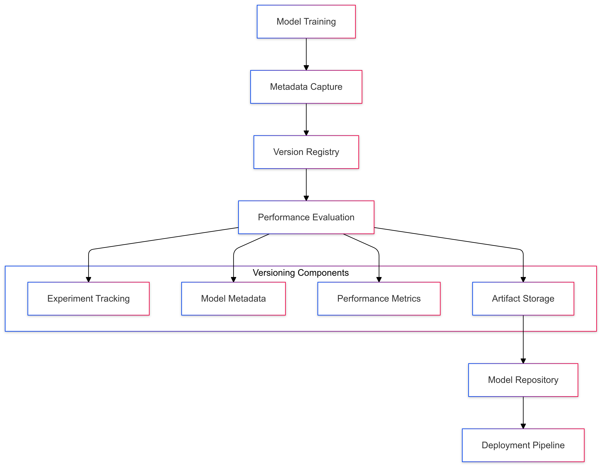
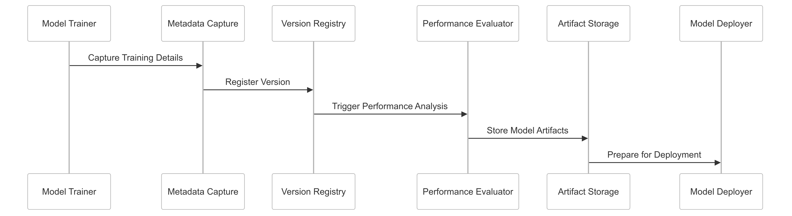

# ADR-009: Model Versioning Strategy for CipherHorizon Machine Learning Layer

## Prologue

In the context of building an advanced cryptocurrency trading analytics platform, facing challenges of model evolution, performance tracking, and reproducibility, we decided to implement a comprehensive model versioning strategy to achieve traceability, reproducibility, and systematic model management accepting the increased complexity of version control and metadata tracking.

## Discussion

### Model Versioning Challenges

- Rapid model iterations
- Performance tracking
- Reproducibility of experiments
- Compliance and audit requirements
- Model lineage and provenance
- Experimental vs. production models

### Current Versioning Limitations

- Manual model tracking
- Inconsistent metadata
- Limited experiment reproducibility
- Lack of systematic model comparison
- Difficulty in rollback scenarios

### Key Versioning Requirements

1. Comprehensive metadata tracking
2. Experiment reproducibility
3. Performance comparison
4. Automated version management
5. Compliance and auditing
6. Seamless model deployment

### Constraints

- Storage and computational overhead
- Metadata complexity
- Performance impact
- Regulatory compliance
- Team collaboration

## Solution

### Model Versioning Architecture



### Versioning Strategy Components

#### 1. Comprehensive Metadata Tracking

```PROTOBUF
message ModelVersion {
    string version_id = 1;
    string model_name = 2;
    ModelType model_type = 3;

    // Training Metadata
    TrainingParameters training_params = 4;
    DatasetMetadata dataset = 5;

    // Performance Metrics
    ModelPerformance performance = 6;

    // Lineage and Provenance
    repeated string parent_versions = 7;
    google.protobuf.Timestamp created_at = 8;

    // Deployment Information
    ModelStatus status = 9;
    DeploymentInfo deployment = 10;
}

enum ModelType {
    PRICE_PREDICTION = 0;
    TRADING_SIGNAL = 1;
    RISK_ASSESSMENT = 2;
}

enum ModelStatus {
    EXPERIMENTAL = 0;
    STAGING = 1;
    PRODUCTION = 2;
    DEPRECATED = 3;
}
```

#### 2. Version Management System

```python
class ModelVersionManager:
    def __init__(self, registry):
        self.registry = registry

    def create_version(self, model, training_data):
        version_metadata = {
            'version_id': generate_unique_id(),
            'model_type': model.type,
            'training_params': extract_training_params(model),
            'performance_metrics': evaluate_model(model, training_data),
            'dataset_signature': hash_dataset(training_data)
        }

        self.registry.register_version(version_metadata)
        return version_metadata

    def compare_versions(self, version1, version2):
        return performance_comparison(version1, version2)
```

### Versioning Workflow

1. Model Training
2. Metadata Capture
3. Performance Evaluation
4. Version Registration
5. Artifact Storage
6. Deployment Management

### Performance Tracking

```python
class ModelPerformanceTracker:
    def track_metrics(self, model_version):
        metrics = {
            'accuracy': calculate_accuracy(),
            'sharpe_ratio': calculate_sharpe_ratio(),
            'max_drawdown': calculate_max_drawdown(),
            'prediction_confidence': calculate_confidence()
        }

        self.store_performance(model_version, metrics)
        self.compare_with_previous_versions(metrics)
```

## Consequences

### Positive Outcomes

- Comprehensive model tracking
- Reproducible experiments
- Performance comparison
- Compliance and auditing
- Systematic model management

### Potential Challenges

- Increased storage requirements
- Metadata complexity
- Performance overhead
- Version management complexity

### Mitigation Strategies

- Efficient storage mechanisms
- Automated metadata generation
- Selective version tracking
- Periodic cleanup processes

## Performance Metrics

### Versioning Targets

- Version Registration Time: < 100ms
- Metadata Storage Overhead: < 5%
- Version Comparison Speed: < 50ms
- Artifact Storage Efficiency: 70%+ compression

## Implementation Roadmap

### Phase 1: Foundation

- Basic version tracking
- Metadata capture
- Performance baseline

### Phase 2: Advanced Capabilities

- Comprehensive metadata
- Performance comparison
- Automated version management

### Phase 3: Intelligent Versioning

- Machine learning-driven version selection
- Predictive model performance
- Automated deployment strategies

## Decision Validation Criteria

- Improved model reproducibility
- Reduced manual tracking effort
- Performance comparison capabilities
- Compliance with regulatory requirements

## Alternatives Considered

1. Manual version tracking
2. Simplified metadata approach
3. External version control systems
4. Cloud-based model registries

## Ethical Considerations

- Transparent model evolution
- Bias detection across versions
- Privacy-preserving metadata
- Explainable version changes

## Appendix

- Versioning architecture details
- Metadata schema
- Performance tracking methodology
- Deployment guidelines

### Model Versioning Workflow


