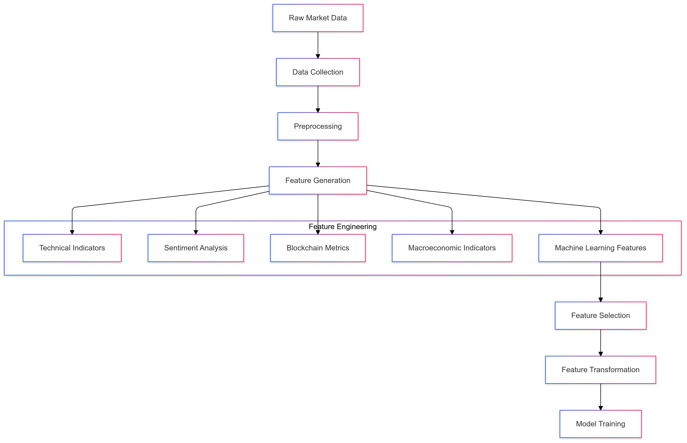
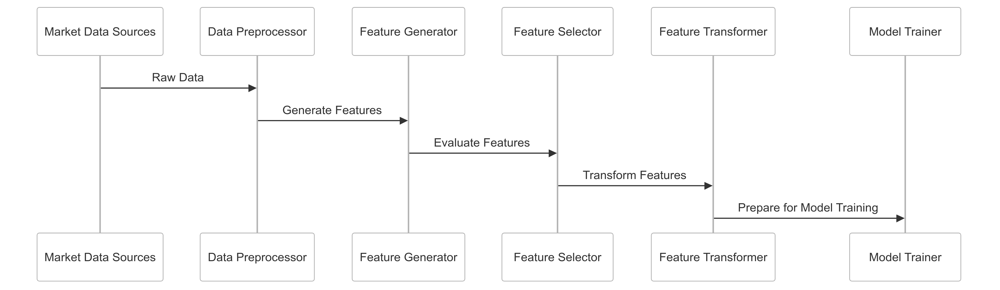

# Feature Engineering Strategy for CipherHorizon Machine Learning Layer

## Prologue

In the context of building an advanced cryptocurrency trading analytics platform, facing challenges of complex market dynamics and limited predictive capabilities, we decided to implement a comprehensive, adaptive feature engineering strategy to achieve enhanced model performance, interpretability, and predictive power accepting the computational complexity and ongoing refinement requirements.

## Discussion

### Feature Engineering Challenges

- Complex, non-linear cryptocurrency market dynamics
- Multiple data source integration
- Limited feature predictive power
- Rapid market evolution
- High-dimensional data
- Noise and irrelevant information

### Current Feature Limitations

- Static feature selection
- Limited domain-specific features
- Lack of adaptive feature generation
- Poor feature interaction modeling
- Insufficient context capture

### Key Feature Engineering Requirements

1. Adaptive feature generation
2. Multi-source data integration
3. Domain-specific feature creation
4. Dynamic feature selection
5. Interpretable feature importance
6. Computational efficiency

### Constraints

- Computational resources
- Data privacy
- Model complexity
- Training time
- Interpretability

## Solution (Decision)

### Feature Engineering Architecture



### Feature Engineering Strategies

#### 1. Comprehensive Feature Generation

```python
class FeatureEngineeringPipeline:
    def __init__(self, data_sources):
        self.sources = data_sources
        self.feature_generators = [
            TechnicalIndicatorGenerator(),
            SentimentFeatureGenerator(),
            BlockchainMetricGenerator(),
            MacroeconomicFeatureGenerator()
        ]

    def generate_features(self, market_data):
        features = {}
        for generator in self.feature_generators:
            features.update(generator.generate(market_data))
        return features
```

#### 2. Feature Categories

- **Technical Indicators**

  - Moving averages
  - Relative Strength Index (RSI)
  - Bollinger Bands
  - MACD

- **Sentiment Features**

  - Social media sentiment
  - News sentiment analysis
  - Community engagement metrics

- **Blockchain Metrics**

  - Network activity
  - Transaction volumes
  - Mining difficulty
  - Wallet concentration

- **Macroeconomic Indicators**

  - Global economic indicators
  - Currency exchange rates
  - Geopolitical events
  - Market volatility indices

#### 3. Dynamic Feature Selection

```python
class AdaptiveFeatureSelector:
    def select_features(self, feature_set, model_performance):
        feature_importance = self.calculate_importance(feature_set, model_performance)

        selected_features = self.rank_features(feature_importance)

        return self.prune_features(selected_features)

    def calculate_importance(self, features, performance):
        # Machine learning-based feature importance
        pass

    def rank_features(self, importance_scores):
        # Ranking and selection logic
        pass
```

### Feature Transformation Techniques

- Normalization
- Standardization
- Polynomial features
- Interaction terms
- Dimensionality reduction

### Feature Metadata Tracking

```PROTOBUF
message FeatureMetadata {
    string feature_id = 1;
    FeatureType type = 2;
    FeatureSource source = 3;
    double importance_score = 4;
    repeated string related_features = 5;
}

enum FeatureType {
    TECHNICAL_INDICATOR = 0;
    SENTIMENT = 1;
    BLOCKCHAIN = 2;
    MACROECONOMIC = 3;
}
```

## Consequences

### Positive Outcomes

- Enhanced model predictive power
- Adaptive feature generation
- Improved feature interpretability
- Multi-source data integration
- Dynamic feature selection

### Potential Challenges

- Computational complexity
- Overfitting risk
- Feature interaction complexity
- Increased training time

### Mitigation Strategies

- Regularization techniques
- Cross-validation
- Feature pruning
- Ensemble methods

## Performance Metrics

### Feature Engineering Targets

- Feature Relevance: > 80%
- Dimensionality Reduction: 30-50%
- Model Performance Improvement: 10-15%
- Computational Overhead: < 20%

## Implementation Roadmap

### Phase 1: Foundation

- Basic feature generation
- Initial feature selection
- Performance baseline

### Phase 2: Advanced Capabilities

- Adaptive feature generation
- Machine learning-driven selection
- Multi-source integration

### Phase 3: Intelligent Feature Engineering

- Automated feature discovery
- Predictive feature importance
- Continuous feature refinement

## Decision Validation Criteria

- Improved model performance
- Feature interpretability
- Computational efficiency
- Adaptive capabilities

## Alternatives Considered

1. Manual feature engineering
2. Static feature selection
3. Automated feature generation tools
4. Domain-expert-driven feature creation

## Ethical Considerations

- Transparent feature generation
- Bias detection in features
- Privacy-preserving feature extraction
- Explainable feature importance

## Appendix

- Feature generation techniques
- Selection methodology
- Performance benchmarks
- Feature interaction analysis

### Feature Engineering Workflow


