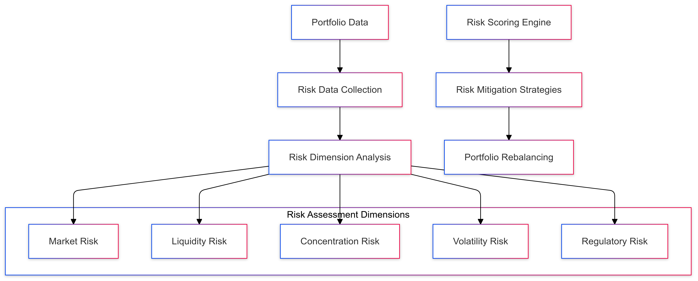

# Portfolio Risk Assessment Strategy for CipherHorizon Risk Management Layer

## Prologue

In the context of building a sophisticated cryptocurrency trading analytics platform, facing challenges of complex risk management and dynamic market volatility, we decided to implement a comprehensive, multi-dimensional portfolio risk assessment strategy to achieve robust risk mitigation, dynamic asset allocation, and proactive risk management accepting the computational complexity and inherent market uncertainties.

## Discussion

### Risk Assessment Challenges

- High cryptocurrency market volatility
- Complex asset interdependencies
- Rapid market state changes
- Diverse risk dimensions
- Regulatory compliance requirements
- User-specific risk tolerances

### Current Risk Management Limitations

- Static risk assessment models
- Limited multi-asset analysis
- Insufficient real-time risk monitoring
- Poor predictive risk capabilities
- Lack of personalized risk strategies

### Key Risk Assessment Requirements

1. Multi-dimensional risk analysis
2. Real-time risk monitoring
3. Personalized risk profiles
4. Predictive risk modeling
5. Automated risk mitigation
6. Regulatory compliance

### Constraints

- Computational resources
- Data processing complexity
- Market unpredictability
- Regulatory restrictions
- User privacy

## Solution

### Risk Assessment Architecture



### Risk Assessment Strategies

#### 1. Comprehensive Risk Scoring Model

```python
class PortfolioRiskAssessment:
    def __init__(self, portfolio_data):
        self.portfolio = portfolio_data
        self.risk_dimensions = [
            MarketRiskAnalyzer(),
            LiquidityRiskAnalyzer(),
            ConcentrationRiskAnalyzer(),
            VolatilityRiskAnalyzer(),
            RegulatoryRiskAnalyzer()
        ]

    def calculate_risk_score(self):
        risk_scores = {}
        for analyzer in self.risk_dimensions:
            risk_scores[analyzer.__class__.__name__] = analyzer.assess(self.portfolio)

        return self.aggregate_risk_score(risk_scores)
```

#### 2. Risk Dimensions

- **Market Risk**
  - Price volatility
  - Market correlation
  - Systematic risk factors
- **Liquidity Risk**
  - Trading volume
  - Exchange liquidity
  - Asset convertibility
- **Concentration Risk**
  - Portfolio diversification
  - Asset allocation
  - Sector exposure
- **Volatility Risk**
  - Historical price fluctuations
  - Implied volatility
  - Stress testing
- **Regulatory Risk**
  - Compliance monitoring
  - Geopolitical factors
  - Regulatory changes

#### 3. Risk Scoring Mechanism

```PROTOBUF
message RiskScore {
    double overall_risk_score = 1;
    map<string, double> dimension_scores = 2;
    RiskLevel risk_level = 3;
    repeated RiskMitigationRecommendation recommendations = 4;
}

enum RiskLevel {
    LOW = 0;
    MODERATE = 1;
    HIGH = 2;
    CRITICAL = 3;
}
```

### Risk Mitigation Strategies

- Dynamic asset allocation
- Automated portfolio rebalancing
- Hedging strategies
- Stop-loss mechanisms
- Diversification recommendations

### Predictive Risk Modeling

```python
class PredictiveRiskModel:
    def forecast_risk(self, portfolio, market_conditions):
        risk_prediction = {
            'short_term_risk': self.short_term_risk_forecast(portfolio),
            'long_term_risk': self.long_term_risk_forecast(portfolio),
            'stress_scenario_risk': self.stress_test_risk(portfolio, market_conditions)
        }
        return risk_prediction
```

## Consequences

### Positive Outcomes

- Comprehensive risk assessment
- Dynamic risk monitoring
- Personalized risk strategies
- Proactive risk mitigation
- Regulatory compliance

### Potential Challenges

- Computational complexity
- Model prediction accuracy
- Rapid market changes
- Regulatory adaptation

### Mitigation Strategies

- Continuous model refinement
- Machine learning adaptation
- Comprehensive monitoring
- Regulatory compliance tracking

## Performance Metrics

### Risk Assessment Targets

- Risk Score Accuracy: 85%+
- Real-time Risk Monitoring: < 100ms
- Mitigation Recommendation Precision: 75%
- Computational Overhead: < 15%

## Implementation Roadmap

### Phase 1: Foundation

- Basic risk dimension analysis
- Initial risk scoring mechanism
- Performance baseline

### Phase 2: Advanced Capabilities

- Machine learning risk prediction
- Multi-dimensional risk analysis
- Automated mitigation strategies

### Phase 3: Intelligent Risk Management

- Predictive risk forecasting
- Adaptive risk strategies
- Comprehensive regulatory compliance

## Decision Validation Criteria

- Improved risk management
- Reduced portfolio losses
- Regulatory compliance
- User satisfaction

## Alternatives Considered

1. Static risk assessment
2. Manual risk management
3. Single-dimension risk analysis
4. External risk assessment services

## Ethical Considerations

- Transparent risk assessment
- User privacy protection
- Fair risk scoring
- Bias mitigation in risk models

## Appendix

- Risk assessment methodology
- Scoring algorithm details
- Mitigation strategy guidelines
- Performance benchmarks

### Risk Assessment Workflow


