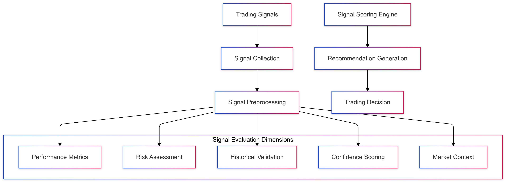
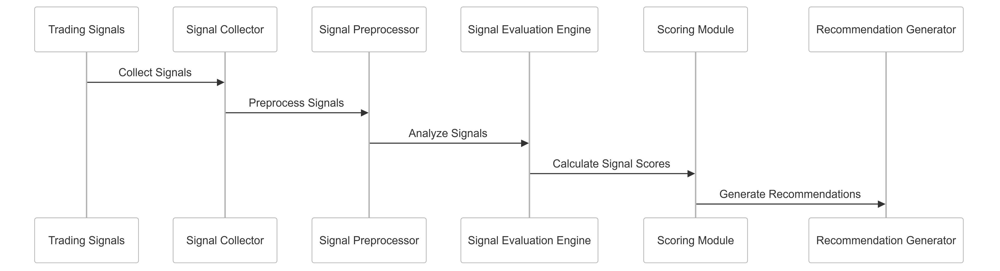

# Trading Signal Evaluation Strategy for CipherHorizon Risk Management Layer

## Prologue

In the context of building an advanced cryptocurrency trading analytics platform,  
facing challenges of complex signal generation and reliable trading recommendations,  
we decided to implement a comprehensive trading signal evaluation framework  
to achieve robust, reliable, and risk-aware trading signal assessment  
accepting the inherent complexity of market prediction and potential false positives.

## Discussion

### Trading Signal Challenges

- High cryptocurrency market volatility
- Multiple signal generation sources
- Conflicting trading recommendations
- Signal reliability and consistency
- Risk-adjusted decision making
- Rapid market state changes

### Current Signal Evaluation Limitations

- Simplistic signal scoring
- Lack of multi-dimensional evaluation
- Poor risk integration
- Limited historical performance tracking
- Insufficient signal confidence assessment

### Key Signal Evaluation Requirements

1. Multi-source signal aggregation
2. Comprehensive signal scoring
3. Risk-adjusted evaluation
4. Historical performance tracking
5. Confidence interval calculation
6. Dynamic signal weighting

### Constraints

- Computational resources
- Real-time processing requirements
- Signal generation complexity
- Market unpredictability

## Solution

### Trading Signal Evaluation Architecture



### Signal Evaluation Strategies

#### 1. Comprehensive Signal Scoring Framework

```python
class TradingSignalEvaluator:
    def __init__(self, signal_sources):
        self.sources = signal_sources
        self.evaluation_modules = [
            PerformanceMetricsAnalyzer(),
            RiskAssessmentModule(),
            HistoricalValidationModule(),
            ConfidenceScoreCalculator(),
            MarketContextAnalyzer()
        ]

    def evaluate_signals(self, signals):
        evaluation_results = {}
        for module in self.evaluation_modules:
            evaluation_results[module.__class__.__name__] = module.analyze(signals)

        return self.aggregate_signal_score(evaluation_results)
```

#### 2. Signal Evaluation Dimensions

- **Performance Metrics**

  - Historical accuracy
  - Profit potential
  - Return on investment
  - Win/loss ratio

- **Risk Assessment**

  - Potential drawdown
  - Volatility impact
  - Risk-adjusted returns
  - Correlation with portfolio

- **Historical Validation**

  - Backtesting performance
  - Consistency across market conditions
  - Long-term signal reliability
  - Adaptation to market changes

- **Confidence Scoring**

  - Machine learning confidence
  - Statistical significance
  - Model uncertainty
  - Prediction interval

- **Market Context**

  - Current market sentiment
  - Macroeconomic indicators
  - Blockchain network metrics
  - Geopolitical factors

#### 3. Signal Scoring Mechanism

```PROTOBUF
message TradingSignalScore {
    string signal_id = 1;
    double overall_score = 2;
    map<string, double> dimension_scores = 3;
    SignalRecommendation recommendation = 4;
    ConfidenceInterval confidence = 5;
}

enum SignalRecommendation {
    STRONG_BUY = 0;
    BUY = 1;
    HOLD = 2;
    SELL = 3;
    STRONG_SELL = 4;
}
```

### Signal Aggregation and Weighting

- Ensemble signal combination
- Dynamic source weighting
- Machine learning-based aggregation
- Adaptive signal selection

### Confidence Interval Calculation

```Python
class ConfidenceIntervalCalculator:
    def calculate_interval(self, signals):
        confidence_metrics = {
            'prediction_range': self.calculate_prediction_range(signals),
            'statistical_significance': self.calculate_significance(signals),
            'model_uncertainty': self.estimate_uncertainty(signals)
        }
        return self.construct_confidence_interval(confidence_metrics)
```

## Consequences

### Positive Outcomes

- Comprehensive signal evaluation
- Risk-aware trading recommendations
- Improved decision-making reliability
- Multi-dimensional signal assessment
- Adaptive signal weighting

### Potential Challenges

- Computational complexity
- Signal aggregation overhead
- Potential conflicting recommendations
- Model prediction uncertainty

### Mitigation Strategies

- Efficient computational techniques
- Continuous model refinement
- Transparent evaluation process
- Comprehensive monitoring

## Performance Metrics

### Signal Evaluation Targets

- Signal Accuracy: 75-85%
- Evaluation Latency: < 100ms
- Confidence Interval Precision: 90%
- Computational Overhead: < 20%

## Implementation Roadmap

### Phase 1: Foundation

- Basic signal scoring mechanism
- Initial evaluation dimensions
- Performance baseline

### Phase 2: Advanced Capabilities

- Machine learning signal aggregation
- Multi-dimensional evaluation
- Adaptive weighting strategies

### Phase 3: Intelligent Signal Assessment

- Predictive signal reliability
- Automated source credibility tracking
- Comprehensive market context integration

## Decision Validation Criteria

- Improved trading recommendation quality
- Reduced false positive signals
- Enhanced risk-adjusted performance
- User satisfaction and trust

## Alternatives Considered

1. Simple signal scoring
2. Manual signal evaluation
3. Single-source signal assessment
4. External signal validation services

## Ethical Considerations

- Transparent signal evaluation
- Bias mitigation in signal scoring
- Fair recommendation generation
- User privacy protection

## Appendix

- Signal evaluation methodology
- Scoring algorithm details
- Confidence calculation guidelines
- Performance benchmarks

### Signal Evaluation Workflow


