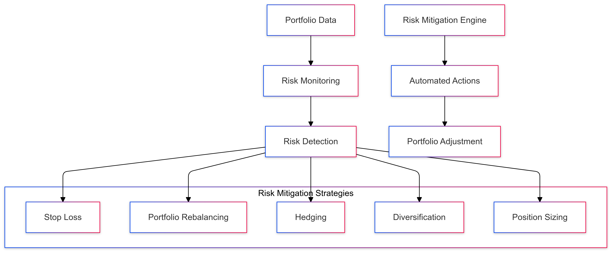
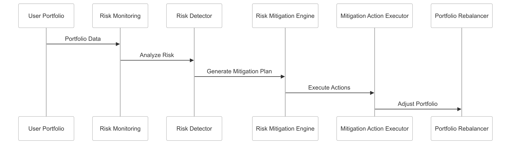

# Automated Risk Mitigation Strategy for CipherHorizon Risk Management Layer

## Prologue

In the context of building an advanced cryptocurrency trading analytics platform, facing challenges of dynamic market risks and complex portfolio management, we decided to implement a comprehensive automated risk mitigation framework to achieve proactive risk reduction, dynamic asset protection, and intelligent portfolio optimization accepting the inherent complexity of automated decision-making and potential limitations.

## Discussion

### Risk Mitigation Challenges

- Extreme cryptocurrency market volatility
- Rapid market state changes
- Complex risk interdependencies
- User-specific risk tolerances
- Regulatory compliance requirements
- Real-time risk management needs

### Current Risk Mitigation Limitations

- Manual risk intervention
- Delayed risk response
- Limited risk scenario coverage
- Inconsistent risk management
- Poor adaptive capabilities
- High human error potential

### Key Risk Mitigation Requirements

1. Real-time risk detection
2. Automated intervention strategies
3. Personalized risk thresholds
4. Dynamic portfolio rebalancing
5. Comprehensive risk coverage
6. Regulatory compliance

### Constraints

- Computational resources
- Market unpredictability
- Regulatory restrictions
- User trust and transparency

## Solution

### Automated Risk Mitigation Architecture



### Risk Mitigation Strategies

#### 1. Comprehensive Risk Management Framework

```python
class AutomatedRiskMitigator:
    def __init__(self, portfolio, risk_profile):
        self.portfolio = portfolio
        self.risk_profile = risk_profile
        self.mitigation_strategies = [
            StopLossStrategy(),
            PortfolioRebalancingStrategy(),
            HedgingStrategy(),
            DiversificationStrategy(),
            PositionSizingStrategy()
        ]

    def evaluate_and_mitigate(self):
        risk_assessment = self.assess_portfolio_risk()

        mitigation_actions = []
        for strategy in self.mitigation_strategies:
            actions = strategy.apply(risk_assessment, self.portfolio)
            mitigation_actions.extend(actions)

        return self.execute_mitigation_actions(mitigation_actions)
```

#### 2. Risk Mitigation Dimensions

- **Stop Loss Mechanism**

  - Dynamic threshold setting
  - Percentage-based and trailing stops
  - Asset-specific stop loss rules

- **Portfolio Rebalancing**

  - Automated asset allocation
  - Correlation-based rebalancing
  - Tax-efficient repositioning

- **Hedging Strategies**

  - Derivative-based hedging
  - Cross-asset risk reduction
  - Volatility protection

- **Diversification**

  - Asset class diversification
  - Sector allocation
  - Geographic risk distribution

- **Position Sizing**

  - Risk-adjusted position allocation
  - Kelly criterion implementation
  - Adaptive position scaling

#### 3. Risk Mitigation Action Schema

```PROTOBUF
message RiskMitigationAction {
    ActionType type = 1;
    string asset_id = 2;
    double action_value = 3;
    RiskLevel risk_level = 4;
    google.protobuf.Timestamp timestamp = 5;
}

enum ActionType {
    STOP_LOSS = 0;
    SELL_PARTIAL = 1;
    REBALANCE = 2;
    HEDGE = 3;
    DIVERSIFY = 4;
}
```

### Intelligent Decision Engine

```python
class RiskDecisionEngine:
    def generate_mitigation_plan(self, risk_assessment):
        decision_tree = {
            'low_risk': self.low_risk_strategy,
            'moderate_risk': self.moderate_risk_strategy,
            'high_risk': self.high_risk_strategy,
            'critical_risk': self.critical_risk_strategy
        }

        risk_level = self.classify_risk_level(risk_assessment)
        mitigation_plan = decision_tree[risk_level](risk_assessment)

        return self.validate_mitigation_plan(mitigation_plan)
```

## Consequences

### Positive Outcomes

- Proactive risk management
- Real-time portfolio protection
- Personalized risk strategies
- Reduced human error
- Consistent risk approach

### Potential Challenges

- Algorithmic decision limitations
- Unexpected market behaviors
- Computational complexity
- User trust and transparency

### Mitigation Strategies

- Comprehensive backtesting
- Transparent decision logging
- Human oversight mechanisms
- Continuous algorithm refinement

## Performance Metrics

### Risk Mitigation Targets

- Risk Reduction Efficiency: 70%+
- Mitigation Response Time: < 100ms
- False Positive Rate: < 15%
- Computational Overhead: < 20%

## Implementation Roadmap

### Phase 1: Foundation

- Basic risk mitigation rules
- Initial strategy implementation
- Performance baseline

### Phase 2: Advanced Capabilities

- Machine learning risk prediction
- Adaptive mitigation strategies
- Comprehensive risk coverage

### Phase 3: Intelligent Risk Management

- Predictive risk mitigation
- Automated strategy evolution
- Advanced decision complexity

## Decision Validation Criteria

- Improved portfolio protection
- Reduced potential losses
- Consistent risk management
- User satisfaction

## Alternatives Considered

1. Manual risk management
2. Static risk mitigation rules
3. External risk management services
4. Limited automated interventions

## Ethical Considerations

- Transparent decision-making
- User consent and control
- Fair risk management
- Algorithmic bias prevention

## Appendix

- Risk mitigation methodology
- Decision engine details
- Performance benchmarks
- Compliance guidelines

### Risk Mitigation Workflow


