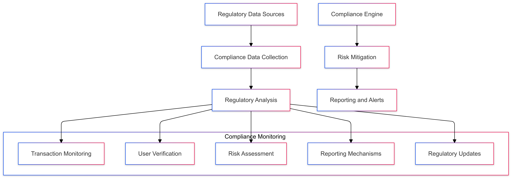

# Compliance Monitoring Strategy for CipherHorizon Risk Management Layers

## Prologue

In the context of building a sophisticated cryptocurrency trading analytics platform, facing challenges of complex regulatory landscapes and evolving compliance requirements, we decided to implement a comprehensive, adaptive compliance monitoring framework to achieve robust regulatory adherence, real-time risk detection, and proactive compliance management accepting the inherent complexity of multi-jurisdictional regulatory environments.

## Discussion

### Compliance Monitoring Challenges

- Complex, evolving cryptocurrency regulations
- Multi-jurisdictional legal requirements
- Rapid technological and regulatory changes
- Diverse international compliance standards
- High-stakes regulatory risks
- User privacy and data protection

### Current Compliance Limitations

- Manual compliance tracking
- Fragmented regulatory understanding
- Delayed risk detection
- Inconsistent compliance approaches
- Limited cross-border regulatory insights
- High compliance management overhead

### Key Compliance Monitoring Requirements

1. Real-time regulatory tracking
2. Automated compliance assessment
3. Multi-jurisdictional coverage
4. Dynamic rule adaptation
5. Comprehensive risk detection
6. Transparent reporting mechanisms

### Constraints

- Regulatory complexity
- Computational resources
- Rapid regulatory evolution
- International legal variations

## Solution

### Compliance Monitoring Architecture



### Compliance Monitoring Strategies

#### 1. Comprehensive Compliance Framework

```python
class ComplianceMonitoringSystem:
    def __init__(self, regulatory_sources):
        self.sources = regulatory_sources
        self.monitoring_modules = [
            TransactionMonitoringModule(),
            UserVerificationModule(),
            RiskAssessmentModule(),
            ReportingModule(),
            RegulatoryUpdateTracker()
        ]

    def perform_compliance_check(self, user_activities):
        compliance_results = {}
        for module in self.monitoring_modules:
            module_results = module.analyze(user_activities)
            compliance_results[module.__class__.__name__] = module_results

        return self.evaluate_compliance_status(compliance_results)
```

#### 2. Compliance Monitoring Dimensions

- **Transaction Monitoring**
  - Suspicious activity detection
  - Anti-money laundering (AML) checks
  - Unusual transaction pattern identification
  - Cross-border transaction analysis
- **User Verification**
  - Know Your Customer (KYC) compliance
  - Identity verification
  - Risk profiling
  - Ongoing user assessment
- **Risk Assessment**
  - Regulatory risk scoring
  - Compliance violation prediction
  - Jurisdictional risk mapping
  - Emerging regulatory trend analysis
- **Reporting Mechanisms**
  - Automated compliance reports
  - Regulatory submission preparation
  - Audit trail generation
  - Transparent disclosure
- **Regulatory Update Tracking**
  - Real-time regulatory changes
  - Multi-jurisdictional law monitoring
  - Adaptive compliance rules
  - Predictive regulatory impact analysis

#### 3. Compliance Monitoring Schema

```protobuf
message ComplianceAssessment {
    string user_id = 1;
    ComplianceStatus status = 2;
    repeated ComplianceViolation violations = 3;
    RiskScore risk_score = 4;
    google.protobuf.Timestamp assessment_time = 5;
}

enum ComplianceStatus {
    COMPLIANT = 0;
    REQUIRES_REVIEW = 1;
    POTENTIAL_VIOLATION = 2;
    NON_COMPLIANT = 3;
}
```

### Intelligent Compliance Decision Engine

```python
class RegulatoryComplianceEngine:
    def assess_compliance_risk(self, user_data, regulatory_landscape):
        risk_assessment = {
            'transaction_risk': self.analyze_transaction_risk(user_data),
            'jurisdictional_risk': self.map_regulatory_risks(regulatory_landscape),
            'user_profile_risk': self.evaluate_user_risk_profile(user_data)
        }

        return self.generate_compliance_recommendation(risk_assessment)
```

## Consequences

### Positive Outcomes

- Proactive regulatory compliance
- Real-time risk detection
- Comprehensive monitoring
- Reduced legal risks
- Transparent reporting

### Potential Challenges

- Regulatory complexity
- Computational overhead
- False positive risks
- Rapid regulatory changes

### Mitigation Strategies

- Continuous model refinement
- Expert regulatory review
- Adaptive monitoring algorithms
- Transparent decision logging

## Performance Metrics

### Compliance Monitoring Targets

- Compliance Detection Accuracy: 90%+
- Monitoring Response Time: < 200ms
- False Positive Rate: < 10%
- Regulatory Update Tracking: Real-time

## Implementation Roadmap

### Phase 1: Foundation

- Basic compliance rules
- Initial monitoring framework
- Performance baseline

### Phase 2: Advanced Capabilities

- Machine learning compliance prediction
- Multi-jurisdictional coverage
- Comprehensive risk assessment

### Phase 3: Intelligent Compliance Management

- Predictive regulatory adaptation
- Advanced risk modeling
- Automated compliance strategy

## Decision Validation Criteria

- Reduced regulatory risks
- Comprehensive monitoring
- User trust and transparency
- Minimal compliance violations

## Alternatives Considered

1. Manual compliance tracking
2. Limited automated monitoring
3. External compliance services
4. Static compliance rules

## Ethical Considerations

- Transparent monitoring processes
- User privacy protection
- Fair risk assessment
- Algorithmic bias prevention

## Appendix

- Compliance monitoring methodology
- Regulatory analysis techniques
- Performance benchmarks
- Reporting guidelines

### Compliance Monitoring Workflow


