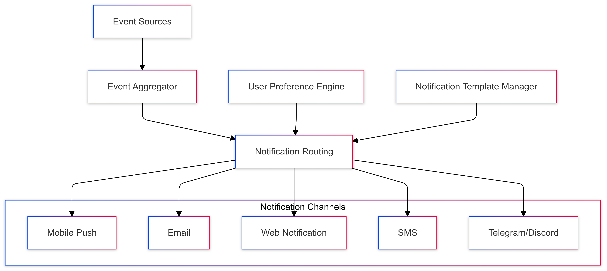
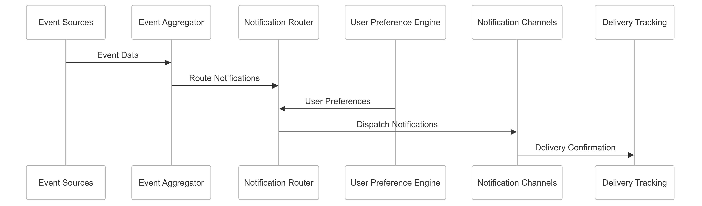

# Real-Time Alerts Strategy for CipherHorizon Notification and Reporting Layer

## Prologue

In the context of building a sophisticated cryptocurrency trading analytics platform, facing challenges of timely information delivery and user engagement, we decided to implement a comprehensive real-time alerting framework  
to achieve instant, personalized, and multi-channel user notifications accepting the complexity of distributed event processing and potential notification fatigue.

## Discussion

### Real-Time Alert Challenges

- High-frequency market changes
- Diverse user notification preferences
- Multiple communication channels
- Low-latency information delivery
- Personalized alert relevance
- Cross-platform notification support

### Current Notification Limitations

- Delayed information delivery
- Generic alert mechanisms
- Limited personalization
- Poor user engagement
- Inconsistent notification experiences
- High manual intervention

### Key Real-Time Alert Requirements

1. Instant event notification
2. Multi-channel delivery
3. Personalized alert configuration
4. Low-latency processing
5. Adaptive notification strategies
6. Comprehensive event coverage

### Constraints

- Network latency
- User device capabilities
- Computational resources
- User attention management
- Privacy considerations

## Solution

### Real-Time Alerts Architecture



### Alert Notification Strategies

#### 1. Comprehensive Notification Framework

```python
class RealTimeAlertSystem:
    def __init__(self, event_sources, notification_channels):
        self.sources = event_sources
        self.channels = notification_channels
        self.notification_modules = [
            EventAggregatorModule(),
            UserPreferenceModule(),
            NotificationRoutingModule(),
            DeliveryTrackingModule()
        ]

    def process_events(self, events):
        processed_notifications = []
        for module in self.notification_modules:
            module_result = module.process(events)
            processed_notifications.extend(module_result)

        return self.dispatch_notifications(processed_notifications)
```

#### 2. Notification Delivery Channels

- **Mobile Push Notifications**
  - iOS/Android support
  - Device-specific optimization
  - Background processing
- **Email Notifications**
  - HTML-formatted alerts
  - Template-based design
  - Deliverability tracking
- **Web Notifications**
  - Browser push notifications
  - Real-time web socket updates
  - Progressive web app support
- **SMS Alerts**
  - Short message delivery
  - Carrier-agnostic routing
  - International support
- **Instant Messaging**
  - Telegram integration
  - Discord notifications
  - Webhook support

#### 3. Notification Schema

```protobuf
message NotificationEvent {
    string event_id = 1;
    EventType type = 2;
    NotificationPriority priority = 3;
    map<string, string> event_details = 4;
    repeated NotificationChannel channels = 5;
    UserPreferences user_preferences = 6;
}

enum EventType {
    TRADING_SIGNAL = 0;
    RISK_THRESHOLD = 1;
    PORTFOLIO_CHANGE = 2;
    COMPLIANCE_ALERT = 3;
}

enum NotificationPriority {
    LOW = 0;
    MEDIUM = 1;
    HIGH = 2;
    CRITICAL = 3;
}
```

### Intelligent Notification Routing

```python
class NotificationRoutingEngine:
    def route_notification(self, event, user_profile):
        routing_strategy = {
            'priority_based': self.priority_routing,
            'user_preference_based': self.preference_routing,
            'context_aware': self.context_routing
        }

        selected_channels = routing_strategy[user_profile.routing_mode](event, user_profile)
        return self.optimize_notification_delivery(selected_channels)
```

## Consequences

### Positive Outcomes

- Instant event notifications
- Personalized alert experiences
- Multi-channel support
- Improved user engagement
- Comprehensive event coverage

### Potential Challenges

- Notification fatigue
- Complex routing logic
- Performance overhead
- Cross-platform compatibility

### Mitigation Strategies

- Adaptive notification frequency
- User-configurable preferences
- Intelligent routing algorithms
- Performance optimization

## Performance Metrics

### Real-Time Alert Targets

- Notification Latency: < 100ms
- Delivery Success Rate: 99%+
- User Engagement Improvement: 30%
- Channel Diversity: 5+ channels

## Implementation Roadmap

### Phase 1: Foundation

- Basic notification routing
- Initial channel support
- Performance baseline

### Phase 2: Advanced Capabilities

- Machine learning-driven routing
- Comprehensive channel integration
- Adaptive notification strategies

### Phase 3: Intelligent Notification Management

- Predictive user engagement
- Advanced routing algorithms
- Personalization at scale

## Decision Validation Criteria

- Improved user satisfaction
- Reduced notification overhead
- Comprehensive event coverage
- Performance efficiency

## Alternatives Considered

1. Single-channel notifications
2. Manual alert management
3. External notification services
4. Limited event coverage

## Ethical Considerations

- User privacy protection
- Transparent notification mechanisms
- Opt-out capabilities
- Minimal data usage

## Appendix

- Notification routing methodology
- Channel integration techniques
- Performance benchmarks
- User preference management

### Notification Workflow


