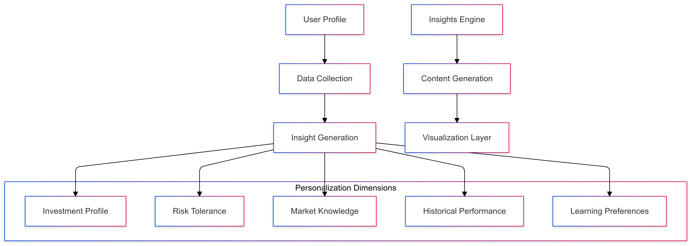
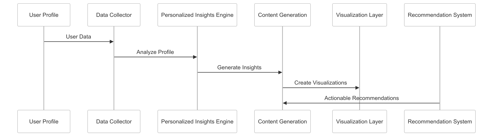

# Personalized Insights Strategy for CipherHorizon Notification and Reporting Layer

## Prologue

In the context of building an advanced cryptocurrency trading analytics platform, facing challenges of diverse user needs and complex market information, we decided to implement a comprehensive personalized insights framework to achieve tailored, actionable, and contextually relevant user insights accepting the computational complexity and ongoing personalization requirements.

## Discussion

### Personalized Insights Challenges

- Diverse user investment profiles
- Varying financial literacy levels
- Complex market information
- Individual risk tolerances
- Contextual relevance
- Information overload

### Current Insights Limitations

- Generic reporting
- One-size-fits-all approach
- Limited user context understanding
- Poor information digestibility
- Lack of actionable recommendations
- Minimal user engagement

### Key Personalized Insights Requirements

1. User-specific content generation
2. Adaptive insight complexity
3. Multi-dimensional analysis
4. Actionable recommendations
5. Dynamic content personalization
6. Intuitive visualization

### Constraints

- Computational resources
- Data privacy
- Machine learning capabilities
- User experience design
- Regulatory compliance

## Solution

### Personalized Insights Architecture



### Personalization Strategies

#### 1. Comprehensive Insights Framework

```python
class PersonalizedInsightsGenerator:
    def __init__(self, user_profile):
        self.profile = user_profile
        self.insight_modules = [
            InvestmentProfileAnalyzer(),
            RiskToleranceModule(),
            MarketKnowledgeAssessment(),
            PerformanceContextualizer(),
            LearningPreferenceAdapter()
        ]

    def generate_insights(self, market_data):
        personalized_insights = []
        for module in self.insight_modules:
            module_insights = module.analyze(
                market_data,
                self.profile
            )
            personalized_insights.extend(module_insights)

        return self.curate_insights(personalized_insights)
```

#### 2. Personalization Dimensions

- **Investment Profile Analysis**
  - Portfolio composition
  - Investment goals
  - Asset allocation preferences
  - Historical trading behavior
- **Risk Tolerance Mapping**
  - Dynamic risk scoring
  - Psychological risk assessment
  - Adaptive risk recommendations
  - Personalized risk visualization
- **Market Knowledge Adaptation**
  - User expertise level
  - Educational content injection
  - Complexity level adjustment
  - Contextual explanations
- **Performance Contextualization**
  - Benchmarking against goals
  - Comparative performance analysis
  - Trend interpretation
  - Predictive performance projection
- **Learning Preference Optimization**
  - Visual vs. textual preferences
  - Information density
  - Recommended learning paths
  - Interactive insight exploration

#### 3. Insights Schema

```PROTOBUF
message PersonalizedInsight {
    string insight_id = 1;
    InsightType type = 2;
    double relevance_score = 3;
    map<string, string> insight_details = 4;
    ActionRecommendation recommendation = 5;
    VisualizationType visualization = 6;
}

enum InsightType {
    PORTFOLIO_PERFORMANCE = 0;
    MARKET_TREND = 1;
    RISK_ASSESSMENT = 2;
    INVESTMENT_OPPORTUNITY = 3;
    EDUCATIONAL_CONTENT = 4;
}
```

### Intelligent Insights Generation

```python
class InsightsGenerationEngine:
    def generate_personalized_content(self, user_profile, market_context):
        insight_generation_strategies = {
            'performance_focused': self.generate_performance_insights,
            'educational_focused': self.generate_learning_insights,
            'risk_mitigation_focused': self.generate_risk_insights
        }

        selected_strategy = insight_generation_strategies[
            user_profile.primary_insight_preference
        ]

        return selected_strategy(user_profile, market_context)
```

## Consequences

### Positive Outcomes

- Highly relevant user insights
- Improved user engagement
- Adaptive content complexity
- Personalized learning experiences
- Contextually rich information

### Potential Challenges

- Computational complexity
- Potential over-personalization
- Machine learning bias
- User privacy concerns

### Mitigation Strategies

- Transparent personalization
- User control mechanisms
- Bias detection algorithms
- Periodic preference reset

## Performance Metrics

### Personalized Insights Targets

- Relevance Score: 80%+
- User Engagement Improvement: 40%
- Insight Generation Latency: < 200ms
- Personalization Accuracy: 75%

## Implementation Roadmap

### Phase 1: Foundation

- Basic personalization rules
- Initial insight generation
- Performance baseline

### Phase 2: Advanced Capabilities

- Machine learning personalization
- Multi-dimensional insight generation
- Adaptive content complexity

### Phase 3: Intelligent Personalization

- Predictive user preference modeling
- Advanced recommendation systems
- Continuous learning adaptation

## Decision Validation Criteria

- Improved user satisfaction
- Increased platform engagement
- Personalization effectiveness
- Learning outcome improvements

## Alternatives Considered

1. Static reporting
2. Manual insight curation
3. Generic recommendation systems
4. Limited personalization approaches

## Ethical Considerations

- Transparent personalization
- User data privacy
- Bias mitigation
- Consent-driven customization

## Appendix

- Personalization methodology
- Insight generation techniques
- Performance benchmarks
- User preference management

### Personalized Insights Workflow


