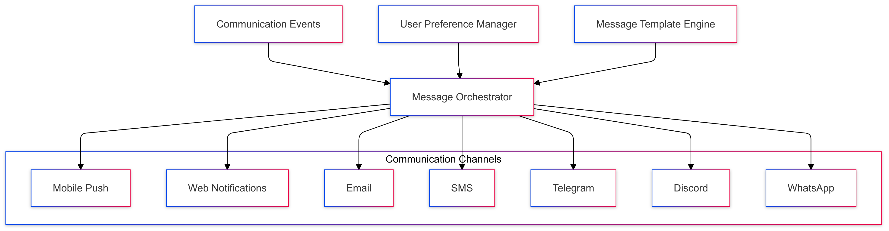
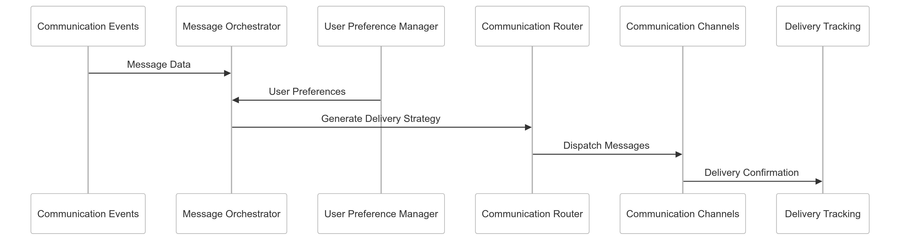

# Multi-Channel Communication Strategy for CipherHorizon Notification and Reporting Layer

## Prologue

In the context of building a sophisticated cryptocurrency trading analytics platform,  
facing challenges of diverse user communication preferences and engagement strategies,  
we decided to implement a comprehensive multi-channel communication framework  
to achieve seamless, flexible, and user-centric communication experiences  
accepting the complexity of cross-platform integration and message synchronization.

## Discussion

### Multi-Channel Communication Challenges

- Diverse user communication preferences
- Platform and device fragmentation
- Varying user engagement patterns
- Communication reliability
- Cross-platform message consistency
- User experience optimization

### Current Communication Limitations

- Limited communication channels
- Inconsistent message delivery
- Poor user engagement
- Platform-specific constraints
- High manual communication overhead
- Lack of unified communication strategy

### Key Multi-Channel Communication Requirements

1. Comprehensive channel support
2. Unified message orchestration
3. Adaptive delivery mechanisms
4. Cross-platform consistency
5. User preference management
6. Low-latency message propagation

### Constraints

- Technical integration complexity
- Platform-specific limitations
- Network reliability
- User privacy
- Computational resources

## Solution

### Multi-Channel Communication Architecture



### Communication Strategy Implementation

#### 1. Comprehensive Communication Framework

```python
class MultiChannelCommunicationSystem:
    def __init__(self, communication_channels):
        self.channels = communication_channels
        self.communication_modules = [
            MessageOrchestrationModule(),
            UserPreferenceModule(),
            DeliveryTrackingModule(),
            MessageTemplateModule()
        ]

    def send_message(self, message, user_context):
        delivery_plan = self.generate_delivery_strategy(message, user_context)

        communication_results = []
        for channel, channel_strategy in delivery_plan.items():
            result = self.execute_channel_strategy(channel, channel_strategy)
            communication_results.append(result)

        return self.aggregate_communication_results(communication_results)
```

#### 2. Communication Channels

- **Mobile Push Notifications**
  - iOS/Android native support
  - Background processing
  - Device-specific optimization
- **Web Notifications**
  - Browser push notifications
  - Progressive web app integration
  - Real-time web socket updates
- **Email Notifications**
  - HTML-formatted messages
  - Template-based design
  - Deliverability tracking
- **SMS Alerts**
  - Short message delivery
  - International carrier support
  - Low-bandwidth compatibility
- **Instant Messaging Platforms**
  - Telegram integration
  - Discord notifications
  - WhatsApp business API
  - Webhook support

#### 3. Communication Schema

```PROTOBUF
message CommunicationEvent {
    string event_id = 1;
    CommunicationPriority priority = 2;
    repeated CommunicationChannel preferred_channels = 3;
    map<string, string> message_details = 4;
    UserCommunicationPreferences user_preferences = 5;
}

enum CommunicationPriority {
    LOW = 0;
    MEDIUM = 1;
    HIGH = 2;
    CRITICAL = 3;
}
```

### Intelligent Routing Mechanism

```python
class CommunicationRoutingEngine:
    def generate_delivery_strategy(self, message, user_profile):
        routing_strategies = {
            'priority_based': self.priority_routing,
            'user_preference_based': self.preference_routing,
            'context_aware': self.context_routing
        }

        selected_strategy = routing_strategies[
            user_profile.routing_preference
        ]

        return selected_strategy(message, user_profile)
```

## Consequences

### Positive Outcomes

- Comprehensive communication coverage
- Flexible user engagement
- Improved message deliverability
- Enhanced user experience
- Adaptive communication strategies

### Potential Challenges

- Integration complexity
- Message synchronization
- Performance overhead
- Platform-specific limitations

### Mitigation Strategies

- Robust error handling
- Adaptive routing algorithms
- Comprehensive testing
- Continuous platform optimization

## Performance Metrics

### Multi-Channel Communication Targets

- Message Delivery Rate: 99%+
- Latency Across Channels: < 200ms
- Channel Diversity: 7+ platforms
- User Engagement Improvement: 35%

## Implementation Roadmap

### Phase 1: Foundation

- Basic channel integration
- Initial routing mechanisms
- Performance baseline

### Phase 2: Advanced Capabilities

- Machine learning-driven routing
- Comprehensive platform support
- Adaptive communication strategies

### Phase 3: Intelligent Communication

- Predictive channel selection
- Advanced routing algorithms
- Personalization at scale

## Decision Validation Criteria

- Improved user satisfaction
- Comprehensive communication coverage
- Performance efficiency
- Platform flexibility

## Alternatives Considered

1. Single-channel communication
2. Manual message distribution
3. External communication services
4. Limited platform support

## Ethical Considerations

- User privacy protection
- Transparent communication mechanisms
- Consent-driven messaging
- Minimal data usage

## Appendix

- Communication routing methodology
- Platform integration techniques
- Performance benchmarks
- User preference management

### Communication Workflow


