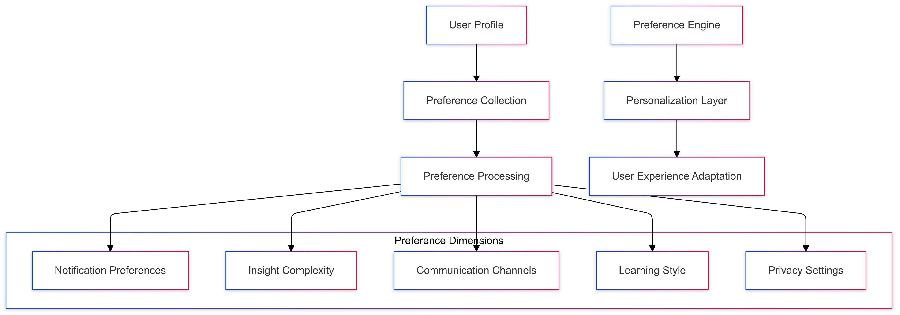
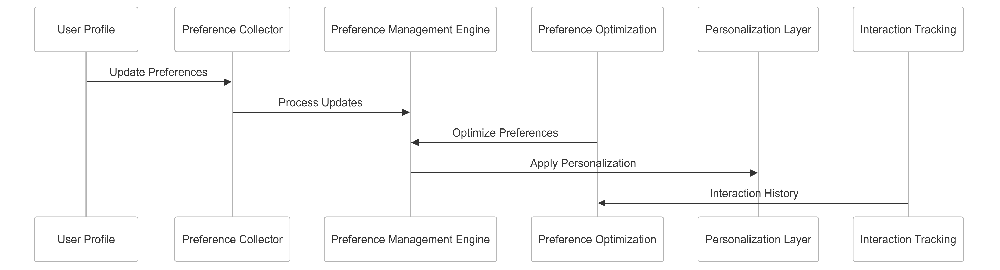

# User Preference Management Strategy for CipherHorizon Notification and Reporting Layer

## Prologue

In the context of building a sophisticated cryptocurrency trading analytics platform, facing challenges of diverse user needs and personalization complexity, we decided to implement a comprehensive user preference management framework to achieve granular, adaptive, and user-centric customization
accepting the computational overhead and ongoing preference evolution requirements.

## Discussion

### User Preference Management Challenges

- Diverse user interaction preferences
- Complex personalization requirements
- Dynamic user behavior
- Privacy and consent management
- Cross-platform consistency
- Personalization granularity

### Current Preference Management Limitations

- Static preference settings
- Limited customization options
- Poor user experience
- Inconsistent preference tracking
- Minimal adaptive capabilities
- Lack of comprehensive preference modeling

### Key User Preference Management Requirements

1. Granular preference configuration
2. Adaptive personalization
3. Cross-platform synchronization
4. Privacy-first approach
5. Machine learning-driven optimization
6. Comprehensive preference tracking

### Constraints

- Data privacy regulations
- Computational resources
- User experience complexity
- Machine learning capabilities
- Consent management

## Solution

### User Preference Management Architecture



### Preference Management Strategies

#### 1. Comprehensive Preference Framework

```python
class UserPreferenceManager:
    def __init__(self, user_profile):
        self.profile = user_profile
        self.preference_modules = [
            NotificationPreferenceModule(),
            InsightComplexityModule(),
            CommunicationChannelModule(),
            LearningStyleModule(),
            PrivacySettingsModule()
        ]

    def update_preferences(self, new_preferences):
        preference_updates = []
        for module in self.preference_modules:
            module_update = module.process_preference_update(
                new_preferences,
                self.profile
            )
            preference_updates.append(module_update)

        return self.validate_and_apply_updates(preference_updates)
```

#### 2. Preference Dimensions

- **Notification Preferences**
  - Alert frequency
  - Notification types
  - Priority levels
  - Time-based filtering
- **Insight Complexity**
  - Technical depth
  - Visualization preferences
  - Educational content level
  - Explanation verbosity
- **Communication Channels**
  - Preferred platforms
  - Channel priority
  - Message delivery mechanisms
  - Cross-platform synchronization
- **Learning Style**
  - Visual vs. textual preferences
  - Interactive content
  - Recommended learning paths
  - Skill progression tracking
- **Privacy Settings**
  - Data sharing preferences
  - Consent management
  - Anonymization levels
  - Third-party integration controls

#### 3. Preference Schema

```protobuf
message UserPreferences {
    string user_id = 1;
    NotificationPreference notification_settings = 2;
    InsightComplexity insight_preferences = 3;
    repeated CommunicationChannel preferred_channels = 4;
    LearningStyleProfile learning_style = 5;
    PrivacyConfiguration privacy_settings = 6;
}

message NotificationPreference {
    FrequencyLevel alert_frequency = 1;
    repeated NotificationType enabled_types = 2;
    TimeWindow preferred_notification_times = 3;
}

enum FrequencyLevel {
    LOW = 0;
    MEDIUM = 1;
    HIGH = 2;
    REAL_TIME = 3;
}
```

### Intelligent Preference Optimization

```Python
class PreferenceOptimizationEngine:
    def optimize_user_preferences(self, user_profile, interaction_history):
        optimization_strategies = {
            'behavior_based': self.optimize_by_behavior,
            'machine_learning_driven': self.ml_driven_optimization,
            'explicit_user_feedback': self.feedback_driven_optimization
        }

        selected_strategy = optimization_strategies[
            user_profile.optimization_preference
        ]

        return selected_strategy(user_profile, interaction_history)
```

## Consequences

### Positive Outcomes

- Highly personalized user experience
- Adaptive preference management
- Improved user engagement
- Comprehensive customization
- Privacy-first approach

### Potential Challenges

- Computational complexity
- Potential over-personalization
- Machine learning bias
- Preference management overhead

### Mitigation Strategies

- Transparent preference tracking
- User control mechanisms
- Periodic preference reset
- Bias detection algorithms

## Performance Metrics

### User Preference Management Targets

- Personalization Accuracy: 80%+
- User Engagement Improvement: 40%
- Preference Update Latency: < 100ms
- Optimization Effectiveness: 75%

## Implementation Roadmap

### Phase 1: Foundation

- Basic preference configuration
- Initial tracking mechanisms
- Performance baseline

### Phase 2: Advanced Capabilities

- Machine learning preference optimization
- Comprehensive preference dimensions
- Adaptive personalization

### Phase 3: Intelligent Preference Management

- Predictive preference modeling
- Advanced optimization algorithms
- Continuous learning adaptation

## Decision Validation Criteria

- Improved user satisfaction
- Increased platform engagement
- Personalization effectiveness
- Privacy compliance

## Alternatives Considered

1. Static preference settings
2. Manual preference management
3. Limited customization approaches
4. Generic personalization techniques

## Ethical Considerations

- Transparent preference tracking
- User data privacy
- Consent-driven customization
- Bias mitigation

## Appendix

- Preference management methodology
- Optimization techniques
- Performance benchmarks
- User preference lifecycle

### User Preference Workflow


