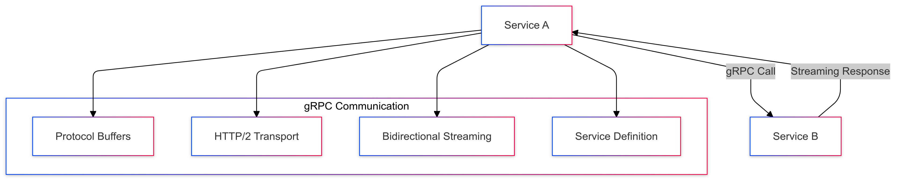
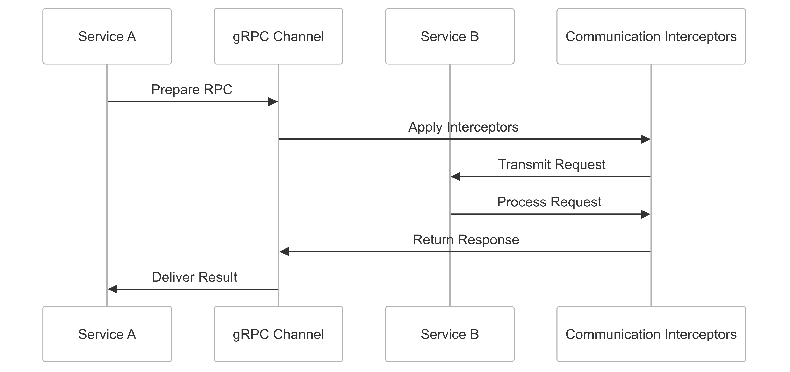

# gRPC Inter-Service Communication Strategy for CipherHorizon

## Prologue

In the context of building a high-performance distributed cryptocurrency trading analytics platform,  
facing challenges of efficient, low-latency service communication and scalability,  
we decided to implement gRPC as our primary inter-service communication protocol  
to achieve high-performance, type-safe, and language-agnostic service interactions  
accepting the learning curve and initial implementation complexity.

## Discussion

### Inter-Service Communication Challenges

- High-frequency data exchange
- Low-latency communication requirements
- Service scalability
- Language-diverse microservices
- Efficient serialization
- Complex data type handling
- Performance overhead

### Current Communication Limitations

- REST API performance bottlenecks
- JSON serialization inefficiencies
- Limited type safety
- Synchronous communication patterns
- High network overhead
- Complex versioning management

### Key Inter-Service Communication Requirements

1. High-performance data transfer
2. Type-safe communication
3. Language-agnostic protocol
4. Efficient serialization
5. Bidirectional streaming
6. Low computational overhead

### Constraints

- Network bandwidth
- Computational resources
- Service complexity
- Cross-language compatibility
- Development team expertise

## Solution

### gRPC Communication Architecture



### gRPC Implementation Strategy

#### 1. Comprehensive Communication Framework

```python
# service_definition.proto
syntax = "proto3";

service CryptoAnalyticsService {
    // Unary RPC
    rpc GetMarketData(MarketDataRequest) returns (MarketDataResponse) {}

    // Server streaming RPC
    rpc SubscribeMarketUpdates(SubscriptionRequest)
        returns (stream MarketUpdate) {}

    // Client streaming RPC
    rpc ProcessTradeSignals(stream TradeSignal)
        returns (ProcessingResult) {}

    // Bidirectional streaming RPC
    rpc ExecuteTradeStrategy(stream StrategyCommand)
        returns (stream StrategyResult) {}
}
```

#### 2. Communication Patterns

- **Unary RPC**
  - Simple request-response
  - Synchronous communication
  - Immediate data retrieval
- **Server Streaming**
  - Continuous market updates
  - Real-time data propagation
  - Efficient long-lived connections
- **Client Streaming**
  - Batch processing
  - Multiple signal submissions
  - Aggregated response handling
- **Bidirectional Streaming**
  - Complex trading strategies
  - Dynamic interaction
  - Real-time strategy execution

#### 3. Performance Optimization Techniques

```python
class gRPCCommunicationManager:
    def __init__(self, service_config):
        self.channel_options = [
            ('grpc.max_send_message_length', 100 * 1024 * 1024),
            ('grpc.max_receive_message_length', 100 * 1024 * 1024),
            ('grpc.keepalive_time_ms', 10000),
            ('grpc.enable_http_proxy', 0)
        ]

        self.interceptors = [
            MetricsInterceptor(),
            AuthenticationInterceptor(),
            CompressionInterceptor()
        ]

    def create_channel(self, target):
        return grpc.insecure_channel(
            target,
            options=self.channel_options
        )
```

### Protocol Buffers Optimization

```protobuf
message MarketDataRequest {
    string symbol = 1;
    int64 timestamp = 2;

    // Efficient encoding
    enum DataType {
        TICK = 0;
        AGGREGATED = 1;
        HISTORICAL = 2;
    }
    DataType data_type = 3;

    // Compact representation
    repeated string exchanges = 4;
}
```

## Consequences

### Positive Outcomes

- High-performance communication
- Type-safe service interactions
- Efficient serialization
- Low-latency data transfer
- Language-agnostic protocol
- Scalable service architecture

### Potential Challenges

- Learning curve
- Initial implementation complexity
- Debugging distributed systems
- Performance tuning requirements

### Mitigation Strategies

- Comprehensive documentation
- Performance profiling
- Monitoring and tracing
- Continuous optimization

## Performance Metrics

### gRPC Communication Targets

- Latency: < 10ms per RPC
- Throughput: 10,000+ RPCs/second
- Serialization Efficiency: 70%+ compression
- Connection Establishment: < 50ms

## Implementation Roadmap

### Phase 1: Foundation

- Basic gRPC service definitions
- Initial performance baseline
- Core communication patterns

### Phase 2: Advanced Capabilities

- Advanced streaming implementations
- Performance optimization
- Cross-service integration

### Phase 3: Intelligent Communication

- Adaptive communication strategies
- Machine learning-driven optimization
- Advanced error handling

## Decision Validation Criteria

- Improved inter-service performance
- Reduced communication overhead
- Enhanced type safety
- Simplified service interactions

## Alternatives Considered

1. REST API
2. GraphQL
3. Apache Thrift
4. JSON-RPC

## Ethical Considerations

- Transparent communication
- Secure service interactions
- Performance fairness
- Resource optimization

## Appendix

- gRPC implementation guidelines
- Performance benchmarks
- Service communication patterns
- Optimization techniques

### gRPC Communication Workflow


