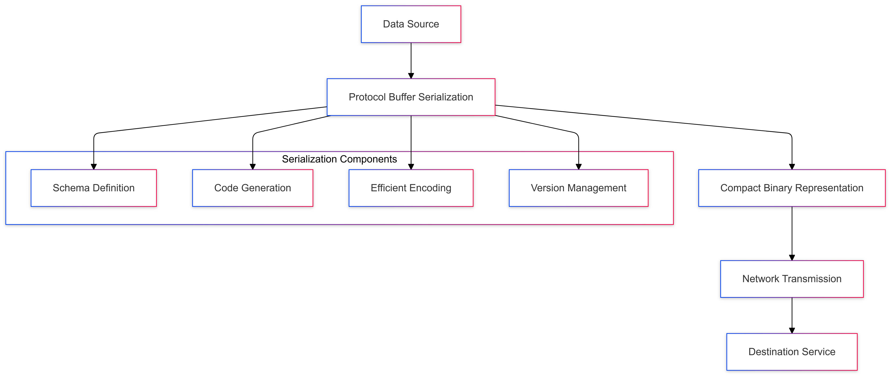
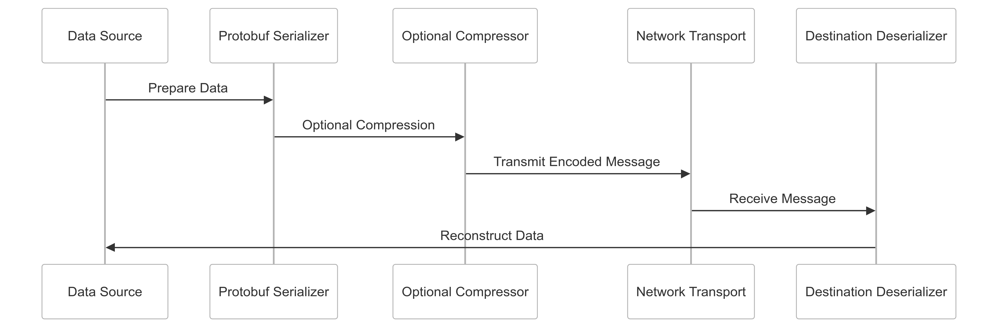

# Protocol Buffers Serialization Strategy for CipherHorizon

## Prologue

In the context of building a high-performance distributed cryptocurrency trading analytics platform, facing challenges of efficient data serialization and cross-service communication,  
we decided to implement Protocol Buffers as our primary serialization mechanism to achieve compact, fast, and language-agnostic data encoding accepting the initial complexity of schema definition and tooling requirements.

## Discussion

### Serialization Challenges

- High-volume data transmission
- Cross-service data compatibility
- Performance overhead
- Complex data type handling
- Network bandwidth limitations
- Versioning and schema evolution
- Language interoperability

### Current Serialization Limitations

- JSON performance bottlenecks
- Large message sizes
- Weak type safety
- Slow parsing mechanisms
- Limited cross-language support
- Complex schema management

### Key Serialization Requirements

1. Efficient data encoding
2. Compact message representation
3. Language-agnostic serialization
4. Strong type safety
5. Backward/forward compatibility
6. Low computational overhead

### Constraints

- Network bandwidth
- Computational resources
- Service complexity
- Development team expertise

## Solution

### Protocol Buffers Serialization Architecture



### Protocol Buffers Implementation Strategy

#### 1. Comprehensive Serialization Framework

```PROTOBUF
syntax = "proto3";

// Market Data Serialization Schema
message MarketDataPoint {
    string symbol = 1;
    double price = 2;
    int64 timestamp = 3;

    // Efficient Enum Representation
    enum ExchangeType {
        BINANCE = 0;
        COINBASE = 1;
        KRAKEN = 2;
    }
    ExchangeType exchange = 4;

    // Nested Message for Complex Types
    message TradingVolume {
        double buy_volume = 1;
        double sell_volume = 2;
    }
    TradingVolume volume = 5;

    // Optional Fields with Efficient Encoding
    oneof market_indicator {
        double rsi = 6;
        double macd = 7;
    }
}
```

#### 2. Serialization Optimization Techniques

```Python
class ProtobufSerializationManager:
    def __init__(self, compression_level=6):
        self.compression_strategies = {
            'default': self.default_serialization,
            'compressed': self.compressed_serialization,
            'streaming': self.streaming_serialization
        }

        self.compression_level = compression_level

    def serialize(self, data, strategy='default'):
        serialization_method = self.compression_strategies[strategy]
        return serialization_method(data)

    def default_serialization(self, data):
        # Efficient binary encoding
        return data.SerializeToString()

    def compressed_serialization(self, data):
        # Optional compression
        return zlib.compress(
            data.SerializeToString(),
            self.compression_level
        )
```

#### 3. Serialization Patterns

- **Compact Encoding**
  - Minimal message overhead
  - Efficient integer encoding
  - Reduced network bandwidth
- **Type Safety**
  - Strongly typed schema
  - Compile-time type checking
  - Reduced runtime errors
- **Versioning Support**
  - Backward compatibility
  - Forward compatibility
  - Incremental schema evolution

### Schema Evolution Strategies

```PROTOBUF
message UserProfile {
    // Original Fields
    string user_id = 1;
    string username = 2;

    // New Fields with Default Handling
    string email = 3 [deprecated = true];
    repeated string contact_methods = 4;

    // Optional Extension
    Extensions 100 to max;
}
```

## Consequences

### Positive Outcomes

- Efficient data serialization
- Compact message representation
- Strong type safety
- Cross-language compatibility
- Low computational overhead
- Flexible schema evolution

### Potential Challenges

- Initial schema complexity
- Learning curve
- Code generation requirements
- Limited human readability

### Mitigation Strategies

- Comprehensive documentation
- Automated schema management
- Code generation tools
- Performance profiling

## Performance Metrics

### Serialization Targets

- Encoding Speed: < 1ms per message
- Message Size Reduction: 60-70%
- Parsing Efficiency: < 2ms per message
- Compression Ratio: 0.6-0.8

## Implementation Roadmap

### Phase 1: Foundation

- Basic schema definitions
- Initial serialization mechanisms
- Performance baseline

### Phase 2: Advanced Capabilities

- Complex type handling
- Compression strategies
- Cross-service integration

### Phase 3: Intelligent Serialization

- Adaptive encoding techniques
- Machine learning-driven optimization
- Advanced schema management

## Decision Validation Criteria

- Improved serialization performance
- Reduced network overhead
- Enhanced type safety
- Simplified data exchange

## Alternatives Considered

1. JSON Serialization
2. XML Encoding
3. Apache Avro
4. MessagePack

## Ethical Considerations

- Data privacy preservation
- Transparent encoding
- Efficient resource utilization
- Minimal computational waste

## Appendix

- Serialization guidelines
- Performance benchmarks
- Schema design principles
- Optimization techniques

### Serialization Workflow


