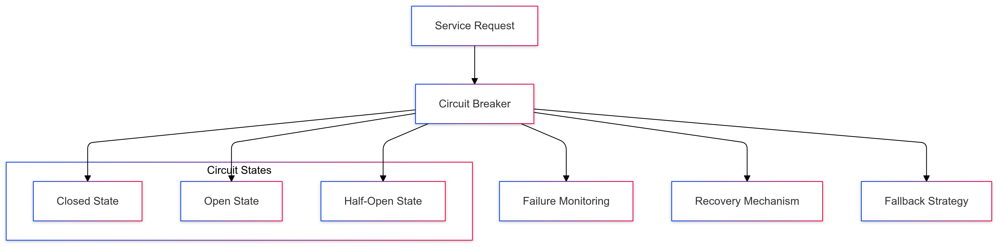
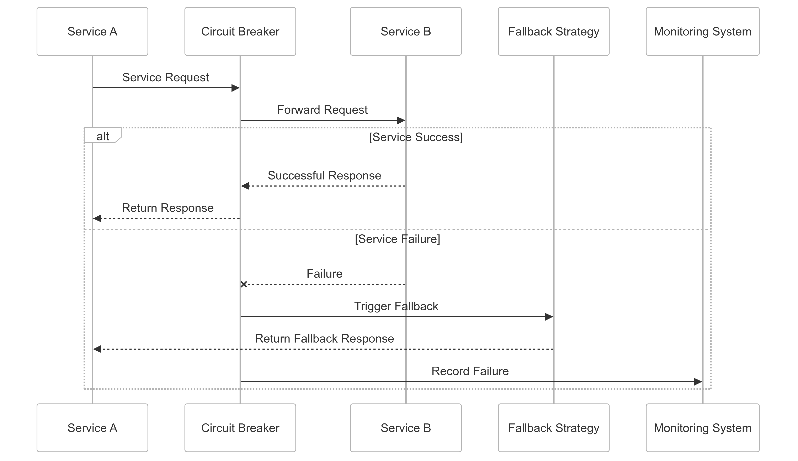

# Circuit Breaker Pattern Strategy for CipherHorizon Inter-Service Communication

## Prologue

In the context of building a resilient distributed cryptocurrency trading analytics platform, facing challenges of service failures and cascading system degradation, we decided to implement a comprehensive circuit breaker pattern to achieve system stability, fault tolerance, and graceful service degradation accepting the complexity of distributed system failure management.

## Discussion

### Circuit Breaker Challenges

- Distributed microservices architecture
- Potential service failures
- Network instability
- Cascading system failures
- Performance degradation
- Resource exhaustion
- Unpredictable external dependencies

### Current Failure Management Limitations

- Synchronous error handling
- Limited failure isolation
- Lack of automatic recovery mechanisms
- Manual intervention requirements
- Poor system resilience
- Inefficient resource utilization

### Key Circuit Breaker Requirements

1. Automatic failure detection
2. Dynamic service isolation
3. Graceful degradation
4. Automatic recovery
5. Configurable failure thresholds
6. Comprehensive monitoring

### Constraints

- Computational overhead
- Complex failure scenarios
- Performance impact
- Monitoring complexity

## Solution

### Circuit Breaker Architecture



### Circuit Breaker Implementation Strategy

#### 1. Comprehensive Circuit Breaker Framework

```Python
class CircuitBreakerManager:
    def __init__(self, service_config):
        self.services = {}
        self.default_config = {
            'failure_threshold': 5,
            'reset_timeout': 30,
            'retry_timeout': 10
        }

    def create_circuit_breaker(self, service_name, custom_config=None):
        config = custom_config or self.default_config
        circuit_breaker = CircuitBreaker(
            name=service_name,
            failure_threshold=config['failure_threshold'],
            reset_timeout=config['reset_timeout']
        )
        self.services[service_name] = circuit_breaker
        return circuit_breaker

    def execute_with_circuit_breaker(self, service_name, operation):
        circuit_breaker = self.services.get(service_name)

        try:
            if circuit_breaker.is_allowed():
                result = operation()
                circuit_breaker.record_success()
                return result
            else:
                return self.fallback_strategy(service_name)
        except Exception as e:
            circuit_breaker.record_failure(e)
            return self.fallback_strategy(service_name)
```

#### 2. Circuit Breaker States

- **Closed State**
  - Normal operation
  - Failure tracking
  - Request processing
  - Performance monitoring
- **Open State**
  - Service isolation
  - Immediate failure response
  - Prevent cascading failures
  - Trigger fallback mechanisms
- **Half-Open State**
  - Controlled recovery
  - Limited request testing
  - Gradual service restoration
  - Dynamic state transition

#### 3. Failure Detection and Recovery

```python
class CircuitBreaker:
    def __init__(self, name, failure_threshold, reset_timeout):
        self.name = name
        self.state = CircuitBreakerState.CLOSED
        self.failure_count = 0
        self.failure_threshold = failure_threshold
        self.reset_timeout = reset_timeout
        self.last_failure_time = None

    def is_allowed(self):
        if self.state == CircuitBreakerState.OPEN:
            if time.time() - self.last_failure_time > self.reset_timeout:
                self.state = CircuitBreakerState.HALF_OPEN
            else:
                return False

        return True

    def record_failure(self, exception):
        self.failure_count += 1
        self.last_failure_time = time.time()

        if self.failure_count >= self.failure_threshold:
            self.state = CircuitBreakerState.OPEN
```

### Fallback Strategy Implementation

```python
def fallback_strategy(service_name):
    fallback_strategies = {
        'market_data_service': return_cached_market_data,
        'trading_signal_service': generate_conservative_signal,
        'risk_management_service': apply_default_risk_settings
    }

    return fallback_strategies.get(
        service_name,
        default_fallback_handler
    )()
```

## Consequences

### Positive Outcomes

- Improved system resilience
- Automatic failure management
- Graceful service degradation
- Reduced cascading failures
- Dynamic recovery mechanisms

### Potential Challenges

- Increased complexity
- Performance overhead
- Potential false positives
- Complex configuration

### Mitigation Strategies

- Comprehensive monitoring
- Adaptive threshold configuration
- Continuous performance tuning
- Detailed logging and tracing

## Performance Metrics

### Circuit Breaker Targets

- Failure Detection Latency: < 50ms
- Recovery Time: < 100ms
- False Positive Rate: < 5%
- Performance Overhead: < 10%

## Implementation Roadmap

### Phase 1: Foundation

- Basic circuit breaker implementation
- Initial failure detection
- Performance baseline

### Phase 2: Advanced Capabilities

- Machine learning-driven thresholds
- Advanced recovery strategies
- Comprehensive monitoring

### Phase 3: Intelligent Failure Management

- Predictive failure detection
- Automated configuration
- Self-healing mechanisms

## Decision Validation Criteria

- Reduced system downtime
- Improved service reliability
- Efficient resource utilization
- Minimal manual intervention

## Alternatives Considered

1. Retry mechanisms
2. Manual error handling
3. Static failure management
4. External monitoring services

## Ethical Considerations

- Transparent failure handling
- Fair resource allocation
- Minimal user impact
- Comprehensive logging

## Appendix

- Circuit breaker implementation guidelines
- Failure management strategies
- Performance benchmarks
- Configuration best practices

### Circuit Breaker Workflow


