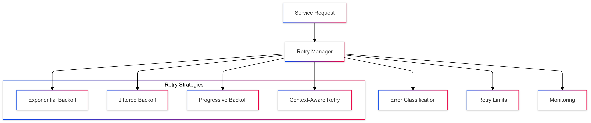
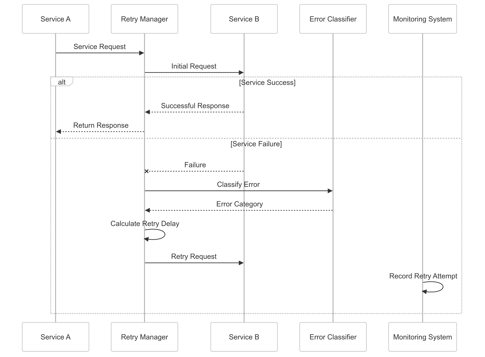

# Retry Mechanism Strategy for CipherHorizon Inter-Service Communication

## Prologue

In the context of building a resilient distributed cryptocurrency trading analytics platform, facing challenges of transient network failures and service intermittency,
we decided to implement a sophisticated retry mechanism strategy to achieve improved system reliability, fault tolerance, and graceful error handling accepting the potential performance overhead and complexity of retry management.

## Discussion

### Retry Mechanism Challenges

- Transient network failures
- Intermittent service unavailability
- Distributed system complexity
- Performance impact of retries
- Avoiding unnecessary resource consumption
- Balancing reliability and efficiency
- Preventing cascading failures

### Current Retry Limitations

- Naive linear retry approaches
- Fixed retry count
- Uniform retry intervals
- Lack of adaptive retry strategies
- Limited error type consideration
- Poor resource utilization
- Manual retry configuration

### Key Retry Mechanism Requirements

1. Intelligent retry decision-making
2. Adaptive backoff strategies
3. Error-type specific handling
4. Configurable retry parameters
5. Minimal performance overhead
6. Comprehensive logging

### Constraints

- Network latency
- Computational resources
- Service dependencies
- Performance sensitivity

## Solution (Decision)

### Retry Mechanism Architecture



### Retry Implementation Strategy

#### 1. Comprehensive Retry Framework

```python
class RetryManager:
    def __init__(self, service_config):
        self.default_config = {
            'max_retries': 3,
            'base_delay': 100,  # milliseconds
            'max_delay': 5000,
            'retry_strategy': 'exponential_backoff'
        }

        self.retry_strategies = {
            'exponential_backoff': self.exponential_backoff,
            'jittered_backoff': self.jittered_backoff,
            'progressive_backoff': self.progressive_backoff
        }

    def execute_with_retry(self, operation, error_types=None):
        config = self.default_config
        error_types = error_types or [ConnectionError, TimeoutError]

        for attempt in range(config['max_retries']):
            try:
                return operation()
            except tuple(error_types) as e:
                if attempt == config['max_retries'] - 1:
                    raise

                delay = self.calculate_delay(attempt, config)
                time.sleep(delay / 1000)

    def calculate_delay(self, attempt, config):
        strategy = self.retry_strategies[config['retry_strategy']]
        return strategy(attempt, config)

    def exponential_backoff(self, attempt, config):
        return min(
            config['base_delay'] * (2 ** attempt),
            config['max_delay']
        )

    def jittered_backoff(self, attempt, config):
        base_delay = self.exponential_backoff(attempt, config)
        jitter = random.uniform(0, 0.1 * base_delay)
        return base_delay + jitter
```

#### 2. Retry Strategies

- **Exponential Backoff**
  - Increasing delay between retries
  - Prevents immediate retry storms
  - Adaptive to system load
- **Jittered Backoff**
  - Random variation in retry intervals
  - Prevents synchronized retries
  - Reduces contention in distributed systems
- **Progressive Backoff**
  - Gradual delay increase
  - Fine-grained retry control
  - Context-aware delay adjustment

#### 3. Error Classification and Handling

```python
class ErrorClassifier:
    def classify_error(self, exception):
        error_categories = {
            'RETRIABLE': [
                ConnectionError,
                TimeoutError,
                ServiceUnavailableError
            ],
            'NON_RETRIABLE': [
                AuthenticationError,
                ValidationError
            ],
            'CRITICAL': [
                SystemError,
                SecurityViolationError
            ]
        }

        for category, error_types in error_categories.items():
            if isinstance(exception, tuple(error_types)):
                return category

        return 'UNKNOWN'
```

### Retry Configuration Management

```python
class RetryConfigManager:
    def get_service_retry_config(self, service_name):
        service_specific_configs = {
            'market_data_service': {
                'max_retries': 5,
                'base_delay': 200,
                'retry_strategy': 'jittered_backoff'
            },
            'trading_signal_service': {
                'max_retries': 3,
                'base_delay': 100,
                'retry_strategy': 'exponential_backoff'
            }
        }

        return service_specific_configs.get(
            service_name,
            self.default_config
        )
```

## Consequences

### Positive Outcomes

- Improved system reliability
- Graceful error handling
- Adaptive retry mechanisms
- Reduced manual intervention
- Intelligent failure management

### Potential Challenges

- Increased complexity
- Potential performance overhead
- Risk of retry amplification
- Complex configuration management

### Mitigation Strategies

- Comprehensive monitoring
- Dynamic configuration
- Intelligent error classification
- Performance profiling

## Performance Metrics

### Retry Mechanism Targets

- Retry Success Rate: 70-80%
- Maximum Retry Latency: < 500ms
- Retry Overhead: < 15%
- False Positive Reduction: 50%

## Implementation Roadmap

### Phase 1: Foundation

- Basic retry implementation
- Initial error handling
- Performance baseline

### Phase 2: Advanced Capabilities

- Machine learning-driven retry strategies
- Comprehensive error classification
- Adaptive configuration

### Phase 3: Intelligent Retry Management

- Predictive retry optimization
- Self-tuning retry mechanisms
- Advanced monitoring

## Decision Validation Criteria

- Improved service reliability
- Reduced manual error handling
- Efficient resource utilization
- Minimal performance impact

## Alternatives Considered

1. Static retry mechanisms
2. Manual error handling
3. External retry services
4. Simplified retry approaches

## Ethical Considerations

- Transparent error management
- Fair resource allocation
- Minimal system disruption
- Comprehensive logging

## Appendix

- Retry implementation guidelines
- Error handling strategies
- Performance benchmarks
- Configuration best practices

### Retry Mechanism Workflow


