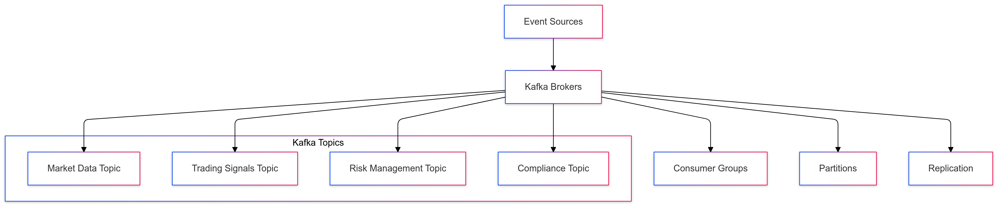
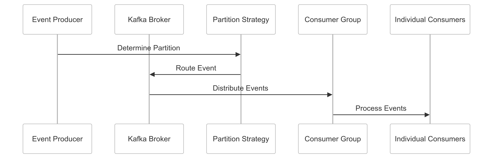

# Kafka Topic-Based Communication Strategy for CipherHorizon Event Streaming

## Prologue

In the context of building a distributed cryptocurrency trading analytics platform, facing challenges of complex event propagation and real-time data processing, we decided to implement Apache Kafka with a comprehensive topic-based communication strategy to achieve scalable, reliable, and high-performance event streaming accepting the operational complexity and initial implementation overhead.

## Discussion

### Event Streaming Challenges

- High-frequency market data
- Complex event propagation
- Real-time processing requirements
- Distributed system complexity
- Data consistency
- Service decoupling
- Scalable message handling

### Current Event Streaming Limitations

- Synchronous communication models
- Limited scalability
- Poor message durability
- Inconsistent event processing
- Manual event routing
- Limited replay capabilities
- Performance bottlenecks

### Key Event Streaming Requirements

1. Scalable message processing
2. Guaranteed message delivery
3. Event replay capabilities
4. Low-latency communication
5. Flexible event routing
6. Horizontal scalability

### Constraints

- Network bandwidth
- Computational resources
- Message processing complexity
- Operational overhead

## Solution

### Kafka Topic-Based Communication Architecture



### Kafka Implementation Strategy

#### 1. Comprehensive Kafka Configuration Framework

```python
class KafkaEventStreamManager:
    def __init__(self, kafka_config):
        self.default_config = {
            'bootstrap_servers': ['kafka1:9092', 'kafka2:9092'],
            'topic_config': {
                'replication_factor': 3,
                'partitions': 12,
                'retention_ms': 604800000,  # 7 days
                'compression_type': 'snappy'
            },
            'producer_config': {
                'acks': 'all',
                'max_in_flight_requests_per_connection': 5,
                'enable_idempotence': True
            },
            'consumer_config': {
                'group_id': 'cipherhorizon-consumer-group',
                'auto_offset_reset': 'earliest',
                'enable_auto_commit': False
            }
        }

    def create_topic(self, topic_name, custom_config=None):
        config = custom_config or self.default_config['topic_config']

        admin_client = KafkaAdminClient(
            bootstrap_servers=self.default_config['bootstrap_servers']
        )

        topic_config = NewTopic(
            name=topic_name,
            num_partitions=config['partitions'],
            replication_factor=config['replication_factor']
        )

        admin_client.create_topics([topic_config])
```

#### 2. Topic Design Strategy

```python
class TopicDesignStrategy:
    TOPICS = {
        'MARKET_DATA': {
            'name': 'market-data-topic',
            'partitions': 12,
            'retention_hours': 168,  # 7 days
            'key_strategy': 'symbol_based'
        },
        'TRADING_SIGNALS': {
            'name': 'trading-signals-topic',
            'partitions': 6,
            'retention_hours': 72,  # 3 days
            'key_strategy': 'strategy_based'
        }
    }

    def design_topic(self, topic_type):
        topic_config = self.TOPICS.get(topic_type)
        return self.create_topic_configuration(topic_config)
```

#### 3. Event Serialization Schema

```PROTOBUF
syntax = "proto3";

message MarketDataEvent {
    string symbol = 1;
    double price = 2;
    int64 timestamp = 3;

    enum EventType {
        TRADE = 0;
        TICKER = 1;
        ORDER_BOOK = 2;
    }
    EventType event_type = 4;

    string exchange = 5;
    double volume = 6;
}
```

### Partitioning and Routing Strategy

```python
class KafkaPartitionStrategy:
    def determine_partition(self, event, topic):
        strategies = {
            'market-data-topic': self.symbol_based_partition,
            'trading-signals-topic': self.strategy_based_partition
        }

        partition_strategy = strategies.get(topic, self.default_partition)
        return partition_strategy(event)

    def symbol_based_partition(self, event):
        # Consistent hashing for symbol-based partitioning
        return hash(event.symbol) % total_partitions
```

## Consequences

### Positive Outcomes

- Scalable event streaming
- Guaranteed message delivery
- Flexible event routing
- High-performance communication
- Event replay capabilities

### Potential Challenges

- Operational complexity
- Initial implementation overhead
- Monitoring requirements
- Potential performance tuning

### Mitigation Strategies

- Comprehensive monitoring
- Performance profiling
- Adaptive configuration
- Continuous optimization

## Performance Metrics

### Kafka Event Streaming Targets

- Throughput: 100,000+ events/second
- Latency: < 50ms per event
- Message Retention: 7 days
- Partition Efficiency: 80%+

## Implementation Roadmap

### Phase 1: Foundation

- Basic Kafka configuration
- Initial topic design
- Performance baseline

### Phase 2: Advanced Capabilities

- Complex partitioning strategies
- Enhanced monitoring
- Multi-cluster support

### Phase 3: Intelligent Event Streaming

- Machine learning-driven routing
- Adaptive partition management
- Advanced event processing

## Decision Validation Criteria

- Improved event processing
- Reduced communication latency
- Scalable message handling
- Minimal performance overhead

## Alternatives Considered

1. RabbitMQ
2. Amazon Kinesis
3. Google Pub/Sub
4. Redis Streams

## Ethical Considerations

- Data privacy
- Transparent event handling
- Resource efficiency
- Minimal environmental impact

## Appendix

- Kafka configuration guidelines
- Topic design principles
- Performance optimization techniques
- Monitoring best practices

### Event Streaming Workflow


