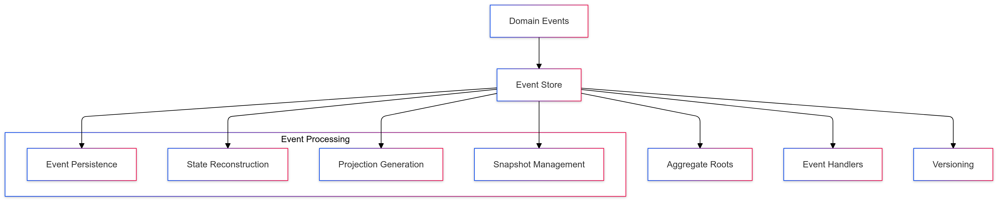
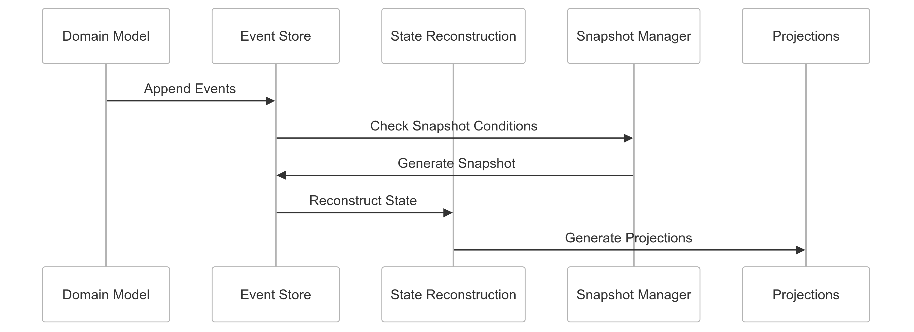

# Event Sourcing Strategy for CipherHorizon Event Streaming

## Prologue

In the context of building a distributed cryptocurrency trading analytics platform, facing challenges of complex state management and audit trail requirements, we decided to implement an event sourcing architecture to achieve comprehensive state reconstruction, complete system traceability, and robust historical tracking accepting the increased complexity of event storage and processing.

## Discussion

### Event Sourcing Challenges

- Complex state management
- Comprehensive system history
- Audit and compliance requirements
- Performance overhead
- Storage complexity
- State reconstruction
- Eventual consistency

### Current State Management Limitations

- Snapshot-based state storage
- Limited historical tracking
- Incomplete system evolution understanding
- Difficult debugging
- Weak audit capabilities
- Inflexible state representation

### Key Event Sourcing Requirements

1. Complete system state history
2. Reproducible system state
3. Comprehensive audit trail
4. Flexible state reconstruction
5. Performance-efficient event storage
6. Compliance and regulatory support

### Constraints

- Storage requirements
- Processing complexity
- Performance overhead
- Eventual consistency trade-offs

## Solution

### Event Sourcing Architecture



### Event Sourcing Implementation Strategy

#### 1. Comprehensive Event Store Framework

```python
class EventStoreManager:
    def __init__(self, storage_strategy):
        self.storage_strategy = storage_strategy
        self.event_handlers = {
            'market_data': MarketDataEventHandler(),
            'trading_signal': TradingSignalEventHandler(),
            'portfolio_change': PortfolioEventHandler()
        }

    def append_event(self, aggregate_id, event_type, event_data):
        event = self.create_event_record(
            aggregate_id,
            event_type,
            event_data
        )

        self.storage_strategy.persist_event(event)
        self.trigger_event_handlers(event)

    def reconstruct_state(self, aggregate_id, event_type):
        events = self.storage_strategy.retrieve_events(
            aggregate_id,
            event_type
        )

        return self.apply_events(events)

```

#### 2. Event Schema and Versioning

```PROTOBUF
syntax = "proto3";

message DomainEvent {
    string event_id = 1;
    string aggregate_id = 2;
    string event_type = 3;
    google.protobuf.Timestamp timestamp = 4;

    // Versioning support
    int32 version = 5;

    // Polymorphic event data
    oneof event_data {
        MarketDataEvent market_data = 6;
        TradingSignalEvent trading_signal = 7;
        PortfolioChangeEvent portfolio_change = 8;
    }

    // Metadata for traceability
    map<string, string> metadata = 9;
}

message MarketDataEvent {
    string symbol = 1;
    double price = 2;
    double volume = 3;
}
```

#### 3. State Reconstruction Strategy

```python
class StateReconstructionEngine:
    def reconstruct_aggregate_state(self, aggregate_id, event_type):
        events = self.event_store.retrieve_events(
            aggregate_id,
            event_type
        )

        initial_state = self.get_initial_state(aggregate_id)

        for event in sorted(events, key=lambda e: e.version):
            initial_state = self.apply_event(initial_state, event)

        return initial_state

    def generate_snapshot(self, aggregate_id):
        current_state = self.reconstruct_aggregate_state(aggregate_id)

        snapshot = {
            'aggregate_id': aggregate_id,
            'state': current_state,
            'version': current_state.version,
            'timestamp': datetime.now()
        }

        self.snapshot_store.save_snapshot(snapshot)
        return snapshot
```

### Snapshot Management Strategy

```python
class SnapshotManager:
    SNAPSHOT_INTERVAL = 100  # Events between snapshots

    def should_create_snapshot(self, aggregate):
        return (
            aggregate.version % self.SNAPSHOT_INTERVAL == 0 and
            aggregate.version > 0
        )

    def create_snapshot(self, aggregate):
        snapshot = {
            'aggregate_id': aggregate.id,
            'state': aggregate.get_state(),
            'version': aggregate.version,
            'timestamp': datetime.now()
        }

        self.snapshot_store.save(snapshot)
        return snapshot
```

## Consequences

### Positive Outcomes

- Comprehensive system history
- Robust audit capabilities
- Flexible state reconstruction
- Complete traceability
- Compliance support

### Potential Challenges

- Increased storage requirements
- Performance overhead
- Eventual consistency
- Complex event handling

### Mitigation Strategies

- Efficient storage mechanisms
- Snapshot optimization
- Selective event persistence
- Performance profiling

## Performance Metrics

### Event Sourcing Targets

- Event Storage Efficiency: 70%+
- State Reconstruction Time: < 100ms
- Snapshot Generation Overhead: < 50ms
- Storage Compression: 60%

## Implementation Roadmap

### Phase 1: Foundation

- Basic event store implementation
- Initial state reconstruction
- Performance baseline

### Phase 2: Advanced Capabilities

- Comprehensive event handling
- Snapshot optimization
- Performance tuning

### Phase 3: Intelligent Event Management

- Machine learning-driven snapshots
- Predictive state reconstruction
- Advanced event compression

## Decision Validation Criteria

- Improved system traceability
- Reduced debugging complexity
- Efficient state management
- Compliance capabilities

## Alternatives Considered

1. Traditional database storage
2. Simplified event tracking
3. Periodic state snapshots
4. External event logging services

## Ethical Considerations

- Transparent system history
- Data privacy protection
- Minimal unnecessary data retention
- Compliance with data regulations

## Appendix

- Event sourcing implementation guidelines
- State reconstruction techniques
- Performance optimization strategies
- Snapshot management principles

### Event Sourcing Workflow


