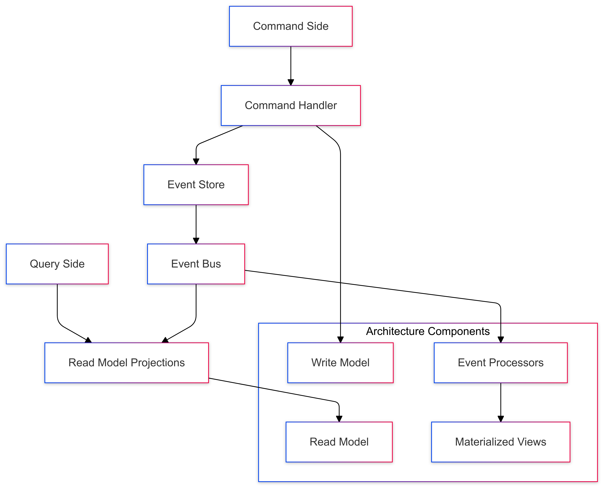
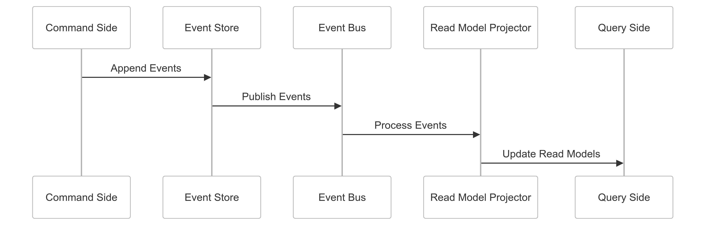

# CQRS (Command Query Responsibility Segregation) Strategy for CipherHorizon Event Streaming

## Prologue

In the context of building a sophisticated cryptocurrency trading analytics platform, facing challenges of complex read and write operations with diverse performance requirements, we decided to implement a CQRS (Command Query Responsibility Segregation) architecture to achieve optimized performance, scalability, and separation of concerns accepting the increased system complexity and eventual consistency trade-offs.

## Discussion

### CQRS Challenges

- Diverse read and write workloads
- Performance optimization requirements
- Complex domain logic
- Scalability limitations
- Data consistency management
- Different query and command access patterns
- Varied data representation needs

### Current System Limitations

- Monolithic data access patterns
- Performance bottlenecks
- Limited horizontal scalability
- Inflexible data modeling
- Inefficient query optimization
- Complex domain logic implementation

### Key CQRS Requirements

1. Separate read and write models
2. Optimized performance for queries
3. Independent scaling of read/write services
4. Flexible data representation
5. Event-driven synchronization
6. Eventual consistency support

### Constraints

- Computational resources
- Eventual consistency challenges
- Complexity of implementation
- Development team expertise

## Solution

### CQRS Architecture



### CQRS Implementation Strategy

#### 1. Comprehensive CQRS Framework

```python
class CQRSArchitecture:
    def __init__(self, event_store, read_model_store):
        self.event_store = event_store
        self.read_model_store = read_model_store

        self.command_handlers = {
            'create_trading_strategy': CreateTradingStrategyHandler(),
            'update_portfolio': UpdatePortfolioHandler(),
            'execute_trade_signal': ExecuteTradeSignalHandler()
        }

        self.query_handlers = {
            'get_portfolio_performance': PortfolioPerformanceQueryHandler(),
            'list_trading_strategies': TradingStrategyQueryHandler()
        }

    def handle_command(self, command):
        handler = self.command_handlers.get(command.type)
        if handler:
            events = handler.handle(command)
            self.event_store.append_events(events)
            self.update_read_models(events)

    def handle_query(self, query):
        handler = self.query_handlers.get(query.type)
        return handler.handle(query) if handler else None
```

#### 2. Command and Query Models

```PROTOBUF
syntax = "proto3";

// Command Model
message CreateTradingStrategyCommand {
    string user_id = 1;
    string strategy_name = 2;
    repeated StrategyRule rules = 3;
    RiskProfile risk_profile = 4;
}

// Query Model
message TradingStrategyQuery {
    string user_id = 1;
    QueryType type = 2;

    enum QueryType {
        LIST_STRATEGIES = 0;
        GET_STRATEGY_DETAILS = 1;
        PERFORMANCE_ANALYSIS = 2;
    }
}

// Event Model
message TradingStrategyEvent {
    string event_id = 1;
    string aggregate_id = 2;
    EventType type = 3;

    enum EventType {
        STRATEGY_CREATED = 0;
        STRATEGY_UPDATED = 1;
        STRATEGY_DELETED = 2;
    }

    bytes payload = 4;
}
```

#### 3. Read Model Projection Strategy

```python
class ReadModelProjector:
    def __init__(self, read_store, event_store):
        self.read_store = read_store
        self.event_store = event_store

        self.projectors = {
            'portfolio_performance': PortfolioPerformanceProjector(),
            'trading_strategy': TradingStrategyProjector()
        }

    def project_events(self, events):
        for event in events:
            projector = self.projectors.get(event.type)
            if projector:
                projected_view = projector.project(event)
                self.read_store.update_view(projected_view)

    def rebuild_read_model(self, aggregate_id):
        events = self.event_store.get_events(aggregate_id)
        self.project_events(events)
```

### Event Synchronization Mechanism

```python

class EventSynchronizationManager:
    def synchronize_read_models(self, events):
        strategies = {
            'immediate_update': self.immediate_synchronization,
            'batch_update': self.batch_synchronization,
            'eventual_consistency': self.eventual_consistency_sync
        }

        sync_strategy = strategies.get(
            self.configuration.sync_strategy,
            self.eventual_consistency_sync
        )

        return sync_strategy(events)
```

## Consequences

### Positive Outcomes

- Optimized read and write performance
- Independent scalability
- Flexible data modeling
- Enhanced query capabilities
- Improved system responsiveness

### Potential Challenges

- Increased system complexity
- Eventual consistency
- Development overhead
- Synchronization complexity

### Mitigation Strategies

- Comprehensive testing
- Performance monitoring
- Adaptive synchronization
- Clear consistency contracts

## Performance Metrics

### CQRS Architecture Targets

- Read Model Query Latency: < 50ms
- Write Model Processing: < 100ms
- Synchronization Overhead: < 20%
- Scalability Improvement: 2-3x

## Implementation Roadmap

### Phase 1: Foundation

- Basic CQRS implementation
- Initial read/write model separation
- Performance baseline

### Phase 2: Advanced Capabilities

- Complex query optimization
- Advanced projection strategies
- Comprehensive synchronization

### Phase 3: Intelligent CQRS

- Machine learning-driven projections
- Predictive read model updates
- Adaptive synchronization

## Decision Validation Criteria

- Improved query performance
- Enhanced system scalability
- Reduced read/write contention
- Flexible data representation

## Alternatives Considered

1. Monolithic data access
2. Traditional ORM approaches
3. Simplified read/write models
4. External query services

## Ethical Considerations

- Transparent data processing
- Fair resource allocation
- Minimal performance bias
- Clear consistency expectations

## Appendix

- CQRS implementation guidelines
- Projection strategies
- Synchronization techniques
- Performance optimization principles

### CQRS Workflow


