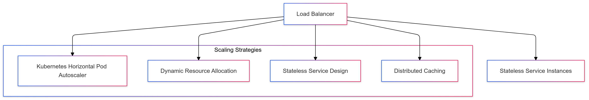
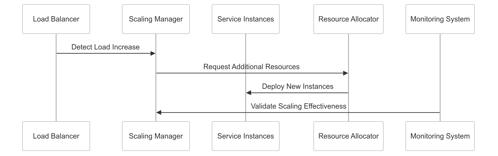

# Horizontal Scaling and Stateless Service Design for CipherHorizon

## Prologue

In the context of building a scalable cryptocurrency trading analytics platform,  
facing challenges of dynamic load management and service reliability,  
we decided to implement a comprehensive horizontal scaling strategy with stateless service design  
to achieve linear scalability, improved resource utilization, and system resilience  
accepting the complexity of distributed system architecture and potential initial performance overhead.

## Discussion

### Scalability Challenges

- Unpredictable cryptocurrency market loads
- Varying computational requirements
- Global user base with diverse access patterns
- High-frequency trading data processing
- Performance consistency
- Resource optimization
- Cost-effective scaling

### Current System Limitations

- Monolithic architecture
- Limited scalability
- Single point of failure
- Inefficient resource allocation
- Complex vertical scaling
- Performance bottlenecks
- High infrastructure costs

### Key Horizontal Scaling Requirements

1. Linear service expansion
2. Stateless service architecture
3. Dynamic resource allocation
4. Minimal inter-service dependencies
5. Consistent performance
6. Cost-effective scaling

### Constraints

- Computational resources
- Network bandwidth
- Development complexity
- Operational overhead

## Solution

### Horizontal Scaling Architecture



### Stateless Service Implementation Strategy

#### 1. Comprehensive Stateless Service Framework

```python
class StatelessServiceManager:
    def __init__(self, service_config):
        self.config = service_config
        self.scaling_strategies = {
            'cpu_based': self.cpu_scaling,
            'request_based': self.request_scaling,
            'custom_metric': self.custom_metric_scaling
        }

    def determine_scaling_strategy(self, current_load):
        strategy = self.scaling_strategies.get(
            self.config.scaling_mode,
            self.default_scaling
        )
        return strategy(current_load)

    def cpu_scaling(self, load):
        return {
            'desired_replicas': calculate_replicas_by_cpu(load),
            'scaling_type': 'horizontal'
        }
```

#### 2. Stateless Design Principles

```python
class StatelessServiceDesign:
    def __init__(self):
        self.design_principles = {
            'external_state_storage': self.use_external_state,
            'immutable_infrastructure': self.support_immutability,
            'idempotent_operations': self.ensure_idempotency
        }

    def validate_stateless_design(self, service):
        validation_results = {}
        for principle, validator in self.design_principles.items():
            validation_results[principle] = validator(service)

        return all(validation_results.values())

    def use_external_state(self, service):
        # Validate external state management
        return not service.has_internal_state()
```

#### 3. Scaling Configuration Schema

```PROTOBUF
syntax = "proto3";

message ServiceScalingConfiguration {
    string service_name = 1;
    ScalingStrategy scaling_strategy = 2;
    ResourceConstraints resource_limits = 3;

    enum ScalingStrategy {
        CPU_BASED = 0;
        REQUEST_BASED = 1;
        CUSTOM_METRIC = 2;
    }

    message ResourceConstraints {
        int32 min_replicas = 1;
        int32 max_replicas = 2;
        double cpu_threshold = 3;
        double memory_threshold = 4;
    }
}
```

### Horizontal Scaling Mechanism

```Python
class HorizontalScaler:
    def scale_service(self, service, scaling_config):
        scaling_strategies = {
            'linear_scaling': self.linear_scale,
            'exponential_scaling': self.exponential_scale,
            'adaptive_scaling': self.adaptive_scale
        }

        strategy = scaling_strategies.get(
            scaling_config.strategy,
            self.default_scaling
        )

        return strategy(service, scaling_config)

    def linear_scale(self, service, config):
        current_load = self.measure_service_load(service)
        desired_replicas = self.calculate_replicas(current_load, config)

        return self.deploy_replicas(service, desired_replicas)

```

## Consequences

### Positive Outcomes

- Linear scalability
- Improved resource utilization
- Enhanced system resilience
- Cost-effective infrastructure
- Consistent performance
- Simplified deployment

### Potential Challenges

- Increased architectural complexity
- Initial implementation overhead
- Distributed system management
- Eventual consistency

### Mitigation Strategies

- Comprehensive monitoring
- Automated deployment
- Performance profiling
- Continuous optimization

## Performance Metrics

### Horizontal Scaling Targets

- Scaling Efficiency: 90%+
- Replica Deployment Time: < 30 seconds
- Resource Utilization: 70-80%
- Scaling Overhead: < 10%

## Implementation Roadmap

### Phase 1: Foundation

- Basic stateless service design
- Initial scaling mechanisms
- Performance baseline

### Phase 2: Advanced Capabilities

- Complex scaling strategies
- Dynamic resource allocation
- Comprehensive monitoring

### Phase 3: Intelligent Scaling

- Predictive scaling
- Machine learning-driven optimization
- Advanced resource management

## Decision Validation Criteria

- Improved system scalability
- Reduced infrastructure costs
- Consistent performance
- Minimal manual intervention

## Alternatives Considered

1. Vertical scaling
2. Monolithic architecture
3. Serverless approaches
4. Static resource allocation

## Ethical Considerations

- Fair resource allocation
- Transparent scaling mechanisms
- Minimal environmental impact
- Efficient computational use

## Appendix

- Stateless design guidelines
- Scaling strategy documentation
- Performance optimization techniques
- Deployment best practices

### Horizontal Scaling Workflow


