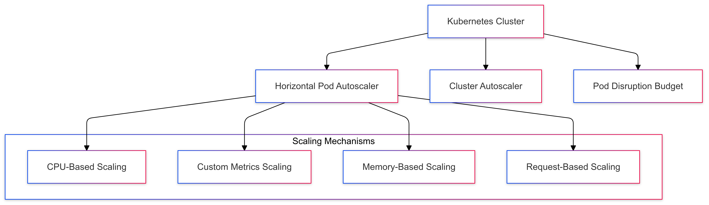
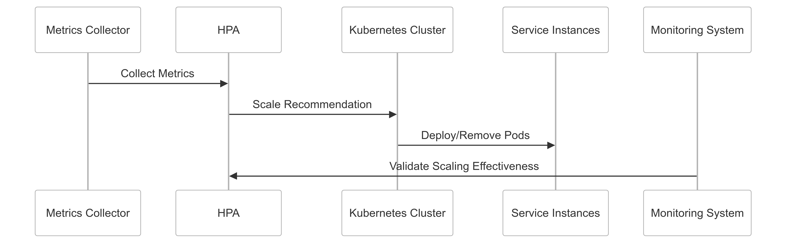

# Kubernetes Pod Scaling Strategy for CipherHorizon

## Prologue

In the context of building a scalable cryptocurrency trading analytics platform,  
facing challenges of dynamic computational requirements and variable market loads,  
we decided to implement comprehensive Kubernetes pod scaling mechanisms  
to achieve dynamic, efficient, and responsive infrastructure management  
accepting the complexity of automated scaling and potential initial configuration overhead.

## Discussion

### Kubernetes Pod Scaling Challenges

- Unpredictable cryptocurrency market dynamics
- Varying computational workloads
- Global user base with diverse access patterns
- High-frequency trading data processing
- Resource optimization
- Cost-effective infrastructure management
- Performance consistency

### Current Scaling Limitations

- Static resource allocation
- Manual scaling interventions
- Inefficient resource utilization
- Performance bottlenecks
- High infrastructure costs
- Limited adaptive capabilities

### Key Kubernetes Scaling Requirements

1. Horizontal pod autoscaling
2. Dynamic resource allocation
3. Multi-dimensional scaling metrics
4. Intelligent scaling decisions
5. Minimal performance overhead
6. Cost-effective infrastructure management

### Constraints

- Computational resources
- Network bandwidth
- Cluster management complexity
- Cost considerations

## Solution

### Kubernetes Scaling Architecture



### Kubernetes Pod Scaling Implementation

#### 1. Comprehensive Scaling Configuration

```yaml
apiVersion: autoscaling/v2beta1
kind: HorizontalPodAutoscaler
metadata:
  name: cipherhorizon-market-data-service
spec:
  scaleTargetRef:
    apiVersion: apps/v1
    kind: Deployment
    name: market-data-service
  minReplicas: 2
  maxReplicas: 10
  metrics:
    - type: Resource
      resource:
        name: cpu
        targetAverageUtilization: 70
    - type: Pods
      pods:
        metricName: processing_latency
        targetAverageValue: 100
```

#### 2. Scaling Strategy Implementation

```python
class KubernetesScalingManager:
    def __init__(self, cluster_config):
        self.scaling_strategies = {
            'cpu_based': self.cpu_scaling,
            'custom_metrics': self.custom_metrics_scaling,
            'request_based': self.request_scaling
        }

    def determine_scaling_strategy(self, service_metrics):
        strategy = self.select_optimal_strategy(service_metrics)
        return strategy(service_metrics)

    def cpu_scaling(self, metrics):
        return {
            'desired_replicas': self.calculate_cpu_replicas(metrics),
            'scaling_type': 'horizontal'
        }

    def custom_metrics_scaling(self, metrics):
        scaling_factors = {
            'market_data_service': self.market_data_scaling_logic,
            'trading_signal_service': self.trading_signal_scaling_logic
        }

        service_scaler = scaling_factors.get(
            metrics.service_name,
            self.default_scaling
        )

        return service_scaler(metrics)
```

#### 3. Scaling Metrics Schema

```PROTOBUF
syntax = "proto3";

message ServiceScalingMetrics {
    string service_name = 1;

    // Resource Metrics
    double cpu_utilization = 2;
    double memory_usage = 3;

    // Custom Metrics
    double request_latency = 4;
    int32 concurrent_requests = 5;
    double processing_throughput = 6;

    // Market-Specific Metrics
    double market_volatility = 7;
    int32 active_trading_signals = 8;
}

```

### Advanced Scaling Mechanism

```Python
class IntelligentScaler:
    def scale_service(self, service, metrics):
        scaling_strategies = {
            'adaptive_scaling': self.adaptive_scale,
            'predictive_scaling': self.predictive_scale,
            'machine_learning_scaling': self.ml_based_scale
        }

        strategy = scaling_strategies.get(
            self.configuration.scaling_mode,
            self.default_scaling
        )

        return strategy(service, metrics)

    def adaptive_scale(self, service, metrics):
        scaling_signals = self.analyze_scaling_signals(metrics)
        return self.execute_scaling_decision(scaling_signals)
```

## Consequences (Results)

### Positive Outcomes

- Dynamic infrastructure management
- Efficient resource utilization
- Improved system responsiveness
- Cost-effective scaling
- Minimal manual intervention
- Consistent performance

### Potential Challenges

- Complex scaling configuration
- Potential scaling oscillations
- Initial performance tuning
- Monitoring overhead

### Mitigation Strategies

- Comprehensive monitoring
- Gradual scaling implementation
- Performance profiling
- Continuous optimization

## Performance Metrics

### Kubernetes Scaling Targets

- Scaling Accuracy: 90%+
- Replica Deployment Time: < 30 seconds
- Resource Utilization: 70-80%
- Scaling Overhead: < 10%

## Implementation Roadmap

### Phase 1: Foundation

- Basic Kubernetes scaling
- Initial metric configuration
- Performance baseline

### Phase 2: Advanced Capabilities

- Custom metrics integration
- Intelligent scaling strategies
- Comprehensive monitoring

### Phase 3: Predictive Scaling

- Machine learning-driven scaling
- Advanced predictive algorithms
- Autonomous infrastructure management

## Decision Validation Criteria

- Improved system scalability
- Reduced infrastructure costs
- Consistent performance
- Minimal manual scaling interventions

## Alternatives Considered

1. Manual scaling
2. Static resource allocation
3. Cloud provider auto-scaling
4. Serverless approaches

## Ethical Considerations

- Fair resource allocation
- Transparent scaling mechanisms
- Efficient computational use
- Minimal environmental impact

## Appendix

- Kubernetes scaling guidelines
- Metric configuration techniques
- Performance optimization strategies
- Deployment best practices

### Kubernetes Scaling Workflow


