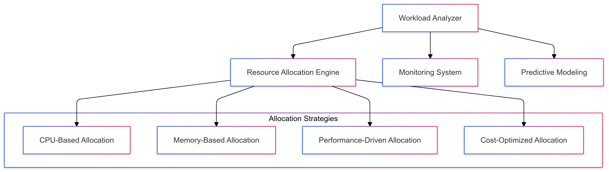
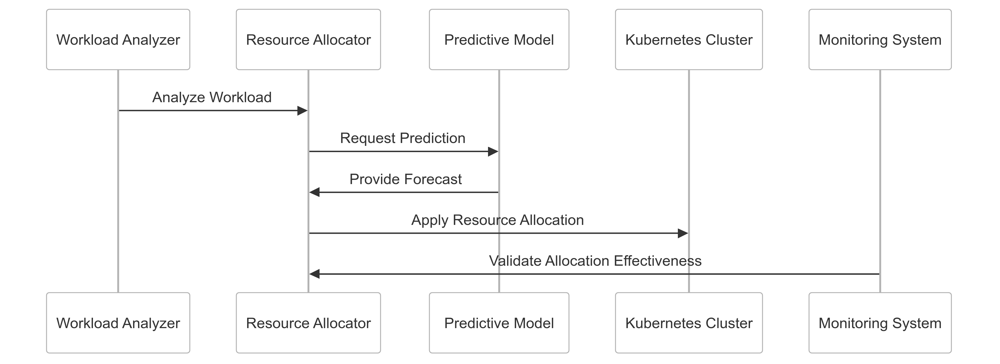

# Dynamic Resource Allocation Strategy for CipherHorizon

## Prologue (Summary)

In the context of building a sophisticated cryptocurrency trading analytics platform, facing challenges of variable computational demands and efficient resource utilization,
we decided to implement a comprehensive dynamic resource allocation strategy to achieve optimal infrastructure efficiency, cost-effectiveness, and responsive performance
accepting the complexity of intelligent resource management and potential initial overhead.

## Discussion (Context)

### Dynamic Resource Allocation Challenges

- Highly variable cryptocurrency market loads
- Unpredictable computational requirements
- Diverse service performance needs
- Cost optimization
- Energy efficiency
- Performance consistency
- Complex workload characteristics

### Current Resource Allocation Limitations

- Static resource provisioning
- Overprovisioning of infrastructure
- High operational costs
- Performance inconsistencies
- Limited adaptability
- Manual resource management
- Inefficient computational utilization

### Key Dynamic Allocation Requirements

1. Intelligent resource distribution
2. Real-time workload adaptation
3. Cost-effective infrastructure
4. Performance optimization
5. Granular resource control
6. Predictive resource management

### Constraints

- Computational resources
- Budget limitations
- Performance requirements
- Complexity of implementation

## Solution (Decision)

### Dynamic Resource Allocation Architecture



### Resource Allocation Implementation

#### 1. Comprehensive Allocation Framework

```python
class DynamicResourceAllocator:
    def __init__(self, cluster_config):
        self.allocation_strategies = {
            'performance_optimized': self.performance_allocation,
            'cost_optimized': self.cost_allocation,
            'balanced': self.balanced_allocation
        }

        self.predictive_models = {
            'workload_prediction': WorkloadPredictionModel(),
            'performance_forecasting': PerformanceforecastModel()
        }

    def allocate_resources(self, service_context):
        strategy = self.select_allocation_strategy(service_context)
        resource_recommendation = strategy(service_context)

        return self.validate_and_apply_allocation(resource_recommendation)

    def performance_allocation(self, context):
        predicted_load = self.predict_workload(context)
        return self.calculate_performance_resources(predicted_load)
```

#### 2. Resource Allocation Strategies

```python
class ResourceAllocationStrategies:
    def performance_allocation(self, service_metrics):
        allocation_rules = {
            'market_data_service': self.market_data_allocation,
            'trading_signal_service': self.trading_signal_allocation
        }

        allocator = allocation_rules.get(
            service_metrics.service_name,
            self.default_allocation
        )

        return allocator(service_metrics)

    def market_data_allocation(self, metrics):
        return {
            'cpu_allocation': self.calculate_cpu_allocation(metrics),
            'memory_allocation': self.calculate_memory_allocation(metrics),
            'priority': 'high'
        }

```

#### 3. Resource Allocation Schema

```PROTOBUF
syntax = "proto3";

message ResourceAllocationRequest {
    string service_name = 1;
    AllocationStrategy strategy = 2;

    message ResourceRequirements {
        double requested_cpu = 1;
        double requested_memory = 2;
        double max_cpu = 3;
        double max_memory = 4;
    }
    ResourceRequirements requirements = 3;

    enum AllocationStrategy {
        PERFORMANCE_OPTIMIZED = 0;
        COST_OPTIMIZED = 1;
        BALANCED = 2;
    }
}
```

### Predictive Resource Management

```python
class PredictiveResourceManager:
    def forecast_resource_needs(self, historical_data):
        prediction_strategies = {
            'machine_learning': self.ml_based_prediction,
            'statistical': self.statistical_prediction,
            'hybrid': self.hybrid_prediction
        }

        strategy = prediction_strategies.get(
            self.configuration.prediction_mode,
            self.default_prediction
        )

        return strategy(historical_data)

    def ml_based_prediction(self, data):
        return self.machine_learning_model.predict(data)
```

## Consequences

### Positive Outcomes

- Optimized resource utilization
- Cost-effective infrastructure
- Adaptive performance management
- Reduced operational overhead
- Improved system responsiveness
- Energy efficiency

### Potential Challenges

- Prediction accuracy limitations
- Initial implementation complexity
- Potential performance variations
- Machine learning model training

### Mitigation Strategies

- Continuous model refinement
- Comprehensive monitoring
- Fallback allocation mechanisms
- Performance profiling

## Performance Metrics

### Dynamic Allocation Targets

- Resource Utilization Efficiency: 80-90%
- Cost Reduction: 30-40%
- Prediction Accuracy: 75%+
- Allocation Latency: < 50ms

## Implementation Roadmap

### Phase 1: Foundation

- Basic resource allocation
- Initial predictive modeling
- Performance baseline

### Phase 2: Advanced Capabilities

- Machine learning integration
- Complex allocation strategies
- Comprehensive monitoring

### Phase 3: Intelligent Resource Management

- Advanced predictive algorithms
- Autonomous resource optimization
- Self-healing infrastructure

## Decision Validation Criteria

- Improved resource efficiency
- Reduced infrastructure costs
- Consistent performance
- Minimal manual intervention

## Alternatives Considered

1. Static resource allocation
2. Manual resource management
3. Cloud provider default scaling
4. Fixed resource provisioning

## Ethical Considerations

- Fair resource distribution
- Transparent allocation mechanisms
- Minimal environmental impact
- Efficient computational use

## Appendix

- Resource allocation guidelines
- Predictive modeling techniques
- Performance optimization strategies
- Cost management principles

### Resource Allocation Workflow


