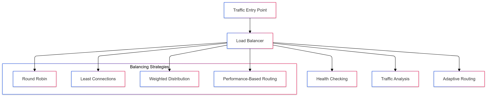

# Load Balancing Strategy for CipherHorizon

## Prologue

In the context of building a distributed cryptocurrency trading analytics platform,  
facing challenges of managing complex traffic distribution and ensuring optimal service performance,  
we decided to implement a comprehensive load balancing strategy  
to achieve high availability, consistent performance, and intelligent traffic routing  
accepting the complexity of distributed system load management and potential initial configuration overhead.

## Discussion

### Load Balancing Challenges

- High-frequency cryptocurrency market interactions
- Global user base with diverse access patterns
- Varying computational requirements
- Performance consistency
- Service availability
- Traffic spike management
- Multi-region infrastructure

### Current Load Balancing Limitations

- Static routing mechanisms
- Inefficient traffic distribution
- Single point of failure
- Limited adaptive capabilities
- Poor performance under high load
- Inconsistent user experience
- Manual traffic management

### Key Load Balancing Requirements

1. Intelligent traffic routing
2. Multi-layer load distribution
3. Adaptive routing strategies
4. High availability
5. Performance optimization
6. Comprehensive health checking

### Constraints

- Network bandwidth
- Computational resources
- Global infrastructure complexity
- Regulatory considerations

## Solution

### Load Balancing Architecture



### Load Balancing Implementation

#### 1. Comprehensive Load Balancing Framework

```python
class LoadBalancerManager:
    def __init__(self, cluster_config):
        self.balancing_strategies = {
            'round_robin': self.round_robin_balance,
            'least_connections': self.least_connections_balance,
            'weighted_distribution': self.weighted_distribution_balance,
            'performance_based': self.performance_based_balance
        }

        self.health_checkers = {
            'basic': BasicHealthChecker(),
            'advanced': AdvancedHealthChecker()
        }

    def route_request(self, request_context):
        strategy = self.select_balancing_strategy(request_context)
        target_service = strategy(request_context)

        return self.validate_and_route(target_service, request_context)

    def performance_based_balance(self, context):
        service_performance = self.analyze_service_performance(context)
        return self.select_optimal_service(service_performance)
```

#### 2. Advanced Routing Strategies

```python
class LoadBalancingStrategies:
    def performance_based_balance(self, request_metrics):
        routing_rules = {
            'market_data_service': self.market_data_routing,
            'trading_signal_service': self.trading_signal_routing
        }

        router = routing_rules.get(
            request_metrics.service_name,
            self.default_routing
        )

        return router(request_metrics)

    def market_data_routing(self, metrics):
        return {
            'selected_instance': self.select_optimal_instance(metrics),
            'routing_score': self.calculate_routing_score(metrics)
        }
```

#### 3. Load Balancing Configuration Schema

```PROTOBUF
syntax = "proto3";

message LoadBalancingConfiguration {
    string service_name = 1;
    BalancingStrategy strategy = 2;

    message ServiceInstance {
        string instance_id = 1;
        double weight = 2;
        InstanceHealth health = 3;
    }
    repeated ServiceInstance instances = 3;

    enum BalancingStrategy {
        ROUND_ROBIN = 0;
        LEAST_CONNECTIONS = 1;
        WEIGHTED = 2;
        PERFORMANCE_BASED = 3;
    }

    enum InstanceHealth {
        HEALTHY = 0;
        DEGRADED = 1;
        UNHEALTHY = 2;
    }
}
```

### Intelligent Traffic Management

```python
class TrafficAnalysisEngine:
    def analyze_traffic_patterns(self, historical_data):
        analysis_strategies = {
            'machine_learning': self.ml_based_analysis,
            'statistical': self.statistical_analysis,
            'hybrid': self.hybrid_analysis
        }

        strategy = analysis_strategies.get(
            self.configuration.analysis_mode,
            self.default_analysis
        )

        return strategy(historical_data)

    def ml_based_analysis(self, data):
        return self.machine_learning_model.predict_traffic_patterns(data)
```

## Consequences

### Positive Outcomes

- Optimized traffic distribution
- Improved service availability
- Consistent performance
- Intelligent routing
- Reduced single point of failure
- Enhanced user experience

### Potential Challenges

- Routing complexity
- Initial configuration overhead
- Potential routing inconsistencies
- Performance measurement accuracy

### Mitigation Strategies

- Comprehensive monitoring
- Continuous strategy refinement
- Fallback routing mechanisms
- Performance profiling

## Performance Metrics

### Load Balancing Targets

- Request Distribution Efficiency: 90%+
- Latency Reduction: 30-40%
- Service Availability: 99.99%
- Routing Decision Latency: < 20ms

## Implementation Roadmap

### Phase 1: Foundation

- Basic load balancing
- Initial routing strategies
- Performance baseline

### Phase 2: Advanced Capabilities

- Machine learning integration
- Complex routing algorithms
- Comprehensive monitoring

### Phase 3: Intelligent Traffic Management

- Advanced predictive routing
- Autonomous traffic optimization
- Self-healing infrastructure

## Decision Validation Criteria

- Improved traffic distribution
- Reduced service latency
- Consistent performance
- Minimal manual intervention

## Alternatives Considered

1. Static routing
2. Manual traffic management
3. Cloud provider default balancing
4. Simple round-robin approaches

## Ethical Considerations

- Fair traffic distribution
- Transparent routing mechanisms
- Minimal performance bias
- Efficient resource utilization

## Appendix

- Load balancing guidelines
- Routing strategy techniques
- Performance optimization principles
- Traffic analysis methodologies

### Load Balancing Workflow


