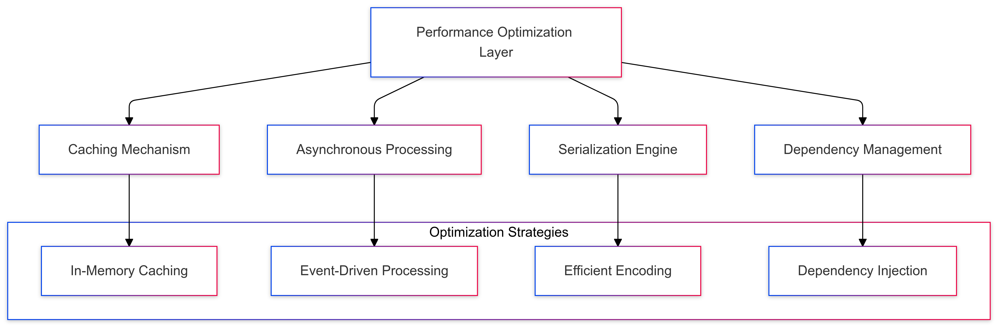
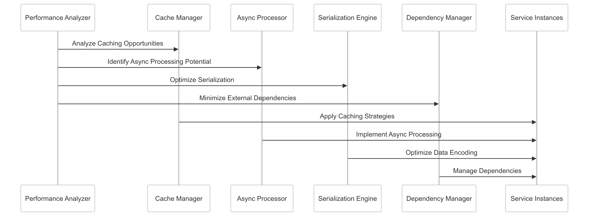

# Performance Optimization Strategy for CipherHorizon

## Prologue

In the context of building a high-performance cryptocurrency trading analytics platform, facing challenges of complex data processing and computational efficiency, we decided to implement a comprehensive performance optimization strategy  
to achieve minimal latency, efficient resource utilization, and responsive system behavior accepting the complexity of advanced optimization techniques and potential implementation overhead.

## Discussion

### Performance Optimization Challenges

- High-frequency market data processing
- Complex computational requirements
- Diverse service interactions
- Limited computational resources
- Varying data access patterns
- Global user base expectations
- Real-time processing demands

### Current Performance Limitations

- Synchronous processing bottlenecks
- Inefficient data serialization
- Excessive external dependencies
- Limited caching mechanisms
- High computational overhead
- Inconsistent system responsiveness

### Key Performance Optimization Requirements

1. Critical data caching
2. Asynchronous processing
3. Efficient serialization
4. Minimal external dependencies
5. Low-latency data access
6. Resource-efficient computations

### Constraints

- Computational resources
- Network bandwidth
- Development complexity
- Maintainability

## Solution

### Performance Optimization Architecture



### Performance Optimization Implementation

#### 1. Comprehensive Caching Framework

```python
class CacheManager:
    def __init__(self, cache_config):
        self.cache_strategies = {
            'in_memory': self.in_memory_cache,
            'distributed': self.distributed_cache,
            'multi_layer': self.multi_layer_cache
        }

        self.cache_policies = {
            'market_data': MarketDataCachePolicy(),
            'trading_signals': TradingSignalCachePolicy()
        }

    def get_cached_data(self, cache_context):
        strategy = self.select_cache_strategy(cache_context)
        cached_data = strategy(cache_context)

        return self.validate_and_return_cache(cached_data)

    def in_memory_cache(self, context):
        cache_key = self.generate_cache_key(context)
        return self.memory_cache.get(cache_key)
```

#### 2. Asynchronous Processing Strategy

```python
class AsynchronousProcessor:
    def __init__(self, processing_config):
        self.processing_strategies = {
            'event_driven': self.event_driven_processing,
            'task_queue': self.task_queue_processing,
            'reactive_streams': self.reactive_stream_processing
        }

    def process_async(self, task_context):
        strategy = self.select_processing_strategy(task_context)
        async_task = strategy(task_context)

        return self.manage_async_execution(async_task)

    def event_driven_processing(self, context):
        return self.create_async_event_handler(context)
```

#### 3. Serialization Optimization

```python
class SerializationManager:
    def __init__(self, serialization_config):
        self.serialization_strategies = {
            'protocol_buffers': self.protobuf_serialization,
            'messagepack': self.messagepack_serialization,
            'custom_binary': self.custom_binary_serialization
        }

    def serialize_data(self, data_context):
        strategy = self.select_serialization_strategy(data_context)
        serialized_data = strategy(data_context)

        return self.validate_serialization(serialized_data)

    def protobuf_serialization(self, context):
        return context.SerializeToString()
```

#### 4. Dependency Management

```python
class DependencyManager:
    def __init__(self, dependency_config):
        self.dependency_strategies = {
            'minimal_external': self.minimize_external_dependencies,
            'selective_import': self.selective_dependency_import,
            'dynamic_loading': self.dynamic_dependency_management
        }

    def manage_dependencies(self, service_context):
        strategy = self.select_dependency_strategy(service_context)
        managed_dependencies = strategy(service_context)

        return self.validate_dependencies(managed_dependencies)

    def minimize_external_dependencies(self, context):
        return self.filter_and_optimize_dependencies(context)
```

### Performance Optimization Schema

```PROTOBUF
syntax = "proto3";

message PerformanceOptimizationConfig {
    CachingStrategy caching = 1;
    ProcessingStrategy processing = 2;
    SerializationMethod serialization = 3;
    DependencyManagementApproach dependency_management = 4;

    enum CachingStrategy {
        IN_MEMORY = 0;
        DISTRIBUTED = 1;
        MULTI_LAYER = 2;
    }

    enum ProcessingStrategy {
        EVENT_DRIVEN = 0;
        TASK_QUEUE = 1;
        REACTIVE_STREAMS = 2;
    }

    enum SerializationMethod {
        PROTOCOL_BUFFERS = 0;
        MESSAGEPACK = 1;
        CUSTOM_BINARY = 2;
    }

    enum DependencyManagementApproach {
        MINIMAL_EXTERNAL = 0;
        SELECTIVE_IMPORT = 1;
        DYNAMIC_LOADING = 2;
    }
}
```

## Consequences (Results)

### Positive Outcomes

- Reduced system latency
- Efficient resource utilization
- Improved computational efficiency
- Enhanced scalability
- Consistent system performance
- Minimal external dependency overhead

### Potential Challenges

- Increased implementation complexity
- Potential caching inconsistencies
- Performance tuning requirements
- Complexity of async processing

### Mitigation Strategies

- Comprehensive monitoring
- Continuous performance profiling
- Adaptive optimization techniques
- Fallback mechanisms

## Performance Metrics

### Optimization Targets

- Latency Reduction: 40-50%
- Resource Utilization: 80-90%
- Caching Efficiency: 75%+
- Serialization Overhead: < 10ms

## Implementation Roadmap

### Phase 1: Foundation

- Basic optimization techniques
- Initial performance baseline
- Core optimization strategies

### Phase 2: Advanced Capabilities

- Machine learning-driven optimization
- Complex caching mechanisms
- Comprehensive monitoring

### Phase 3: Intelligent Performance Management

- Predictive optimization
- Autonomous performance tuning
- Advanced dependency management

## Decision Validation Criteria

- Improved system responsiveness
- Reduced computational overhead
- Efficient resource utilization
- Minimal performance degradation

## Alternatives Considered

1. Monolithic optimization approach
2. Manual performance tuning
3. Generic caching solutions
4. Static dependency management

## Ethical Considerations

- Efficient resource consumption
- Transparent optimization mechanisms
- Minimal environmental impact
- Fair computational resource allocation

## Appendix

- Performance optimization guidelines
- Caching strategy techniques
- Serialization best practices
- Dependency management principles

### Performance Optimization Workflow


