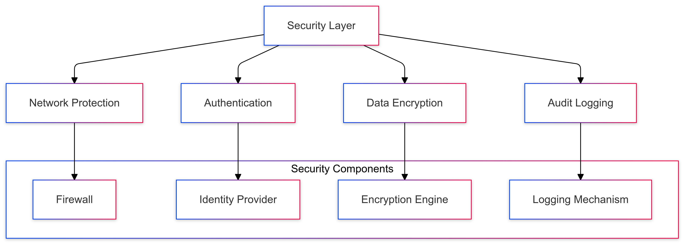
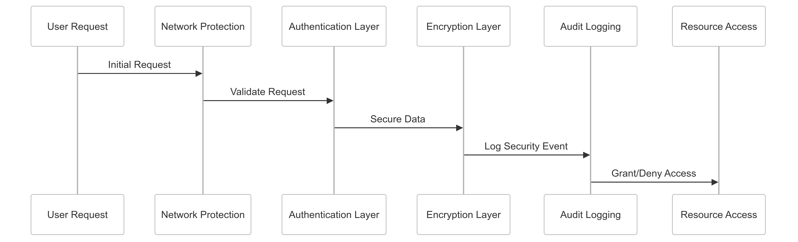

# Multi-Layer Security Strategy for CipherHorizon

## Prologue

In the context of building a secure cryptocurrency trading analytics platform,  
facing complex cybersecurity challenges and regulatory compliance requirements,  
we decided to implement a comprehensive multi-layer security architecture  
to achieve robust protection, data integrity, and comprehensive threat mitigation  
accepting the complexity of advanced security implementation and potential performance overhead.

## Discussion

### Security Challenges

- Cryptocurrency platform high-value target
- Diverse threat landscape
- Complex regulatory requirements
- Global user base
- Sensitive financial data
- Rapidly evolving cyber threats
- Multiple attack vectors

### Current Security Limitations

- Fragmented security approach
- Inadequate threat protection
- Limited authentication mechanisms
- Inconsistent encryption strategies
- Poor audit trail management
- Insufficient network-level protection

### Key Security Requirements

1. Network-level protection
2. Robust service authentication
3. Comprehensive data encryption
4. Detailed audit logging
5. Minimal external dependencies
6. Adaptive threat response

### Constraints

- Performance overhead
- Complexity of implementation
- Regulatory compliance
- User experience

## Solution

### Multi-Layer Security Architecture



### Security Implementation Strategy

#### 1. Comprehensive Security Framework

```python
class SecurityManager:
    def __init__(self, security_config):
        self.security_layers = {
            'network_protection': NetworkProtectionLayer(),
            'authentication': AuthenticationLayer(),
            'encryption': EncryptionLayer(),
            'audit_logging': AuditLoggingLayer()
        }

        self.threat_detection = ThreatDetectionEngine()

    def apply_security_layers(self, request_context):
        security_results = {}
        for layer_name, security_layer in self.security_layers.items():
            layer_result = security_layer.process(request_context)
            security_results[layer_name] = layer_result

        self.threat_detection.analyze(security_results)
        return self.validate_security_compliance(security_results)

```

#### 2. Network Protection Layer

```python
class NetworkProtectionLayer:
    def __init__(self):
        self.firewall_rules = {
            'whitelist_ips': self.configure_ip_whitelist,
            'rate_limiting': self.implement_rate_limiting,
            'ddos_protection': self.configure_ddos_protection
        }

    def process(self, network_context):
        protection_results = {}
        for rule_name, rule_implementation in self.firewall_rules.items():
            protection_results[rule_name] = rule_implementation(network_context)

        return protection_results
```

#### 3. Authentication Mechanism

```python
class AuthenticationLayer:
    def __init__(self):
        self.authentication_strategies = {
            'multi_factor': self.multi_factor_authentication,
            'oauth': self.oauth_authentication,
            'jwt': self.jwt_authentication
        }

    def process(self, authentication_context):
        strategy = self.select_authentication_strategy(authentication_context)
        return strategy(authentication_context)
```

#### 4. Data Encryption Strategy

```python
class EncryptionLayer:
    def __init__(self):
        self.encryption_methods = {
            'at_rest': self.encrypt_at_rest,
            'in_transit': self.encrypt_in_transit,
            'field_level': self.field_level_encryption
        }

    def process(self, data_context):
        encryption_results = {}
        for method_name, encryption_method in self.encryption_methods.items():
            encryption_results[method_name] = encryption_method(data_context)

        return encryption_results
```

### Security Configuration Schema

```PROTOBUF
syntax = "proto3";

message SecurityConfiguration {
    NetworkProtection network_protection = 1;
    AuthenticationMethod authentication = 2;
    EncryptionStrategy encryption = 3;
    AuditLoggingConfig audit_logging = 4;

    enum NetworkProtection {
        FIREWALL = 0;
        IP_WHITELISTING = 1;
        RATE_LIMITING = 2;
    }

    enum AuthenticationMethod {
        MULTI_FACTOR = 0;
        OAUTH = 1;
        JWT = 2;
    }

    enum EncryptionStrategy {
        AT_REST = 0;
        IN_TRANSIT = 1;
        FIELD_LEVEL = 2;
    }

    message AuditLoggingConfig {
        bool enable_detailed_logging = 1;
        int32 retention_days = 2;
        LoggingLevel logging_level = 3;
    }

    enum LoggingLevel {
        MINIMAL = 0;
        STANDARD = 1;
        COMPREHENSIVE = 2;
    }
}
```

## Consequences (Results)

### Positive Outcomes

- Comprehensive security coverage
- Robust threat protection
- Enhanced data integrity
- Regulatory compliance
- Minimal external dependencies
- Adaptive security mechanisms

### Potential Challenges

- Performance overhead
- Complexity of implementation
- Potential false positives
- Continuous maintenance requirements

### Mitigation Strategies

- Performance optimization
- Continuous security testing
- Adaptive threat detection
- Regular security audits

## Performance Metrics

### Security Implementation Targets

- Threat Detection Accuracy: 95%+
- Authentication Latency: < 50ms
- Encryption Overhead: < 10%
- Logging Performance Impact: < 5%

## Implementation Roadmap

### Phase 1: Foundation

- Basic security layer implementation
- Initial protection mechanisms
- Performance baseline

### Phase 2: Advanced Capabilities

- Machine learning threat detection
- Advanced encryption techniques
- Comprehensive monitoring

### Phase 3: Intelligent Security

- Predictive threat prevention
- Autonomous security adaptation
- Advanced compliance management

## Decision Validation Criteria

- Improved security posture
- Minimal successful attacks
- Regulatory compliance
- User trust enhancement

## Alternatives Considered

1. Monolithic security approach
2. Cloud provider default security
3. Third-party security services
4. Minimal security implementation

## Ethical Considerations

- User privacy protection
- Transparent security mechanisms
- Fair access controls
- Minimal data collection

## Appendix

- Security implementation guidelines
- Threat mitigation strategies
- Performance optimization techniques
- Compliance documentation

### Security Workflow


