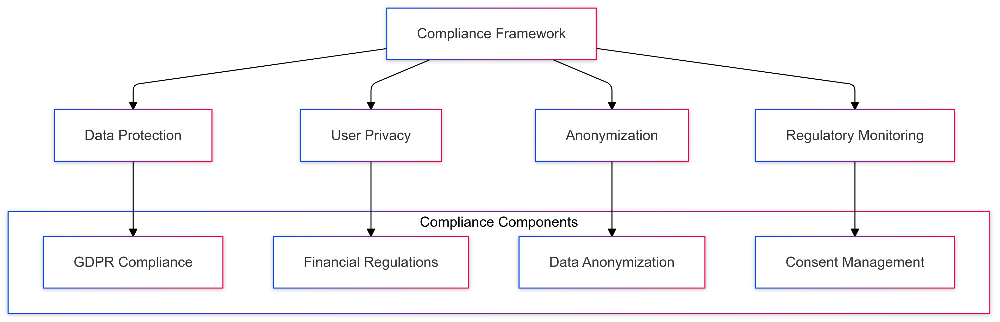
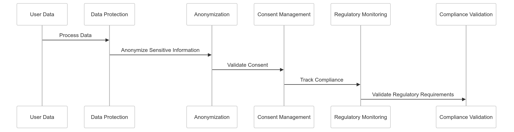

# Regulatory Compliance Strategy for CipherHorizon

## Prologue

In the context of building a global cryptocurrency trading analytics platform,  
facing complex regulatory landscapes and data protection requirements,  
we decided to implement a comprehensive regulatory compliance framework  
to achieve robust data protection, user privacy, and global regulatory adherence  
accepting the complexity of multi-jurisdictional compliance and potential operational overhead.

## Discussion

### Regulatory Compliance Challenges

- Global cryptocurrency regulatory diversity
- Complex data protection requirements
- GDPR and international privacy laws
- Financial sector regulatory standards
- Cross-border data transmission
- User data protection
- Evolving regulatory landscape

### Current Compliance Limitations

- Fragmented compliance approach
- Inconsistent data handling
- Limited user data protection
- Insufficient anonymization techniques
- Poor cross-jurisdictional compliance
- Manual compliance management

### Key Compliance Requirements

1. GDPR data protection
2. Financial data security
3. User data anonymization
4. Minimal external dependencies
5. Transparent data handling
6. Adaptive compliance mechanisms

### Constraints

- Operational complexity
- Performance overhead
- Diverse regulatory requirements
- User experience considerations

## Solution

### Regulatory Compliance Architecture



### Compliance Implementation Strategy

#### 1. Comprehensive Compliance Framework

```python
class RegulatoryComplianceManager:
    def __init__(self, compliance_config):
        self.compliance_modules = {
            'data_protection': DataProtectionModule(),
            'user_privacy': UserPrivacyModule(),
            'anonymization': DataAnonymizationModule(),
            'consent_management': ConsentManagementModule()
        }

        self.regulatory_monitor = RegulatoryMonitoringEngine()

    def process_data_request(self, request_context):
        compliance_results = {}
        for module_name, compliance_module in self.compliance_modules.items():
            module_result = compliance_module.process(request_context)
            compliance_results[module_name] = module_result

        self.regulatory_monitor.track_compliance(compliance_results)
        return self.validate_compliance(compliance_results)
```

#### 2. GDPR Compliance Module

```python
class DataProtectionModule:
    def __init__(self):
        self.protection_strategies = {
            'data_minimization': self.minimize_data_collection,
            'purpose_limitation': self.limit_data_usage,
            'storage_limitation': self.implement_data_retention
        }

    def process(self, data_context):
        protection_results = {}
        for strategy_name, strategy_implementation in self.protection_strategies.items():
            protection_results[strategy_name] = strategy_implementation(data_context)

        return protection_results
```

#### 3. Data Anonymization Strategy

```python
class DataAnonymizationModule:
    def __init__(self):
        self.anonymization_techniques = {
            'pseudonymization': self.pseudonymize_data,
            'tokenization': self.tokenize_sensitive_data,
            'k_anonymity': self.apply_k_anonymity
        }

    def process(self, data_context):
        anonymization_results = {}
        for technique_name, anonymization_method in self.anonymization_techniques.items():
            anonymization_results[technique_name] = anonymization_method(data_context)

        return anonymization_results
```

#### 4. Consent Management

```python
class ConsentManagementModule:
    def __init__(self):
        self.consent_strategies = {
            'explicit_consent': self.require_explicit_consent,
            'granular_consent': self.implement_granular_consent,
            'consent_revocation': self.enable_consent_withdrawal
        }

    def process(self, consent_context):
        consent_results = {}
        for strategy_name, strategy_implementation in self.consent_strategies.items():
            consent_results[strategy_name] = strategy_implementation(consent_context)

        return consent_results
```

### Regulatory Compliance Configuration Schema

```PROTOBUF
syntax = "proto3";

message RegulatoryComplianceConfiguration {
    GDPRComplianceSettings gdpr_settings = 1;
    FinancialRegulationCompliance financial_compliance = 2;
    DataAnonymizationStrategy anonymization = 3;
    ConsentManagementConfig consent_management = 4;

    message GDPRComplianceSettings {
        bool enable_data_minimization = 1;
        bool enforce_purpose_limitation = 2;
        int32 data_retention_days = 3;
    }

    message FinancialRegulationCompliance {
        repeated string regulated_jurisdictions = 1;
        bool enable_transaction_monitoring = 2;
        bool implement_know_your_customer = 3;
    }

    enum DataAnonymizationStrategy {
        PSEUDONYMIZATION = 0;
        TOKENIZATION = 1;
        K_ANONYMITY = 2;
    }

    message ConsentManagementConfig {
        bool require_explicit_consent = 1;
        bool enable_granular_consent = 2;
        bool allow_consent_withdrawal = 3;
    }
}
```

## Consequences

### Positive Outcomes

- Comprehensive regulatory compliance
- Enhanced user data protection
- Transparent data handling
- Minimal external dependencies
- Adaptive compliance mechanisms
- Global regulatory adherence

### Potential Challenges

- Operational complexity
- Performance overhead
- Continuous regulatory updates
- Implementation consistency

### Mitigation Strategies

- Continuous regulatory monitoring
- Automated compliance updates
- Performance optimization
- Regular compliance audits

## Performance Metrics

### Compliance Implementation Targets

- Compliance Coverage: 95%+
- Data Processing Latency: < 50ms
- Anonymization Overhead: < 10%
- Consent Management Efficiency: 90%

## Implementation Roadmap

### Phase 1: Foundation

- Basic compliance framework
- Initial protection mechanisms
- Performance baseline

### Phase 2: Advanced Capabilities

- Machine learning compliance prediction
- Advanced anonymization techniques
- Comprehensive monitoring

### Phase 3: Intelligent Compliance

- Predictive regulatory adaptation
- Autonomous compliance management
- Advanced data protection

## Decision Validation Criteria

- Improved regulatory compliance
- Minimal legal risks
- Enhanced user trust
- Comprehensive data protection

## Alternatives Considered

1. Manual compliance management
2. Third-party compliance services
3. Minimal compliance approach
4. Region-specific solutions

## Ethical Considerations

- User privacy protection
- Transparent data handling
- Minimal data collection
- Fair consent mechanisms

## Appendix

- Compliance implementation guidelines
- Regulatory monitoring strategies
- Anonymization techniques
- Consent management principles

### Compliance Workflow


