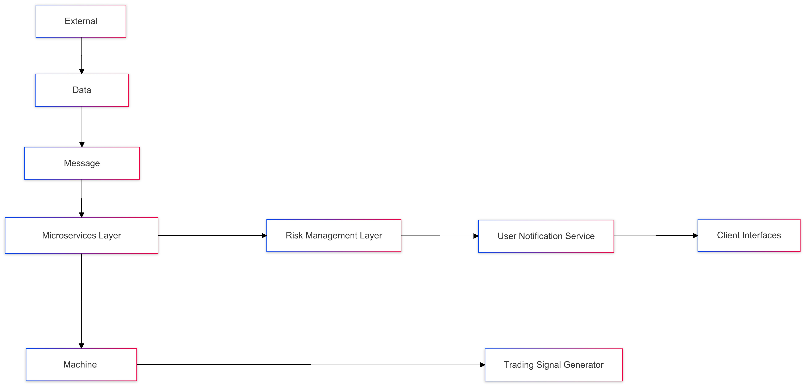
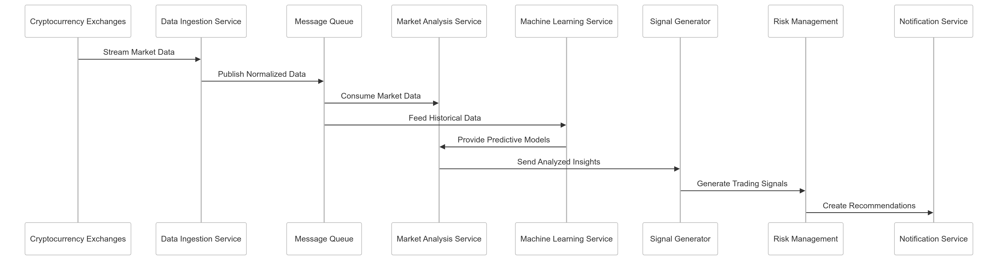

# CipherHorizon: Architectural Blueprint

## 1. System Architecture Overview

### High-Level Architecture Diagram

## 2. Architectural Layers

### 2.1 Data Ingestion Layer

- Multi-exchange data collection
- Real-time normalization
- Data validation
- High-throughput processing

### 2.2 Message Queue Layer

- Apache Kafka
- Event streaming
- Decoupled communication
- Guaranteed message delivery

### 2.3 Microservices Layer

- Independent, scalable services
- Domain-driven design
- Polyglot persistence
- Event-driven communication

### 2.4 Machine Learning Layer

- Predictive modeling
- Continuous learning
- Model versioning
- Feature engineering

### 2.5 Risk Management Layer

- Portfolio risk assessment
- Trading signal evaluation
- Automated risk mitigation
- Compliance monitoring

### 2.6 Notification and Reporting Layer

- Real-time alerts
- Personalized insights
- Multi-channel communication
- User preference management

## 3. Communication Patterns

### Inter-Service Communication

- gRPC for high-performance RPC
- Protocol Buffers for serialization
- Circuit breaker patterns
- Retry mechanisms

### Event Streaming

- Kafka topic-based communication
- Event sourcing
- CQRS (Command Query Responsibility Segregation)

## 4. Data Flow Architecture

## 5. Scalability Strategies

### Horizontal Scaling

- Stateless service design
- Kubernetes pod scaling
- Dynamic resource allocation
- Load balancing

### Performance Optimization

- Caching critical data
- Asynchronous processing
- Efficient serialization
- Minimal external dependencies

## 6. Resilience and Fault Tolerance

### Circuit Breaker Pattern

- Prevent cascading failures
- Graceful service degradation
- Automatic recovery mechanisms

### Retry and Fallback Strategies

- Exponential backoff
- Configurable retry limits
- Alternative data sources

## 7. Compliance and Security

### Multi-Layer Security

- Network-level protection
- Service authentication
- Data encryption
- Audit logging

### Regulatory Compliance

- GDPR considerations
- Financial data protection
- Anonymized user data

## Appendix: Decision Framework

### Architecture Decision Record

- [ADR-001: Data Ingestion Layer Design for Multi-Exchange Cryptocurrency Data Processing](ADRs/ADR-001.md)
- [ADR-002: Apache Kafka Message Queue Layer for Event Streaming in CipherHorizon](ADRs/ADR-002.md)
- [ADR-003: Microservices Layer Architecture for CipherHorizon](ADRs/ADR-003.md)
- [ADR-004: Domain-Driven Design for CipherHorizon Microservices Architecture](ADRs/ADR-004.md)
- [ADR-005: Polyglot Persistence Strategy for CipherHorizon Microservices](ADRs/ADR-005.md)
- [ADR-006: Event-Driven Communication Strategy for CipherHorizon Microservices](ADRs/ADR-006.md)
- [ADR-007: Predictive Modeling Strategy for CipherHorizon Machine Learning Layer](ADRs/ADR-007.md)
- [ADR-008: Continuous Learning Strategy for CipherHorizon Machine Learning Layer](ADRs/ADR-008.md)
- [ADR-009: Model Versioning Strategy for CipherHorizon Machine Learning Layer](ADRs/ADR-009.md)
- [ADR-010: Feature Engineering Strategy for CipherHorizon Machine Learning Layer](ADRs/ADR-010.md)
- [ADR-011: Portfolio Risk Assessment Strategy for CipherHorizon Risk Management Layer](ADRs/ADR-011.md)
- [ADR-012: Trading Signal Evaluation Strategy for CipherHorizon Risk Management Layer](ADRs/ADR-012.md)
- [ADR-013: Automated Risk Mitigation Strategy for CipherHorizon Risk Management Layer](ADRs/ADR-013.md)
- [ADR-014: Compliance Monitoring Strategy for CipherHorizon Risk Management Layer](ADRs/ADR-014.md)
- [ADR-015: Real-Time Alerts Strategy for CipherHorizon Notification and Reporting Layer](ADRs/ADR-015.md)
- [ADR-016: Personalized Insights Strategy for CipherHorizon Notification and Reporting Layer](ADRs/ADR-016.md)
- [ADR-017: Multi-Channel Communication Strategy for CipherHorizon Notification and Reporting Layer](ADRs/ADR-017.md)
- [ADR-018: User Preference Management Strategy for CipherHorizon Notification and Reporting Layer](ADRs/ADR-018.md)
- [ADR-019: gRPC Inter-Service Communication Strategy for CipherHorizon](ADRs/ADR-019.md)
- [ADR-020: Protocol Buffers Serialization Strategy for CipherHorizon](ADRs/ADR-020.md)
- [ADR-021: Circuit Breaker Pattern Strategy for CipherHorizon Inter-Service Communication](ADRs/ADR-021.md)
- [ADR-022: Retry Mechanism Strategy for CipherHorizon Inter-Service Communication](ADRs/ADR-022.md)
- [Topic-Based Communication Strategy for CipherHorizon Event Streaming](ADRs/ADR-023.md)
- [ADR-024: Event Sourcing Strategy for CipherHorizon Event Streaming](ADRs/ADR-024.md)
- [ADR-025: CQRS (Command Query Responsibility Segregation) Strategy for CipherHorizon Event Streaming](ADRs/ADR-025.md)
- [ADR-026: Horizontal Scaling and Stateless Service Design for CipherHorizon](ADRs/ADR-026.md)
- [ADR-027: Kubernetes Pod Scaling Strategy for CipherHorizon](ADRs/ADR-027.md)
- [ADR-028: Dynamic Resource Allocation Strategy for CipherHorizon](ADRs/ADR-028.md)
- [ADR-029: Load Balancing Strategy for CipherHorizon](ADRs/ADR-029.md)
- [ADR-030: Performance Optimization Strategy for CipherHorizon](ADRs/ADR-030.md)
- [ADR-031: Multi-Layer Security Strategy for CipherHorizon](ADRs/ADR-031.md)
- [ADR-032: Regulatory Compliance Strategy for CipherHorizon](ADRs/ADR-032.md)

## Conclusion

CipherHorizon's architecture represents a robust, scalable, and flexible solution for cryptocurrency trading analytics, designed to adapt to evolving market dynamics and technological advancements.

## License

This project is licensed under the MIT License. See [LICENSE.md](LICENSE) for details.
