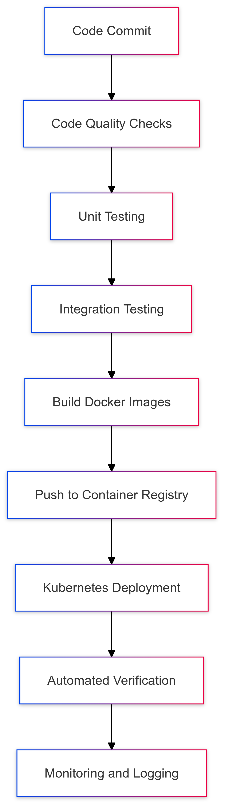
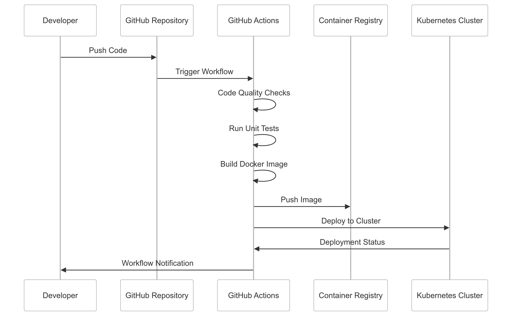

# CipherHorizon CI/CD Pipeline Strategy

## Table of Contents

- [CipherHorizon CI/CD Pipeline Strategy](#cipherhorizon-cicd-pipeline-strategy)
  - [Table of Contents](#table-of-contents)
  - [Pipeline Overview](#pipeline-overview)
    - [CI/CD Architecture](#cicd-architecture)
  - [Workflow Diagrams](#workflow-diagrams)
    - [Full CI/CD Workflow](#full-cicd-workflow)
  - [GitHub Actions Workflows](#github-actions-workflows)
    - [1. Code Quality Workflow](#1-code-quality-workflow)
    - [2. Testing Workflow](#2-testing-workflow)
    - [3. Docker Build and Push Workflow](#3-docker-build-and-push-workflow)
    - [4. Kubernetes Deployment Workflow](#4-kubernetes-deployment-workflow)
  - [Detailed Pipeline Stages](#detailed-pipeline-stages)
    - [1. Code Quality Checks](#1-code-quality-checks)
    - [2. Automated Testing](#2-automated-testing)
    - [3. Docker Image Build](#3-docker-image-build)
    - [4. Kubernetes Deployment](#4-kubernetes-deployment)
  - [Best Practices](#best-practices)
    - [Security](#security)
    - [Performance](#performance)
    - [Reliability](#reliability)
  - [Monitoring and Observability](#monitoring-and-observability)
    - [Notification Integrations](#notification-integrations)
  - [Troubleshooting](#troubleshooting)
    - [Common Debugging Commands](#common-debugging-commands)

## Pipeline Overview

### CI/CD Architecture



## Workflow Diagrams

### Full CI/CD Workflow



## GitHub Actions Workflows

### 1. Code Quality Workflow

```yml
# .github/workflows/code-quality.yml
name: Code Quality Checks

on: [push, pull_request]

jobs:
  code-quality:
    runs-on: ubuntu-latest

    steps:
      - uses: actions/checkout@v3

      # Golang Linting
      - name: Golang Linters
        uses: golangci/golangci-lint-action@v3
        with:
          version: latest

      # Python Linting
      - name: Python Linters
        uses: py-actions/flake8@v2

      # Rust Linting
      - name: Rust Linters
        uses: actions-rs/clippy-check@v1
        with:
          token: ${{ secrets.GITHUB_TOKEN }}
          args: --all-targets --all-features -- -D warnings

      # Code Formatting
      - name: Check Formatting
        run: |
          gofmt -d .
          black --check .
          rustfmt --check src/**/*.rs
```

### 2. Testing Workflow

```yml
# .github/workflows/testing.yml
name: Automated Testing

on: [push, pull_request]

jobs:
  unit-tests:
    runs-on: ubuntu-latest
    strategy:
      matrix:
        service:
          - market-data
          - trading-signal
          - risk-management

    steps:
      - uses: actions/checkout@v3

      # Setup environments
      - name: Set up Go
        uses: actions/setup-go@v3
        with:
          go-version: 1.19

      - name: Set up Python
        uses: actions/setup-python@v3
        with:
          python-version: 3.9

      - name: Set up Rust
        uses: actions-rs/toolchain@v1
        with:
          toolchain: stable

      # Run service-specific tests
      - name: Run Golang Tests
        if: matrix.service == 'market-data'
        run: |
          cd services/market-data
          go test ./... -coverprofile=coverage.out

      - name: Run Python Tests
        if: matrix.service == 'trading-signal'
        run: |
          cd services/trading-signal
          python -m pytest

      - name: Run Rust Tests
        if: matrix.service == 'risk-management'
        run: |
          cd services/risk-management
          cargo test

      # Upload coverage reports
      - name: Upload Coverage
        uses: codecov/codecov-action@v3
```

### 3. Docker Build and Push Workflow

```yml
# .github/workflows/docker-build.yml
name: Docker Build and Push

on:
  push:
    branches: [main]

jobs:
  build-and-push:
    runs-on: ubuntu-latest
    strategy:
      matrix:
        service:
          - market-data
          - trading-signal
          - risk-management

    steps:
      - uses: actions/checkout@v3

      # Docker Build and Push
      - name: Set up Docker Buildx
        uses: docker/setup-buildx-action@v2

      - name: Login to DockerHub
        uses: docker/login-action@v2
        with:
          username: ${{ secrets.DOCKERHUB_USERNAME }}
          password: ${{ secrets.DOCKERHUB_TOKEN }}

      - name: Build and Push
        uses: docker/build-push-action@v3
        with:
          context: ./services/${{ matrix.service }}
          push: true
          tags: |
            cipherhorizon/${{ matrix.service }}:latest
            cipherhorizon/${{ matrix.service }}:${{ github.sha }}
```

### 4. Kubernetes Deployment Workflow

```yml
# .github/workflows/kubernetes-deploy.yml
name: Kubernetes Deployment

on:
  push:
    branches: [main]

jobs:
  deploy:
    runs-on: ubuntu-latest

    steps:
      - uses: actions/checkout@v3

      # Configure Kubernetes Cluster
      - name: Configure Kubernetes Cluster
        uses: azure/k8s-set-context@v2
        with:
          method: service-account
          k8s-url: ${{ secrets.KUBERNETES_SERVICE_URL }}
          k8s-secret: ${{ secrets.KUBERNETES_SERVICE_ACCOUNT_TOKEN }}

      # Deploy to Kubernetes
      - name: Deploy Services
        run: |
          kubectl apply -f kubernetes/manifests/
          kubectl rollout status deployment/market-data-service
          kubectl rollout status deployment/trading-signal-service
          kubectl rollout status deployment/risk-management-service

      # Verify Deployment
      - name: Verify Deployment
        run: |
          kubectl get deployments
          kubectl get pods
```

## Detailed Pipeline Stages

### 1. Code Quality Checks

- Static code analysis
- Linting for multiple languages
- Formatting verification
- Security vulnerability scanning

### 2. Automated Testing

- Unit tests for each microservice
- Coverage report generation
- Multi-language test support
- Integration test preparation

### 3. Docker Image Build

- Multi-stage Docker builds
- Image tagging (latest, commit hash)
- Container registry push
- Security scanning

### 4. Kubernetes Deployment

- Manifest file application
- Rollout status checking
- Deployment verification
- Automated rollback support

## Best Practices

### Security

- Use GitHub secrets
- Minimal permission principle
- Regular credential rotation
- Container image scanning

### Performance

- Parallel job execution
- Caching dependencies
- Optimized build processes
- Minimal workflow complexity

### Reliability

- Comprehensive test coverage
- Multiple environment support
- Automated rollback mechanisms
- Detailed logging and notifications

## Monitoring and Observability

### Notification Integrations

- Slack notifications
- Email alerts
- GitHub status checks
- Custom webhook support

## Troubleshooting

### Common Debugging Commands

```bash
# View workflow runs
gh run list

# Inspect specific workflow
gh run view <run-id>

# Rerun failed workflow
gh run rerun <run-id>
```
