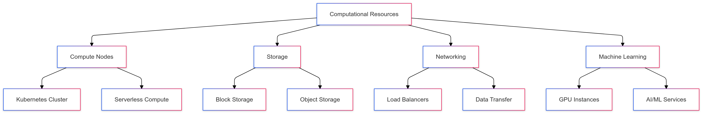

# CipherHorizon Cloud Cost Analysis

## Table of Contents

1. [Overview](#overview)
2. [Architecture Components](#architecture-components)
3. [Cost Comparison Methodology](#cost-comparison-methodology)
4. [Cloud Provider Detailed Analysis](#cloud-provider-detailed-analysis)
   1. [Azure Kubernetes Service (AKS)](#azure-kubernetes-service-aks)
   2. [AWS Elastic Kubernetes Service (EKS)](#aws-elastic-kubernetes-service-eks)
   3. [Google Kubernetes Engine (GKE)](#google-kubernetes-engine-gke)
5. [Comparative Cost Breakdown](#comparative-cost-breakdown)
6. [Optimization Strategies](#optimization-strategies)
7. [Total Cost of Ownership](#total-cost-of-ownership)
8. [Recommendations](#recommendations)

## Overview

### Project Architecture Scope

- Microservices-based cryptocurrency analytics platform
- Global, high-performance infrastructure
- Complex computational requirements
- Multi-region deployment

### Key Infrastructure Components

- Kubernetes Cluster
- Microservices
- Database Services
- Caching Layer
- Machine Learning Infrastructure
- Monitoring and Logging
- Data Processing Services

## Architecture Components

### Computational Resources

### Estimated Resource Requirements

- Compute Nodes: 10-15 nodes
- Storage: 500TB total
- Machine Learning: GPU-enabled instances
- Data Transfer: 500TB/month
- Microservices: 20+ services

## Cost Comparison Methodology

### Pricing Factors

1. Compute Instance Pricing
2. Storage Costs
3. Network Transfer
4. Managed Kubernetes Service
5. Machine Learning Infrastructure
6. Data Processing
7. Monitoring and Logging

### Standardized Comparison Metrics

- Monthly operational cost
- Per-transaction processing cost
- Scalability pricing
- Reserved vs. on-demand instances
- Multi-region deployment expenses

## Cloud Provider Detailed Analysis

### Azure Kubernetes Service (AKS)

#### Compute Costs

- Node Pools: Standard D-series
  - D8s v4: $0.4/hour per node
  - 10 nodes: $4/hour
  - Monthly: $2,880

#### Storage Costs

- Azure Managed Disks
  - Premium SSD: $0.17/GB/month
  - 500TB: $85,000/month

#### Machine Learning

- Azure Machine Learning
  - GPU Compute: $3.50/hour
  - Monthly (dedicated): $2,520

#### Networking

- Load Balancer: $0.025/hour
- Data Transfer: $0.087/GB
- Estimated: $5,000/month

#### Total Estimated Monthly Cost

- Compute: $2,880
- Storage: $85,000
- ML Infrastructure: $2,520
- Networking: $5,000
- **Total: $95,400/month**

### AWS Elastic Kubernetes Service (EKS)

#### Compute Costs

- EC2 Instances: m5.4xlarge
  - $0.768/hour per node
  - 10 nodes: $7.68/hour
  - Monthly: $5,530

#### Storage Costs

- EBS Volumes
  - Provisioned IOPS SSD: $0.125/GB/month
  - 500TB: $62,500/month

#### Machine Learning

- SageMaker GPU Instances
  - ml.p3.2xlarge: $4.20/hour
  - Monthly (dedicated): $3,024

#### Networking

- ELB: $0.0225/hour
- Data Transfer: $0.09/GB
- Estimated: $4,500/month

#### Total Estimated Monthly Cost

- Compute: $5,530
- Storage: $62,500
- ML Infrastructure: $3,024
- Networking: $4,500
- **Total: $75,554/month**

### Google Kubernetes Engine (GKE)

#### Compute Costs

- Compute Optimized Instances
  - c2-standard-8: $0.32/hour per node
  - 10 nodes: $3.20/hour
  - Monthly: $2,304

#### Storage Costs

- Persistent Disk
  - SSD Balanced: $0.17/GB/month
  - 500TB: $85,000/month

#### Machine Learning

- AI Platform Training
  - GPU Instances: $3.20/hour
  - Monthly (dedicated): $2,304

#### Networking

- Load Balancing: $0.036/hour
- Data Transfer: $0.08/GB
- Estimated: $4,320/month

#### Total Estimated Monthly Cost

- Compute: $2,304
- Storage: $85,000
- ML Infrastructure: $2,304
- Networking: $4,320
- **Total: $93,928/month**

## Comparative Cost Breakdown

### Cost Comparison Chart

| Component         | Azure   | AWS         | GCP     |
| ----------------- | ------- | ----------- | ------- |
| Compute           | $2,880  | $5,530      | $2,304  |
| Storage           | $85,000 | $62,500     | $85,000 |
| ML Infrastructure | $2,520  | $3,024      | $2,304  |
| Networking        | $5,000  | $4,500      | $4,320  |
| **Total Monthly** | $95,400 | **$75,554** | $93,928 |

### Performance vs. Cost Insights

- AWS offers most cost-effective solution
- Azure provides robust enterprise features
- GCP balances performance and pricing

## Optimization Strategies

### Cost Reduction Techniques

1. Reserved Instances

   - 1-3 year commitments
   - Up to 70% cost savings

2. Spot Instances for Non-Critical Workloads

   - 70-90% cheaper than on-demand
   - Suitable for batch processing

3. Rightsizing Resources

   - Continuous monitoring
   - Automatic scaling
   - Remove underutilized resources

4. Multi-Cloud Strategy

   - Distribute workloads
   - Leverage best pricing
   - Avoid vendor lock-in

## Total Cost of Ownership

### Additional Considerations

- Operational expenses
- Engineering time
- Maintenance overhead
- Compliance costs
- Training and skill development

### Estimated TCO Breakdown

- Infrastructure: 60%
- Personnel: 25%
- Maintenance: 10%
- Compliance: 5%

## Recommendations

### Hybrid Cloud Approach

1. Use AWS as primary cloud provider
2. Implement multi-cloud strategy
3. Utilize reserved instances
4. Implement continuous cost monitoring
5. Develop cloud-agnostic architecture

### Cost Optimization Roadmap

- [ ] Implement cloud cost management tools
- [ ] Develop automated scaling mechanisms
- [ ] Create multi-cloud deployment scripts
- [ ] Establish cloud governance policies
- [ ] Regular cost and performance audits

## Conclusion

While AWS currently offers the most cost-effective solution, a dynamic, multi-cloud approach with continuous optimization will provide the best long-term value.

## Disclaimer

Prices are estimated and may vary. Actual costs depend on specific usage, region, and current cloud provider pricing.
