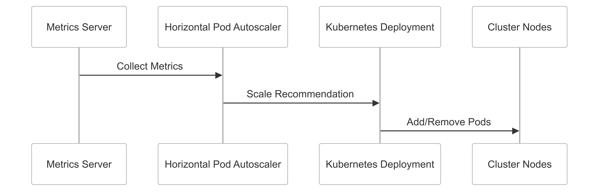

# CipherHorizon Kubernetes Deployment Strategy

## Table of Contents

- [CipherHorizon Kubernetes Deployment Strategy](#cipherhorizon-kubernetes-deployment-strategy)
  - [Table of Contents](#table-of-contents)
  - [Kubernetes Deployment Architecture](#kubernetes-deployment-architecture)
    - [Architecture Overview](#architecture-overview)
  - [Core Kubernetes Manifest Components](#core-kubernetes-manifest-components)
    - [1. Deployment Manifest](#1-deployment-manifest)
    - [2. Service Manifest](#2-service-manifest)
    - [3. ConfigMap Manifest](#3-configmap-manifest)
    - [4. Secret Manifest](#4-secret-manifest)
  - [Scalability Strategies](#scalability-strategies)
    - [Horizontal Pod Autoscaler (HPA)](#horizontal-pod-autoscaler-hpa)
    - [Cluster Autoscaler Configuration](#cluster-autoscaler-configuration)
  - [Scalability Considerations](#scalability-considerations)
    - [Multi-Dimensional Scaling Approach](#multi-dimensional-scaling-approach)
      - [1. Resource-Based Scaling](#1-resource-based-scaling)
      - [2. Custom Metrics Scaling](#2-custom-metrics-scaling)
      - [3. Scaling Strategies](#3-scaling-strategies)
    - [Scaling Workflow](#scaling-workflow)
  - [Advanced Configuration](#advanced-configuration)
    - [Pod Disruption Budget](#pod-disruption-budget)
    - [Node Affinity](#node-affinity)
  - [Deployment Best Practices](#deployment-best-practices)
    - [1. Resource Management](#1-resource-management)
    - [2. Monitoring and Logging](#2-monitoring-and-logging)
    - [3. Security](#3-security)
  - [Troubleshooting Commands](#troubleshooting-commands)
  - [Performance Optimization Techniques](#performance-optimization-techniques)
  - [Monitoring and Observability](#monitoring-and-observability)
    - [Prometheus Metrics Collection](#prometheus-metrics-collection)

## Kubernetes Deployment Architecture

### Architecture Overview


## Core Kubernetes Manifest Components

### 1. Deployment Manifest

```yml
apiVersion: apps/v1
kind: Deployment
metadata:
  name: market-data-service
  namespace: cipherhorizon
  labels:
    app: market-data-service
    tier: backend
    component: data-processing
spec:
  replicas: 3
  strategy:
    type: RollingUpdate
    rollingUpdate:
      maxSurge: 25%
      maxUnavailable: 25%
  selector:
    matchLabels:
      app: market-data-service
  template:
    metadata:
      labels:
        app: market-data-service
    spec:
      containers:
        - name: market-data-service
          image: cipherhorizon/market-data-service:v1.0.0
          ports:
            - containerPort: 8080
          resources:
            requests:
              cpu: 100m
              memory: 256Mi
            limits:
              cpu: 500m
              memory: 512Mi
          env:
            - name: KAFKA_BOOTSTRAP_SERVERS
              valueFrom:
                configMapKeyRef:
                  name: market-data-config
                  key: kafka-servers
          readinessProbe:
            httpGet:
              path: /health
              port: 8080
            initialDelaySeconds: 30
            periodSeconds: 10
          livenessProbe:
            httpGet:
              path: /health
              port: 8080
            initialDelaySeconds: 45
            periodSeconds: 20
```

### 2. Service Manifest

```yml
apiVersion: v1
kind: Service
metadata:
  name: market-data-service
  namespace: cipherhorizon
  annotations:
    prometheus.io/scrape: "true"
    prometheus.io/port: "8080"
spec:
  selector:
    app: market-data-service
  ports:
    - protocol: TCP
      port: 80
      targetPort: 8080
  type: ClusterIP
```

### 3. ConfigMap Manifest

```yml
apiVersion: v1
kind: ConfigMap
metadata:
  name: market-data-config
  namespace: cipherhorizon
data:
  kafka-servers: kafka.cipherhorizon.svc.cluster.local:9092
  data-retention-days: "7"
  log-level: "info"
  max-connections: "1000"
```

### 4. Secret Manifest

```yml
apiVersion: v1
kind: Secret
metadata:
  name: market-data-secrets
  namespace: cipherhorizon
type: Opaque
stringData:
  kafka-password: ${KAFKA_PASSWORD}
  encryption-key: ${ENCRYPTION_KEY}
```

## Scalability Strategies

### Horizontal Pod Autoscaler (HPA)

```yml
apiVersion: autoscaling/v2beta1
kind: HorizontalPodAutoscaler
metadata:
  name: market-data-service-hpa
  namespace: cipherhorizon
spec:
  scaleTargetRef:
    apiVersion: apps/v1
    kind: Deployment
    name: market-data-service
  minReplicas: 2
  maxReplicas: 10
  metrics:
    - type: Resource
      resource:
        name: cpu
        targetAverageUtilization: 70
    - type: Pods
      pods:
        metricName: processing_latency
        targetAverageValue: 100m
```

### Cluster Autoscaler Configuration

```yml
apiVersion: apps/v1
kind: Deployment
metadata:
  name: cluster-autoscaler
  namespace: kube-system
spec:
  replicas: 1
  selector:
    matchLabels:
      app: cluster-autoscaler
  template:
    metadata:
      labels:
        app: cluster-autoscaler
    spec:
      containers:
        - name: cluster-autoscaler
          image: k8s.gcr.io/autoscaling/cluster-autoscaler:v1.22.0
          command:
            - ./cluster-autoscaler
            - --v=4
            - --cloud-provider=aws
            - --skip-nodes-with-local-storage=false
            - --expander=least-waste
            - --balance-similar-node-groups
          resources:
            limits:
              cpu: 100m
              memory: 300Mi
            requests:
              cpu: 100m
              memory: 300Mi
```

## Scalability Considerations

### Multi-Dimensional Scaling Approach

#### 1. Resource-Based Scaling

- CPU Utilization
- Memory Consumption
- Network I/O

#### 2. Custom Metrics Scaling

- Processing Latency
- Request Throughput
- Error Rate

#### 3. Scaling Strategies

- Horizontal Pod Autoscaling
- Vertical Pod Autoscaling
- Cluster Autoscaling

### Scaling Workflow



## Advanced Configuration

### Pod Disruption Budget

```yml
apiVersion: policy/v1
kind: PodDisruptionBudget
metadata:
  name: market-data-service-pdb
spec:
  minAvailable: 2
  selector:
    matchLabels:
      app: market-data-service
```

### Node Affinity

```yml
affinity:
  nodeAffinity:
    requiredDuringSchedulingIgnoredDuringExecution:
      nodeSelectorTerms:
        - matchExpressions:
            - key: dedicated
              operator: In
              values:
                - high-performance
```

## Deployment Best Practices

### 1. Resource Management

- Set appropriate resource requests and limits
- Use resource quotas
- Implement pod priority classes

### 2. Monitoring and Logging

- Integrate Prometheus
- Use ELK stack for logging
- Implement distributed tracing

### 3. Security

- Use network policies
- Implement RBAC
- Rotate secrets regularly

## Troubleshooting Commands

```bash
# Check deployment status
kubectl get deployments -n cipherhorizon

# Describe deployment
kubectl describe deployment market-data-service -n cipherhorizon

# View pod logs
kubectl logs -l app=market-data-service -n cipherhorizon

# Check HPA status
kubectl get hpa -n cipherhorizon
```

## Performance Optimization Techniques

1. Optimize container images
2. Use multi-stage builds
3. Implement efficient caching
4. Use persistent volumes wisely
5. Monitor and tune resource allocation

## Monitoring and Observability

### Prometheus Metrics Collection

```yml
apiVersion: monitoring.coreos.com/v1
kind: ServiceMonitor
metadata:
  name: market-data-service-monitor
  namespace: monitoring
spec:
  selector:
    matchLabels:
      app: market-data-service
  endpoints:
    - port: metrics
      interval: 15s
```
