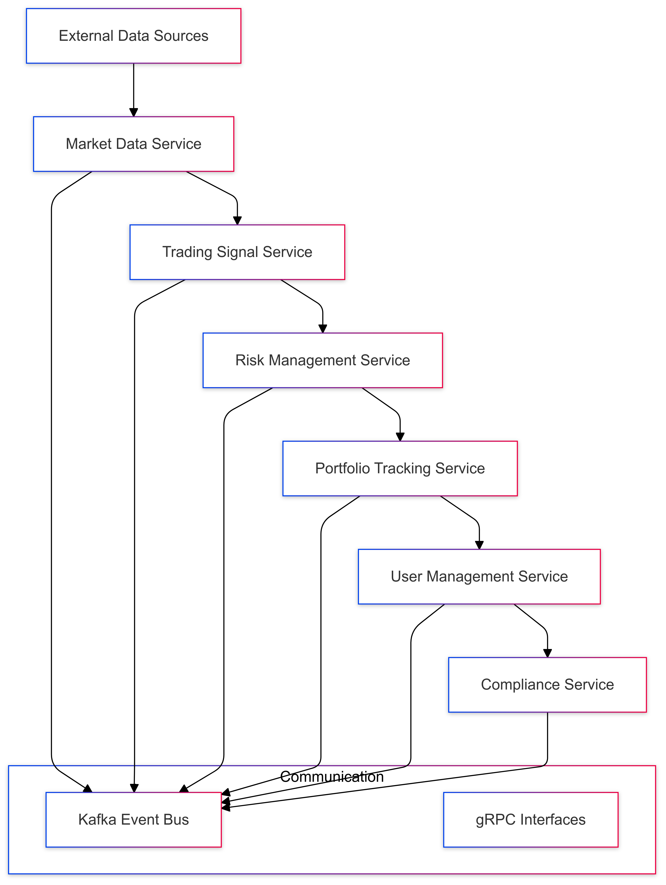
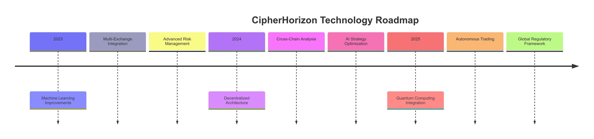

# CipherHorizon - Distributed Cryptocurrency Trading Analytics Platform

## 🚀 Project Overview

CipherHorizon is an advanced, distributed microservice-based platform designed to revolutionize cryptocurrency trading through intelligent analytics, machine learning, and real-time market insights.

## Mission Statement

To democratize cryptocurrency trading by providing sophisticated, data-driven insights and automated trading strategies for investors of all levels.

## 📊 Key Features

### Intelligent Market Analysis

- Real-time cryptocurrency market tracking
- Advanced predictive analytics
- Multi-exchange data aggregation
- Machine learning-powered insights

### Technical Capabilities

- Microservice-based architecture
- Horizontal scalability
- Low-latency data processing
- Advanced risk management

## 🔧 Technical Architecture

CipherHorizon employs a sophisticated, domain-driven microservices architecture designed to provide a comprehensive cryptocurrency trading analytics platform with high performance, scalability, and resilience.

- 📘 [Architectural Blueprint](ARCHITECTURE_OVERVIEW.md)
- 📘 [Technical Decisions](TECHNICAL_DECISIONS.md)

### Core Microservices Landscape



### Detailed Summary

#### 1. [Market Data Service](microservices/01-market-data-service.md)

#### Key Functionalities

- Collect cryptocurrency market data from multiple exchanges
- Normalize and standardize market information
- High-frequency data ingestion
- Real-time price tracking

##### Performance Characteristics

- Latency: < 50ms per data point
- Throughput: 10,000+ trades/second
- Support for 20+ cryptocurrency exchanges

#### 2. [Trading Signal Service](microservices/02-trading-signal-service.md)

##### Key Functionalities

- Generate trading signals
- Evaluate market conditions
- Implement multiple trading strategies
- Risk-weighted signal scoring

##### Performance Characteristics

- Multi-model signal generation
- Confidence score calculation
- Real-time strategy adaptation
- Machine learning-powered insights

#### 3. [Risk Management Service](microservices/03-risk-management-service.md)

##### Key Functionalities

- Comprehensive portfolio risk assessment
- Calculate advanced risk metrics
- Provide risk-adjusted recommendations
- Implement dynamic risk thresholds

##### Performance Characteristics

- Multi-dimensional risk analysis
- Real-time risk scoring
- Adaptive risk management
- Predictive risk modeling

#### 4. [Portfolio Tracking Service](microservices/04-portfolio-tracking-service.md)

##### Key Functionalities

- Manage user investment portfolios
- Track asset performance
- Calculate comprehensive portfolio metrics
- Provide investment insights

##### Performance Characteristics

- Real-time portfolio valuation
- Multi-asset class support
- Historical performance tracking
- Benchmark comparison

#### 5. [User Management Service](microservices/05-user-management-service.md)

##### Key Functionalities

- User authentication and authorization
- Profile management
- Secure access control
- Multi-factor authentication

##### Performance Characteristics

- Adaptive authentication
- Secure token management
- Compliance verification
- Anomaly detection

#### 6. [Compliance Service](microservices/06-compliance-service.md)

##### Key Functionalities

- Regulatory monitoring
- Transaction compliance checking
- Anti-money laundering (AML) verification
- Suspicious activity detection

##### Performance Characteristics

- Real-time compliance verification
- Multi-dimensional risk assessment
- Regulatory reporting
- Machine learning-powered pattern recognition

### Inter-Service Communication Architecture

#### Communication Protocols

- **Primary Protocol**: gRPC
- **Event Streaming**: Apache Kafka
- **Serialization**: Protocol Buffers

#### Communication Patterns

- Event-driven architecture
- Asynchronous messaging
- Eventual consistency model

### Performance Design Principles

#### Scalability Strategies

- Horizontal pod scaling
- Stateless service design
- Dynamic resource allocation
- Multi-region deployment

#### Optimization Techniques

- Intelligent caching
- Parallel processing
- Efficient serialization
- Minimal external dependencies

### Security and Compliance

#### Multi-Layer Security

- Network-level protection
- Service authentication
- Data encryption
- Comprehensive audit logging

#### Compliance Considerations

- Regulatory monitoring
- Data privacy protection
- Transparent security mechanisms

## ☁️ Deployment Guide

CipherHorizon offers a flexible, robust deployment strategy designed to accommodate diverse infrastructure needs and technological environments.

### 🌐 Deployment Options

#### 1. Local Development

- **Ideal for**: Developers, Researchers, Proof of Concept
- **Environments**:
  - Minikube
  - Kind
  - Docker Desktop Kubernetes
- **Setup Time**: 30-60 minutes
- **Resource Requirements**:
  - 4+ CPU cores
  - 8GB+ RAM
  - 50GB+ Disk Space

#### 2. Cloud Deployment

- **Supported Providers**:
  - Amazon Web Services (EKS)
  - Google Cloud Platform (GKE)
  - Microsoft Azure (AKS)
  - DigitalOcean Kubernetes

### 🚀 Deployment Strategies

#### Kubernetes-Native Deployment

- **Containerization**: Docker
- **Orchestration**: Kubernetes
- **Scaling**: Horizontal Pod Autoscaler
- **Update Mechanism**: Rolling Updates

#### Deployment Modes

1. **Development Mode**

   - Minimal resource configuration
   - Local testing
   - Simplified setup

2. **Production Mode**

   - High-availability configuration
   - Multi-region support
   - Advanced security features
   - Comprehensive monitoring

### 📦 Key Deployment Components

#### Infrastructure

- **Microservices**: 6 core services
- **Event Streaming**: Apache Kafka
- **Service Communication**: gRPC
- **Data Serialization**: Protocol Buffers

#### Performance Targets

- **API Response Time**: < 500ms
- **Scalability**: Millions of records
- **Performance Degradation**: < 10%

### 🔒 Security Considerations

#### Multi-Layer Security

- Network-level protection
- Service authentication
- Data encryption
- Comprehensive audit logging

#### Compliance

- GDPR considerations
- Financial data protection
- Anonymized user data handling

### 💻 Prerequisites

#### Development Environment

- Docker (v20.10+)
- Kubernetes Cluster (Minikube/Kind/K3s)
- kubectl (v1.21+)
- Helm (v3.6+)
- Git
- Python 3.9+
- Golang 1.17+

### 🛠️ Quick Start

```bash
# Clone the repository
git clone https://github.com/cipherhorizon/platform.git
cd platform

# Initialize local Kubernetes cluster
make setup-local-cluster

# Deploy CipherHorizon
make deploy-platform
```

### 📊 Monitoring and Observability

#### Integrated Monitoring

- Prometheus
- Grafana
- ELK Stack
- Distributed Tracing

### 💡 Unique Deployment Features

1. **Adaptive Scaling**

   - Automatic resource allocation
   - Performance-based scaling
   - Cost-efficient infrastructure

2. **Multi-Cloud Support**

   - Cloud-agnostic architecture
   - Seamless migration
   - Vendor-neutral design

3. **Continuous Deployment**

   - GitHub Actions integration
   - Automated testing
   - Seamless updates

### 🔍 Detailed Documentation

For comprehensive deployment instructions, configuration details, and troubleshooting:

- 📘 [Full Deployment Guide](DEPLOYMENT_GUIDE.md)
- 📘 [Containerization Guide](CONTAINERIZATION.md)
- 📘 [Kubernetes Deployment Strategy](KUBERNETES_DEPLOYMENT.md)
- 📘 [CI/CD Pipeline Strategy](CICD_PIPELINE.md)

## 🧪 Testing Strategy

### Coverage Targets

- **Unit Test Coverage**: 80%+
- **Critical Path Coverage**: 95%+
- **Integration Test Coverage**: 70%+
- **Performance Test Coverage**: Key scenarios

### Test Environment

- Isolated test databases
- Mocked external services
- Comprehensive test data generation

📘  [Full Testing Strategy](TESTING_STRATEGY.md)

### Future Testing Roadmap

- [ ] Implement contract testing
- [ ] Enhance performance test coverage
- [ ] Develop chaos engineering scenarios
- [ ] Integrate advanced security scanning
- [ ] Create comprehensive test data generation

## 🚀 Product Roadmap



📘  [Future Roadmap and Optimization Strategies](ROADMAP.md)

### Innovation Focus Areas

1. **Machine Learning**

   - Advanced predictive models
   - Transfer learning techniques
   - Explainable AI

2. **Infrastructure**

   - Serverless computing
   - Multi-cloud deployment
   - Edge computing integration

3. **Compliance**

   - Real-time regulatory monitoring
   - Global market adaptability
   - Transparent AI decision-making

### Community and Ecosystem

- Open-source contributions
- Research partnerships
- Developer hackathons
- Academic collaborations

### Feedback and Collaboration

- Community-driven feature requests
- Regular technical workshops
- Open innovation programs

## 💰 Cost Analysis

### Cloud Provider Comparison

| Provider  | Scalability | Performance |
| --------- | ----------- | ----------- |
| AWS EKS   | High        | Excellent   |
| GCP GKE   | High        | Very Good   |
| Azure AKS | High        | Excellent   |

📘  [Cloud Cost Analysis](COST_ANALYSIS.md)

### Cost Optimization Strategies

- Reserved instance pricing
- Spot instances for non-critical workloads
- Auto-scaling
- Right-sizing resources
- Multi-cloud approach

## Additional Resources

- [Kubernetes Documentation](https://kubernetes.io/docs/)
- [Helm Charts](https://helm.sh/docs/)
- [Docker Best Practices](https://docs.docker.com/develop/best-practices/)

## License

This project is licensed under the MIT License. See [LICENSE.md](LICENSE) for details.
