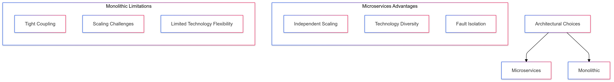
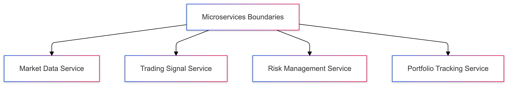
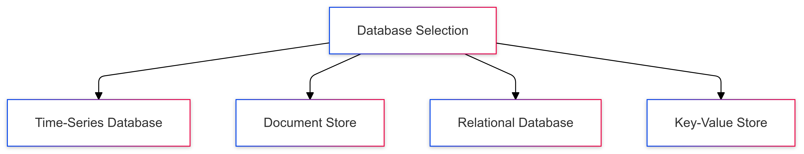
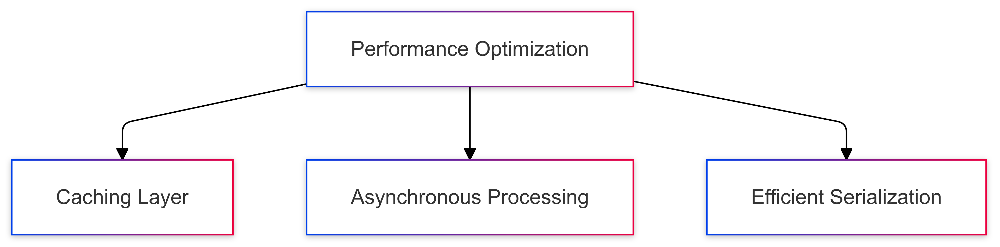
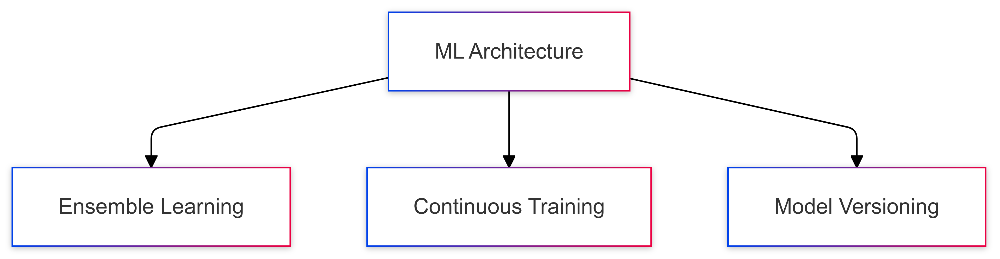
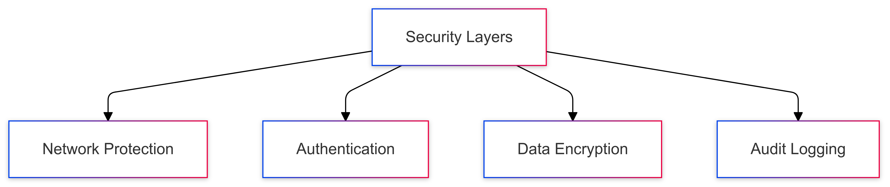
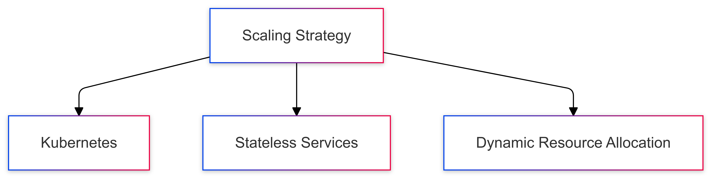

# CipherHorizon - Key Technical Decisions and Trade-offs

## Table of Contents

1. [Introduction](#introduction)
2. [Architectural Paradigm Selection](#architectural-paradigm-selection)
3. [Technology Stack Decisions](#technology-stack-decisions)
4. [Microservices Design Trade-offs](#microservices-design-trade-offs)
5. [Data Management Strategies](#data-management-strategies)
6. [Performance Optimization Decisions](#performance-optimization-decisions)
7. [Machine Learning Architecture](#machine-learning-architecture)
8. [Security and Compliance Considerations](#security-and-compliance-considerations)
9. [Scalability and Resilience](#scalability-and-resilience)
10. [Conclusion](#conclusion)

## Introduction

### Purpose of Technical Decision Documentation

This document captures the critical technical decisions and associated trade-offs made during the design and implementation of CipherHorizon, providing insight into the rationale behind our architectural choices.

## Architectural Paradigm Selection

### Microservices vs. Monolithic Architecture



#### Decision: Microservices Architecture

**Rationale:**

- Enhanced scalability
- Independent service deployment
- Technology stack flexibility
- Improved fault isolation

**Trade-offs:**

- Increased operational complexity
- Network latency between services
- More challenging distributed system management

### Polyglot Programming Approach

#### Decision: Multi-Language Implementation

**Languages Chosen:**

- Golang: Performance-critical services
- Python: Machine learning
- Rust: Systems programming components

**Trade-offs:**

- Pros:
  - Leverage language strengths
  - Optimize performance-critical components
  - Flexibility in development
- Cons:
  - Increased complexity in cross-service communication
  - Potential inconsistent coding standards

## Technology Stack Decisions

### Communication Protocols

```PROTOBUF

// gRPC Service Definition
syntax = "proto3";

service CryptoAnalyticsService {
    // Unary RPC for market data retrieval
    rpc GetMarketData(MarketDataRequest) returns (MarketDataResponse) {}

    // Streaming RPC for real-time updates
    rpc SubscribeMarketUpdates(SubscriptionRequest)
        returns (stream MarketUpdate) {}
}
```

#### Decision: gRPC with Protocol Buffers

**Rationale:**

- High-performance RPC mechanism
- Strong typing
- Language-agnostic
- Efficient serialization

**Trade-offs:**

- Pros:
  - Low latency
  - Compact message encoding
  - Strong contract definition
- Cons:
  - Learning curve
  - Limited human readability
  - Debugging complexity

### Event Streaming Platform

#### Decision: Apache Kafka

**Key Considerations:**

- Distributed streaming
- High throughput
- Replay capabilities
- Fault tolerance

**Trade-offs:**

- Pros:
  - Scalable message processing
  - Event sourcing support
  - Multi-subscriber model
- Cons:
  - Operational complexity
  - Additional infrastructure overhead
  - Learning curve

## Microservices Design Trade-offs

### Service Boundaries



#### Decision: Domain-Driven Service Decomposition

**Principles:**

- Clear bounded contexts
- Minimal inter-service dependencies
- Single responsibility
- Independent scalability

**Trade-offs:**

- Pros:
  - Improved maintainability
  - Easier independent deployment
  - Clear domain separation
- Cons:
  - Potential data duplication
  - Increased inter-service communication
  - Complex transaction management

## Data Management Strategies

### Polyglot Persistence



#### Decision: Multi-Database Approach

**Databases:**

- InfluxDB: Market time-series data
- MongoDB: Trading strategies
- PostgreSQL: User portfolios
- Redis: Caching and real-time data

**Trade-offs:**

- Pros:
  - Optimized data storage
  - Performance tuning
  - Flexible data modeling
- Cons:
  - Increased complexity
  - Data consistency challenges
  - Operational overhead

## Performance Optimization Decisions

### Caching and Computation



#### Decision: Multi-Level Caching

**Strategies:**

- In-memory caching
- Distributed cache
- Intelligent cache invalidation

**Trade-offs:**

- Pros:
  - Reduced latency
  - Improved throughput
  - Resource efficiency
- Cons:
  - Cache coherence challenges
  - Memory management complexity
  - Potential stale data

## Machine Learning Architecture

### Model Development



#### Decision: Adaptive Ensemble Learning

**Approach:**

- Multiple model architectures
- Continuous model retraining
- Performance-based model selection

**Trade-offs:**

- Pros:
  - Improved prediction accuracy
  - Reduced individual model bias
  - Adaptive learning
- Cons:
  - Increased computational complexity
  - Model management overhead
  - Potential overfitting

## Security and Compliance Considerations

### Multi-Layer Security



#### Decision: Defense-in-Depth Security

**Security Principles:**

- Network-level protection
- Multi-factor authentication
- End-to-end encryption
- Comprehensive audit logging

**Trade-offs:**

- Pros:
  - Robust threat mitigation
  - Regulatory compliance
  - User trust
- Cons:
  - Performance overhead
  - Increased complexity
  - Potential user friction

## Scalability and Resilience

### Horizontal Scaling



#### Decision: Kubernetes-Based Scaling

**Scaling Mechanisms:**

- Horizontal pod autoscaling
- Dynamic resource allocation
- Multi-region deployment

**Trade-offs:**

- Pros:
  - Linear scalability
  - Self-healing infrastructure
  - Resource efficiency
- Cons:
  - Operational complexity
  - Learning curve
  - Potential over-provisioning

## Conclusion

### Balancing Competing Priorities

Our technical decisions represent a careful balance between:

- Performance
- Scalability
- Security
- Development Flexibility
- Operational Efficiency

### Continuous Evaluation

We commit to:

- Regular architecture reviews
- Emerging technology assessment
- Performance optimization
- Adaptive decision-making

## Appendix: Decision Framework

### Evaluation Criteria

- Technical feasibility
- Performance impact
- Operational complexity
- Future adaptability
- Cost considerations

### Architecture Decision Record

- [ADR-033: Technology Stack Selection - Polyglot Programming Approach](ADRs/ADR-033.md)
- [ADR-034: Communication Protocols - gRPC and Protocol Buffers Selection](ADRs/ADR-034.md)
- [ADR-035: Event Streaming Platform - Apache Kafka Selection](ADRs/ADR-035.md)
- [ADR-036: Microservices Design - Domain-Driven Service Decomposition](ADRs/ADR-036.md)
- [ADR-037: Data Management Strategies - Polyglot Persistence Approach](ADRs/ADR-037.md)
- [ADR-038: Performance Optimization Strategies - Multi-Dimensional Approach](ADRs/ADR-038.md)
- [ADR-039: Machine Learning Architecture - Adaptive Ensemble Learning Strategy](ADRs/ADR-039.md)
- [ADR-040: Multi-Layer Security Architecture Strategy](ADRs/ADR-040.md)
- [ADR-041: Scalability and Resilience - Horizontal Scaling and Stateless Service Design](ADRs/ADR-041.md)

## License

This project is licensed under the MIT License. See [LICENSE.md](LICENSE) for details.
