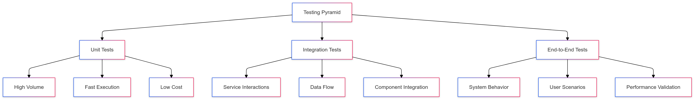

# CipherHorizon Testing Strategy

## Table of Contents

- [CipherHorizon Testing Strategy](#cipherhorizon-testing-strategy)
  - [Table of Contents](#table-of-contents)
  - [Testing Philosophy](#testing-philosophy)
    - [Guiding Principles](#guiding-principles)
  - [Testing Pyramid](#testing-pyramid)
  - [Test Types](#test-types)
    - [1. Unit Tests](#1-unit-tests)
    - [2. Integration Tests](#2-integration-tests)
    - [3. Performance Tests](#3-performance-tests)
    - [4. Security Tests](#4-security-tests)
  - [Core Microservices Test Strategy](#core-microservices-test-strategy)
    - [Market Data Service Test Cases](#market-data-service-test-cases)
    - [Trading Signal Service Test Cases](#trading-signal-service-test-cases)
  - [Test Coverage Goals](#test-coverage-goals)
    - [Coverage Targets](#coverage-targets)
    - [Critical Path Definition](#critical-path-definition)
  - [Testing Frameworks and Tools](#testing-frameworks-and-tools)
    - [Language-Specific Frameworks](#language-specific-frameworks)
    - [Performance and Load Testing](#performance-and-load-testing)
    - [Security Testing](#security-testing)
  - [Test Infrastructure](#test-infrastructure)
    - [Continuous Integration](#continuous-integration)
  - [Performance Test Strategy](#performance-test-strategy)
  - [Test Environment Configuration](#test-environment-configuration)
  - [Advanced Testing Techniques](#advanced-testing-techniques)
    - [Chaos Engineering](#chaos-engineering)
    - [Property-Based Testing](#property-based-testing)
  - [Future Testing Roadmap](#future-testing-roadmap)
  - [Reporting and Metrics](#reporting-and-metrics)
    - [Test Result Tracking](#test-result-tracking)
  - [Best Practices](#best-practices)

## Testing Philosophy

### Guiding Principles

- Comprehensive test coverage
- Maintainable test suites
- Fast and reliable tests
- Continuous improvement
- Shift-left testing approach

## Testing Pyramid



## Test Types

### 1. Unit Tests

- Test individual components
- Validate core functionalities
- Rapid execution
- Isolated testing

### 2. Integration Tests

- Verify service interactions
- Test data flow between components
- Validate inter-service communication

### 3. Performance Tests

- Measure system responsiveness
- Identify bottlenecks
- Validate scalability

### 4. Security Tests

- Vulnerability scanning
- Penetration testing
- Authentication validation

## Core Microservices Test Strategy

### Market Data Service Test Cases

```go
// market_data_service_test.go
func TestMarketDataValidation(t *testing.T) {
    testCases := []struct {
        name     string
        input    MarketData
        expected ValidationResult
    }{
        {
            name: "Valid Market Data",
            input: MarketData{
                Symbol:    "BTC",
                Price:     50000.00,
                Timestamp: time.Now(),
            },
            expected: ValidationResult{Valid: true},
        },
        {
            name: "Invalid Price",
            input: MarketData{
                Symbol:    "BTC",
                Price:     -100.00,
                Timestamp: time.Now(),
            },
            expected: ValidationResult{
                Valid:  false,
                Errors: []string{"Invalid price"},
            },
        },
    }

    for _, tc := range testCases {
        t.Run(tc.name, func(t *testing.T) {
            result := ValidateMarketData(tc.input)
            assert.Equal(t, tc.expected, result)
        })
    }
}
```

### Trading Signal Service Test Cases

```python
# test_trading_signal_service.py
def test_signal_generation():
    # Test signal generation logic
    test_cases = [
        {
            "market_conditions": {
                "volatility": 0.5,
                "trend": "bullish"
            },
            "expected_signal": {
                "type": "BUY",
                "confidence": 0.75
            }
        },
        {
            "market_conditions": {
                "volatility": 0.9,
                "trend": "bearish"
            },
            "expected_signal": {
                "type": "SELL",
                "confidence": 0.85
            }
        }
    ]

    for case in test_cases:
        signal = generate_trading_signal(case["market_conditions"])
        assert signal["type"] == case["expected_signal"]["type"]
        assert signal["confidence"] >= case["expected_signal"]["confidence"]
```

## Test Coverage Goals

### Coverage Targets

- **Unit Test Coverage**: 80%+
- **Critical Path Coverage**: 95%+
- **Integration Test Coverage**: 70%+
- **Performance Test Coverage**: Key scenarios

### Critical Path Definition

1. User authentication
2. Market data retrieval
3. Trading signal generation
4. Portfolio management
5. Risk assessment
6. Compliance verification

## Testing Frameworks and Tools

### Language-Specific Frameworks

- **Golang**:
  - `testing` package
  - `testify` for assertions
  - `gomock` for mocking
- **Python**:
  - `pytest`
  - `unittest`
  - `mock`
- **Rust**:
  - Built-in testing module
  - `proptest` for property-based testing

### Performance and Load Testing

- Apache JMeter
- Locust
- K6
- Gatling

### Security Testing

- OWASP ZAP
- Burp Suite
- Snyk
- Dependabot

## Test Infrastructure

### Continuous Integration

```yml
# GitHub Actions Testing Workflow
name: Comprehensive Testing

on: [push, pull_request]

jobs:
  unit-tests:
    strategy:
      matrix:
        service:
          - market-data
          - trading-signal
          - risk-management

    steps:
      - uses: actions/checkout@v3

      - name: Run Unit Tests
        run: |
          make test SERVICE=${{ matrix.service }}

      - name: Upload Coverage
        uses: codecov/codecov-action@v3
```

## Performance Test Strategy

```python
# performance_test.py
from locust import HttpUser, task, between

class MarketDataServiceUser(HttpUser):
    wait_time = between(1, 5)

    @task
    def retrieve_market_data(self):
        self.client.get("/market-data/BTC")

    @task
    def generate_trading_signal(self):
        self.client.post("/trading-signals", json={
            "symbol": "BTC",
            "strategy": "momentum"
        })

```

## Test Environment Configuration

```yml
# docker-compose.test.yml
version: "3.8"
services:
  test-database:
    image: postgres:13
    environment:
      POSTGRES_DB: testdb
      POSTGRES_PASSWORD: testpassword

  test-kafka:
    image: confluentinc/cp-kafka:6.2.0

  market-data-service:
    build:
      context: ./services/market-data
    environment:
      - DATABASE_URL=postgres://testdb
      - KAFKA_BOOTSTRAP_SERVERS=test-kafka:9092
```

## Advanced Testing Techniques

### Chaos Engineering

- Simulate service failures
- Test system resilience
- Validate recovery mechanisms

### Property-Based Testing

- Generate random test inputs
- Verify system behavior
- Discover edge cases

## Future Testing Roadmap

1. Implement contract testing
2. Enhance performance test coverage
3. Develop chaos engineering scenarios
4. Integrate security scanning
5. Create comprehensive test data generation

## Reporting and Metrics

### Test Result Tracking

- Code coverage reports
- Performance benchmark tracking
- Trend analysis
- Continuous improvement metrics

## Best Practices

- Keep tests independent
- Use meaningful test descriptions
- Avoid test interdependencies
- Maintain fast test execution
- Regularly review and update tests
